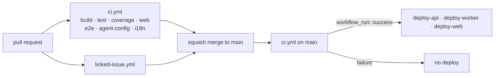

# Workflows

Continuous integration and deployment for this repository. Everything here runs
on GitHub-hosted runners.

## What each one is for

| Workflow | Runs on | Owns |
|---|---|---|
| `ci.yml` | pull request, push to `main`, dispatch | Verifying the repository. Its job ids are the required status checks. |
| `linked-issue.yml` | pull request, including `edited` | One rule: the pull request body closes an issue. |
| `deploy-api.yml` | CI success on `main`, dispatch | The API container, **and the database schema** |
| `deploy-worker.yml` | CI success on `main`, dispatch | The Worker container |
| `deploy-web.yml` | CI success on `main`, dispatch | The public and admin static sites, separately |

## What this slice does not own

- **The AWS resources themselves.** Those are Terraform, in `infra/`
  ([ADR-0010](../../docs/decisions/ADR-0010-infrastructure-as-code.md)). These
  workflows ship artifacts to an environment that already exists.
- **Runtime secrets.** They live in AWS Secrets Manager and are injected into the
  ECS task definition. The only credential GitHub holds is
  `AWS_DEPLOY_ROLE_ARN`, and it is inert without its OIDC trust policy.
- **The ruleset.** `docs/github-ruleset.json` is the source of truth for which of
  these contexts are required, applied with `gh api`.

## CI



**Job ids are the status-check contexts.** Renaming a job renames the context
and silently drops it from the required set — the ruleset goes on waiting for a
name that nothing reports. If you rename one, update
`docs/github-ruleset.json` and reapply it in the same pull request.

Four jobs — `coverage`, `web`, `e2e`, `i18n` — currently detect that the thing
they would check has not been written yet, emit a `::notice::` naming the issue
that fills them in, and exit 0. The reasoning, and the obligation to *replace*
the skip branch rather than add a second job, is in
[ADR-0011](../../docs/decisions/ADR-0011-ci-contexts-precede-their-checks.md).

### Fork safety

This repository is public and takes fork pull requests.

- `pull_request`, **never** `pull_request_target`. The latter runs fork-authored
  code with a write token and repository secrets in scope.
- No job in `ci.yml` or `linked-issue.yml` reads a secret. Keep it that way;
  anything needing one runs against recorded fixtures.
- "Require approval for first-time contributors" stays enabled in Actions
  settings.

## Deployments

All three deploy workflows share a shape: `preflight` → `image` → (`migrate`) →
`deploy`, authenticating with OIDC role assumption and gated behind the
`production` environment with a required reviewer.

`preflight` checks that every secret and variable it needs is present and fails
with a message naming the missing one. That is what runs today, because the AWS
environment does not exist yet.

The full secret and variable contract, the trust-policy scoping, the migration
ordering rule, and the rollback path are in
[`docs/deployment.md`](../../docs/deployment.md). Read that before changing any
of these files.

## Changing a workflow

```bash
actionlint                     # from the repository root
```

`actionlint` catches expression typos, invalid `needs` edges, and unknown
context properties, none of which surface until a run fails otherwise.
