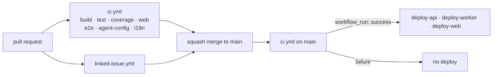

# Workflows

Continuous integration and deployment for this repository. Everything here runs
on GitHub-hosted runners.

## What each one is for

| Workflow | Runs on | Owns |
|---|---|---|
| `ci.yml` | pull request, push to `main`, dispatch | Verifying the repository. Its job ids are the required status checks. |
| `linked-issue.yml` | pull request, including `edited` | One rule: the pull request body closes an issue. |
| `i18n-translate.yml` | push to `main`, dispatch | Generating `locales/fr-CA.json` and opening a pull request with it |
| `deploy-api.yml` | CI success on `main`, dispatch | The API container, **and the database schema** |
| `deploy-worker.yml` | CI success on `main`, dispatch | The Worker container |
| `deploy-web.yml` | CI success on `main`, dispatch | The public and admin static sites, separately |

## What this slice does not own

- **The AWS resources themselves.** Those are Terraform, in `infra/`
  ([ADR-0010](../../docs/decisions/ADR-0010-infrastructure-as-code.md)). These
  workflows ship artifacts to an environment that already exists.
- **Runtime secrets.** They live in AWS Secrets Manager and are injected into the
  ECS task definition. The only credential GitHub holds is
  `AWS_DEPLOY_ROLE_ARN`, and it is inert without its OIDC trust policy.
- **The ruleset.** `docs/github-ruleset.json` is the source of truth for which of
  these contexts are required, applied with `gh api`.

## CI



**Job ids are the status-check contexts.** Renaming a job renames the context
and silently drops it from the required set — the ruleset goes on waiting for a
name that nothing reports. If you rename one, update
`docs/github-ruleset.json` and reapply it in the same pull request.

Three jobs — `coverage`, `web`, `e2e` — currently detect that the thing they
would check has not been written yet, emit a `::notice::` naming the issue that
fills them in, and exit 0. `i18n` was the fourth until #10; its translation-parity
step is real now, and the two lint steps beside it still skip until #8 lands the
locale files. The reasoning, and the obligation to *replace*
the skip branch rather than add a second job, is in
[ADR-0011](../../docs/decisions/ADR-0011-ci-contexts-precede-their-checks.md).

`init-dev.sh` is checked in two of those jobs rather than a job of its own,
because a new job is a new status-check context and would have to be added to
`docs/github-ruleset.json` before it could be required. `build` runs
`shellcheck -s sh` over it — it is POSIX `sh`, not bash, because Windows
contributors run it under Git Bash. `test` runs `./init-dev.sh --check`, which
installs nothing and fails if the script has stopped agreeing with the files
that pin the .NET and Node versions. See
[ADR-0015](../../docs/decisions/ADR-0015-one-shell-script-for-development-setup.md).

### Fork safety

This repository is public and takes fork pull requests.

- `pull_request`, **never** `pull_request_target`. The latter runs fork-authored
  code with a write token and repository secrets in scope.
- No job in `ci.yml` or `linked-issue.yml` reads a secret. Keep it that way;
  anything needing one runs against recorded fixtures.
- **`ci.yml` never runs inference.** The `i18n` job verifies the locales with
  `translate-locale.mjs --check`, which constructs no translator. Generation is
  a separate workflow that runs only on a push to `main`. A fork must not be
  able to make this repository spend an inference call or write a generated
  locale file. See [ADR-0021](../../docs/decisions/ADR-0021-ci-translation-opens-a-pull-request.md).
- "Require approval for first-time contributors" stays enabled in Actions
  settings.

## Translating the locales

`i18n-translate.yml` regenerates `locales/fr-CA.json` from `locales/en-CA.json`
and opens a pull request with the result. It is the counterpart of the `i18n`
job in `ci.yml`, and the split between them is a security boundary:

```mermaid
flowchart TD
    pr["pull_request<br/>(including forks)"] --> chk["ci.yml · i18n<br/>--check · reads files only"]
    push["push to main"] --> gen["i18n-translate.yml<br/>--generate"]
    gen --> q{"any key stale?"}
    q -->|no| stop["exit 0, open nothing"]
    q -->|yes| call["one batched provider call"]
    call --> prq["pull request on<br/>chore/fr-CA-translations"]
    prq --> human["a human reads the French"]
```

Three things about it that are easy to undo by accident:

- **It never pushes to `main`.** A human reads the French first. The branch is
  rebuilt and force-pushed every run, so there is one pull request that updates.
- **It is the only workflow here that may hold an inference credential**, because
  it is the only one that never runs fork-authored code.
- **The Node major is read out of `ci.yml`, not written here.** A tool version is
  pinned in exactly one file — see
  [ADR-0015](../../docs/decisions/ADR-0015-one-shell-script-for-development-setup.md)
  and the pinning rule in `AGENTS.md`.

Configuration, all optional, all repository-level:

| Setting | Kind | Required? |
|---|---|---|
| `DEEPL_API_KEY` | secret | **Yes.** Without it the job reports which keys are waiting and changes nothing. The host is derived from the key's `:fx` suffix, so there is nothing else to set. |
| `TRANSLATION_PR_TOKEN` | secret | **Yes, in practice.** Without it the pull request is opened with `GITHUB_TOKEN`, so **CI does not run on it** and it must be nudged by hand before it can merge. |
| `TRANSLATION_FORMALITY` | variable | No. Defaults to `prefer_more`. |
| `TRANSLATION_PROVIDER`, `TRANSLATION_ENDPOINT`, `TRANSLATION_MODEL`, `TRANSLATION_API_KEY` | variables + secret | No. These exist so a future provider swap is a settings change rather than a code change. |

The provider is DeepL, targeting `FR-CA` —
[ADR-0022](../../docs/decisions/ADR-0022-translation-provider-is-configuration.md),
which records why Amazon Translate, the worker's Anthropic key, and human-only
translation were rejected. GitHub Models, which ADR-0007 named, was retired on
30 July 2026.

## Deployments

All three deploy workflows share a shape: `preflight` → `image` → (`migrate`) →
`deploy`, authenticating with OIDC role assumption and gated behind the
`production` environment with a required reviewer.

`preflight` checks that every secret and variable it needs is present — including
the ones only a later job reads — and fails with a message naming the missing
one. That is what runs today, because the AWS environment does not exist yet.
The check is a composite action, [`../actions/require-config`](../actions/require-config/action.yml),
shared by all three workflows.

Each `preflight` also carries an explicit trigger guard rather than relying on
`workflow_run`'s `branches: [main]` filter alone:

```yaml
if: >-
  github.event_name == 'workflow_dispatch' ||
  (github.event.workflow_run.event == 'push' &&
   github.event.workflow_run.head_branch == 'main' &&
   github.event.workflow_run.conclusion == 'success')
```

`event == 'push'` admits only a merge to `main`. Without it a green CI run on an
open pull request could reach `image`, which is not behind the `production`
environment, and push a container built from unreviewed code.

The full secret and variable contract, the trust-policy scoping, the migration
ordering rule, and the rollback path are in
[`docs/deployment.md`](../../docs/deployment.md). Read that before changing any
of these files.

## The deploy blind spot

The deploy workflows never run on a pull request. That is deliberate — they
trigger on a push to `main` — but it means **nothing reachable only from a
deploy workflow is exercised before it merges.** A local action, a script, a
manifest: an error in any of them surfaces on `main` or not at all.

That is how [#36](https://github.com/HPAC-Safety/safety-report/issues/36) got
in. `actionlint` validates workflow files but not `action.yml` manifests, and no
pull request ever loaded the one that was broken.

CI's `agent-config` job therefore invokes `require-config` with dummy values, so
its manifest is parsed on every pull request. **Anything new that only the deploy
workflows use needs the same treatment** — a cheap exercise in CI, not a promise
to be careful.

## Changing a workflow

```bash
actionlint                     # from the repository root
```

`actionlint` catches expression typos, invalid `needs` edges, and unknown
context properties, none of which surface until a run fails otherwise.
