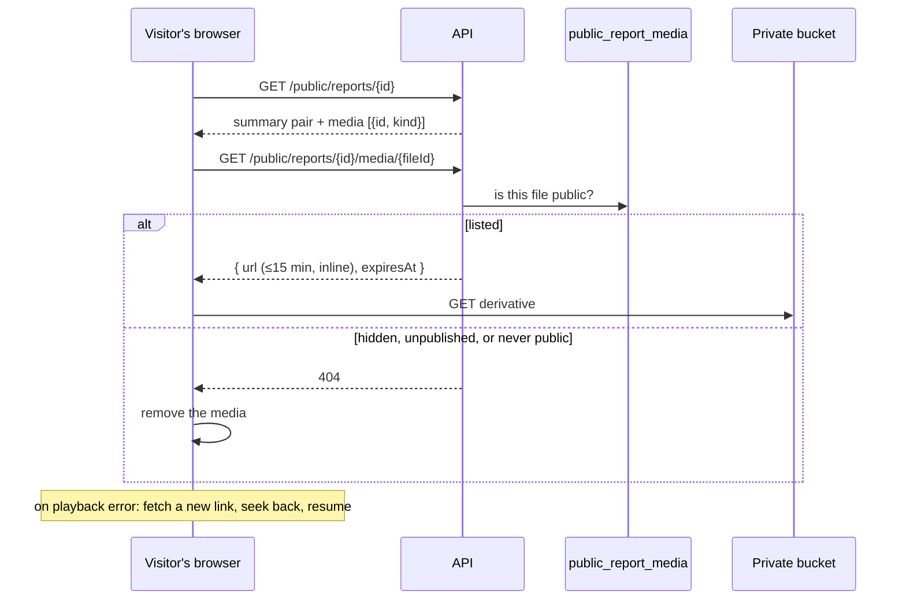

# ADR-0117 — A published report shows the reporter's photos and video

**Status:** Accepted. **Amends**
[ADR-0026](ADR-0026-presigned-urls-and-private-blob-storage.md): a short-lived
pre-signed GET may now be minted for an anonymous visitor, but only for a
derivative this record makes public. **Amends**
[ADR-0094](ADR-0094-video-is-remuxed-not-transcoded-and-never-refused.md) and
[ADR-0098](ADR-0098-submission-copies-the-original-and-the-worker-makes-the-derivative.md)
where they say no attachment is ever published: a verified image or video
derivative may be; a retained unstripped original still never is. Changes
`AGENTS.md` invariant 1: publication consent is no longer the only system
question.
**Amended by**
[ADR-0119](ADR-0119-a-published-report-offers-its-documents-for-download.md):
a validated document is public too, as a forced download, and media consent is
reworded to cover documents and asked whenever any file is attached.

## Context

The public report page (#28, #329) shows the approved summary pair and
member comments. HPAC wants a visitor to see the photos and video the reporter
supplied there too (#412). Until now every attachment was private to
reviewers, stated in five places.

A picture does not anonymize the way text does. The summary pipeline replaces
a person with a role; a photo keeps a face, a wing's registration, a
recognizable launch, or a bystander. The existing consent question promises
"a de-identified version … with no name, location, and other identifiable
factors," which is a promise about the text. The storage posture was built for
an authorized reviewer with a session measured in minutes, not for a visitor
nobody has identified.

## Decision

1. **Every verified image and video derivative on a published report is
   public, unless a reviewer hid it.** The owner chose to publish everything
   the reporter shared over asking a reviewer to opt each file in. There is no
   pre-publication media check: moderation is after the fact, as it is for
   comments ([ADR-0114](ADR-0114-members-may-comment-on-a-published-report.md)).
   A safety officer or administrator may hide a file, and show it again. Each
   change is audited.
2. **Only a verified derivative, never an original.** A document, a video
   retained without a derivative under ADR-0094, a failed file, and a file the
   Worker has not processed yet are never public. The rule rests on the same
   compartment check `ReviewerMediaLink` makes: a link is minted only for a
   key in the stripped compartment.
3. **Media needs its own consent.** A second system question,
   `consent_media` (role `ConsentMedia`), asks whether HPAC may show the
   photos and video on the published report. The form shows it only when
   publication consent is yes and an image or video is attached, and it is
   required then. `reports.consent_media` projects the answer, as
   `consent_publish` does. Media is public only when both are yes. A report
   filed before the question existed has no answer, and silence is not
   consent, so it stays text-only; nobody is re-asked. Like publication
   consent, it cannot be deleted, deactivated, retyped, or rekeyed. When it
   is shown is a built-in rule, not an authored dependency, so an
   administrator cannot make it appear without a publication consent to go
   with it.
4. **One view holds the rule.** `public_report_media` lists a file only when
   its report is in `public_reports`, its report's `consent_media` is true,
   and the file is a live, unhidden image or video with a verified derivative
   and no processing error
   ([ADR-0116](ADR-0116-a-read-rule-lives-in-a-view.md)). Unpublishing or
   deleting the report empties it with no further step.
5. **Bytes are served by short-lived pre-signed GETs, not by the CDN.** The
   report page lists each public file's opaque id and kind. For each one the
   page asks `GET /api/v1/public/reports/{id}/media/{fileId}`, which needs no
   sign-in and returns a pre-signed GET to the derivative. The GET lives at
   most `BlobUrlLifetime.Maximum` (15 minutes) and is served inline under the
   derivative's own content type, pinned in the signature. The link response
   carries `X-Content-Type-Options: nosniff`, as the reviewer's does; a
   pre-signed S3 response cannot be made to add a header of its own. The endpoint returns 404 for anything
   the view does not hold. The bucket stays private and there is still no
   route that serves blob bytes. `PublicMediaLink` joins
   `ReviewerMediaLink` and `MediaUploadSlot` as the only callers allowed to
   pre-sign.
6. **Retraction is bounded by the link's lifetime.** A pre-signed URL cannot
   be revoked, so a hidden or unpublished file stays reachable through an
   already-issued link for at most 15 minutes, and no new link is issued. The
   page absorbs expiry: when an image or video errors, it asks for a new link
   and resumes a video where it was. If the endpoint answers 404, it removes
   that media from the page.
7. **A generic label, and audio as recorded.** Each file is labelled from the
   locale catalogue ("Photo 1 of 3", "Video 1 of 2"). There is no
   reviewer-written description. Video plays with its audio; speech that
   identifies someone is a reason to hide the file.

## Rejected alternatives

- **A reviewer opts each file in.** Safer, and it puts a judgment in front of
  every photo. The owner chose to publish what the reporter shared and to
  moderate after the fact.
- **A pre-publication check**, whether an inline preview before approval or
  an approval dialog listing the media. Rejected with the opt-in: it is a
  review step by another name.
- **Letting publication consent cover media.** Its wording promises a
  de-identified report, and a photo is not de-identified by anything this
  system does.
- **Rewording publication consent** to name photos. The same answer would
  then mean two different things across reports, and the reports answered
  under the old wording would still need a rule.
- **Copying the derivative to a public, CDN-served prefix.** It is faster and
  cacheable, but it changes the storage posture ADR-0026 and
  `docs/data-handling.md` rest on, and a cached copy cannot be recalled.
- **A longer public URL lifetime**, such as an hour or a day. It would
  interrupt playback less often, but retraction would take that long too.
  Re-fetching on error gives the same playback without the longer exposure.
- **A per-request check with no expiry** (a blob proxy, or CloudFront signed
  cookies). A proxy is the second door ADR-0026 refuses; signed cookies are
  new infrastructure for a small feed.
- **A reviewer-written bilingual description per file.** It is better
  accessibility, but it would block publishing a file on reviewer effort the
  owner chose not to ask for.
- **A muted public copy of each video.** It is another derivative, and more
  storage, for a risk that hiding the file already answers.

## Consequences

- A photo that identifies someone is public from approval until a reviewer
  hides it, plus up to 15 minutes. That is the owner's accepted trade, the
  same one made for comments.
- There are now two system questions and two answers read by name.
  `QuestionRole` gains `ConsentMedia`.
- The public surface grows by one anonymous endpoint and one field on the
  report page. The feed item is unchanged.
- Until ffmpeg is deployed (#30), no deployed video has a derivative, so no
  video is public there. Images are.
- Every public view of a file is a request to the API and then to S3, with no
  CDN cache. That is fine at HPAC's volume and is the price of point 6.

## Amendment (2026-09-28)

**Media in the public feed list, thumbnails, and a lightbox are now in scope**
(issue #427; #412 put them out of scope). The stacked embeds point 7
described are replaced by one horizontal thumbnail strip per report page,
public and staff. This amendment records what changed; the points above stay
the historical record of what shipped first.

- **A viewer-scoped attachment count.** The public feed and the admin report
  list each show a count — the number of attachments *that viewer* may see:
  the `public_report_media` count for the public, every non-deleted
  `report_files` row for a signed-in `SafetyOfficer`/`Administrator`, on both
  lists. Computed in SQL (`public_reports.public_attachment_count` /
  `.full_attachment_count`, `admin_report_queue.attachment_count`), never in
  C#. A staff-only private attachment (ADR-0135) is never counted. The public
  feed item's DTO carries only the count — no ids, kinds, names, or links; a
  report's own detail still lists each public file's opaque id, kind, and (for
  a document) format, as point 5 above always did, plus the staff attachment
  list below when the reader is staff.
- **The strip replaces the stacked embeds** on `/reports/:id`. An image
  thumbnail is the existing derivative scaled with CSS; a video gets a
  generic play tile; a document gets a type icon and downloads instead of
  opening (never inline, never in the lightbox) — no new Worker derivative.
- **Staff see every attachment, public or not**, each marked with its state
  and public visibility (the admin vocabulary: `public`, `hidden`,
  `no_consent`, `when_published`, `private`, plus `processing`/`failed`), with
  Hide and Show, on both `/reports/:id` and `/admin/reports/:id` — which now uses the
  same strip and lightbox in place of its list rows, and works for an
  unpublished report. The public report endpoint reads a staff bearer token
  when one is sent (JwtBearer is the default scheme) while staying anonymous;
  a hidden or otherwise non-public item's state and visibility appear only in
  that staff response.
- **The lightbox** steps through images and videos in attachment order, wraps
  at both ends, is keyboard-operable (arrows, Escape), and traps and returns
  focus. A document is never opened in it (decision 3, issue #427).
- **`GET .../attachments/{id}/view` is now inline**, not a forced download,
  for an image or video derivative — still audited, still at most 15 minutes
  — so the lightbox can embed it. `.../download` is unchanged (documents).
  Point 5 above still holds for the public endpoint.
- **Audit narrows to non-public items.** A public item on a staff page loads
  through the anonymous public link, unaudited, the same as for a visitor;
  only a non-public item's view goes through the audited staff mint. The
  lightbox reuses a thumbnail's link while it is valid; a refresh after an
  error writes another row.
- **A processing or failed image or video** (point 2 above: never public) is
  now also never viewed inline by staff. It is offered as a forced, audited
  download of its raw original instead — see the ADR-0094 amendment and the
  new `GET .../attachments/{id}/original` endpoint. It is never reachable in
  the lightbox either: the lightbox steps only through ready images and
  videos.
- **A staff user activates a document always through the audited
  `/download`** (decision 21), under the sanitized reporter filename, whether
  that document is currently public or not. Decision 11's unaudited public
  link is for sparing thumbnail loads an extra audit row; it never covered a
  document download, which is always audited for staff.
- **Video in the lightbox autoplays, with its audio**, when the lightbox opens
  on it or a Left/Right step lands on it (decision 22). It still stops when
  the lightbox moves away from it or closes.

See issue #427 for the full decision record, and
[ADR-0094](ADR-0094-video-is-remuxed-not-transcoded-and-never-refused.md#amendment-2026-09-28)
for the raw-original download this amendment relies on.
