# Domain and lifecycle

Supporting detail for
[`domain-and-lifecycle.feature`](domain-and-lifecycle.feature) that doesn't
fit Gherkin.

## Lifecycle diagram

```mermaid
stateDiagram-v2
    [*] --> Submitted
    Submitted --> Summarizing: Worker claims summary job, consent yes
    Submitted --> Unpublished: Worker claims summary job, consent not yes
    Summarizing --> Pending: valid bilingual pair saved
    Summarizing --> SummaryFailed: bounded retries exhausted
    SummaryFailed --> Pending: officer writes both texts
    Pending --> Pending: either text edited; a new draft revision
    Pending --> Published: officer publishes the pair
    Pending --> Unpublished: officer unpublishes (optional note)
    Published --> Published: either text edited or rolled back; the new revision is approved by its author and public at once
    Published --> Unpublished: officer unpublishes
    Unpublished --> Published: officer publishes, consent yes
    Unpublished --> Pending: either text edited, consent yes; a new draft revision
```

A report is Pending, Published, or Unpublished once the Worker is done with
it; there is no Approved or Rejected status
([ADR-0125](../../decisions/ADR-0125-a-report-is-pending-published-or-unpublished.md)).
Review exists only to check a summary. Publishing approves the current pair
and makes the report public at once, and unpublishing takes it off the public
feed without deleting it; either can be done again later.

A summary is an append-only list of revisions
([ADR-0177](../../decisions/ADR-0177-summaries-are-append-only-revisions-and-a-live-edit-publishes-itself.md)).
Each edit or rollback adds one; nothing saved is rewritten. Approval belongs to
a revision. On a Published report a saved revision is approved by the person who
saved it and is public at once, so the report never leaves the feed to be
corrected and keeps its first publish date (REQ-DOM-005, REQ-MOD-195). On a
Pending or Unpublished report a saved revision is a draft, and **Publish**
approves the latest one (REQ-MOD-032, REQ-MOD-198). The public reads only the
latest approved revision (REQ-MOD-199).

A report whose reporter did not consent is never sent to the model: the Worker
sets it Unpublished with no summary, and it stays that way for good. Nobody
can publish it, edit a summary for it, or move it to any other state; the one
thing an officer can do is delete it (REQ-DOM-006, REQ-DOM-015). An action from
a state the diagram does not allow is refused and changes nothing
(REQ-DOM-014).

Soft deletion may occur from any state and is a terminal application state
even though retained rows still contain their prior status.

## Aggregate boundaries

The report aggregate owns its answers, files, bilingual summary pair, and
report-related outbox work for invariants and deletion. Question revisions are
a separate aggregate. There is no user aggregate — identity lives in the
token, never in the database
([ADR-0065](../../decisions/ADR-0065-no-user-records-identity-is-the-token-subject.md)).
Audit-log entries are append-only records. Storage objects are referenced by opaque keys but are not database
entities.

## Soft deletion mechanics

Every persisted entity/table except `audit_log` has a nullable PostgreSQL
`deleted timestamptz` column mapped from the C# property `Deleted`.
Application queries use global filters by default. Administrative
investigations that intentionally include deleted rows use an explicit
unfiltered query and remain authorized and audited. `audit_log` has no
`Deleted` column and no delete operation.

## What the database refuses

Immutability is not only the domain's `private init`: PostgreSQL refuses it too,
through column-scoped `BEFORE UPDATE OR DELETE` triggers on `reports`,
`report_answers`, `report_files`, and `summary_revisions`
([ADR-0178](../../decisions/ADR-0178-the-database-refuses-changes-to-the-reporters-account-and-to-summary-revisions.md),
CON-DP-013 to CON-DP-016 in
[data and persistence](../../data-and-persistence.md)). REQ-DOM-018 to
REQ-DOM-025 read the locked and writable columns; REQ-DOM-026 the once-only
deletion stamp; REQ-DOM-027 the refused `DELETE`; REQ-DOM-030 the refused
`TRUNCATE`; REQ-DOM-028 that an unchanged value is not a change; REQ-DOM-029 the
one way past a trigger, which is a migration's own transaction. A refusal is `SQLSTATE 23000` and names the table
and column, never a value.

## Identity and time

External IDs use the repository's opaque TinyId value rather than sequential
database identifiers. Persisted instants use `DateTimeOffset`/`timestamptz`.
Question answers that represent a date use `DateOnly`; local wall-clock
answers use `TimeOnly`; unspecified `DateTime` is prohibited. Enum values
persist as stable lowercase codes and are localized only at UI/API-message
edges.

## Out of scope

What not to build here. The global list in
[system overview](../../system-overview.md) still holds; this narrows it
to this area ([ADR-0083](../../decisions/ADR-0083-specification-driven-development.md)).

- A session setting, role, or runtime flag that bypasses an immutability trigger.
  A migration that must change a locked column disables the trigger in its own
  transaction and argues it in its own ADR (ADR-0178).
- Row-level security, `REVOKE`, or a separate database role.
- Undelete, restore, or any path back from a soft deletion.
- Physical deletion of an application record, or a cascade that removes rows
  rather than stamping them.
- An automated purge or retention job over raw reports. Retention ends at an
  explicit deletion.
- Lifecycle states beyond the ones the scenarios name, or a workflow engine to
  move between them.
- Ownership of a report by a member. A report belongs to no one
  ([ADR-0067](../../decisions/ADR-0067-a-reporter-must-be-a-member-and-is-not-recorded.md)).
- A way to publish, summarize, or acknowledge a report whose reporter did not
  consent, or to change that consent after submission.
- An Approved, Rejected, or Reopened status; Publish and Unpublish cover them
  ([ADR-0125](../../decisions/ADR-0125-a-report-is-pending-published-or-unpublished.md)).
