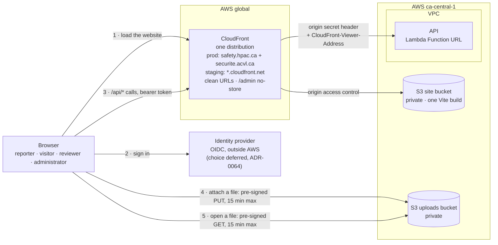
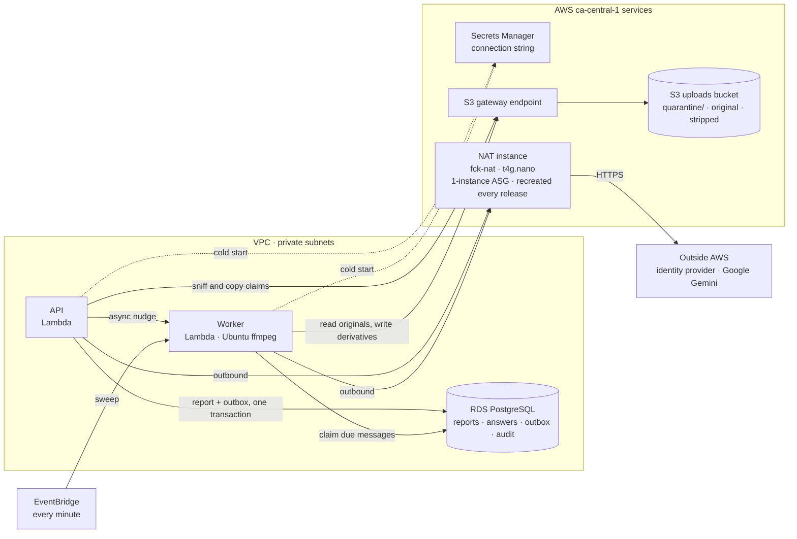
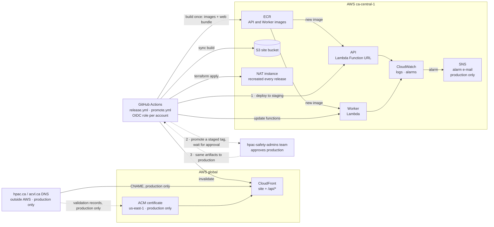

# Infrastructure and operations

This page describes the target: no AWS deployment exists yet. "Where today's
Terraform differs" says exactly what is still scaffolding, and
[`docs/deployment.md`](../docs/deployment.md) says what stage that work is at.

## Production topology

**CON-INF-001** Each environment (staging, production) is one deliberately
small AWS environment in `ca-central-1`, built from the same Terraform
([ADR-0158](decisions/ADR-0158-two-aws-accounts-staged-and-promoted-by-approval.md)).
*Verified by: none — an infrastructure property no application scenario can
observe; Terraform validation and the `infra` job are its check.*

The whole system runs in AWS. Everything that holds data is in `ca-central-1`;
the only global pieces are CloudFront, which serves the static website bundle
and routes `/api/*` to the API, and its `us-east-1` certificate (production
only). Hosting is set by
[ADR-0042](decisions/ADR-0042-lambda-hosted-api-with-fargate-migration-path.md)
(the API on Lambda) and
[ADR-0123](decisions/ADR-0123-the-worker-runs-on-lambda-and-the-website-on-s3-and-cloudfront.md)
(the Worker on Lambda, the website on S3 and CloudFront). There is no ALB
([ADR-0159](decisions/ADR-0159-cloudfront-routes-api-to-a-function-url-no-alb.md)).

### 1. How requests reach the system

There is no ALB: CloudFront is the one public entry point for both the
website and the API, on the path `/api/*`
([ADR-0159](decisions/ADR-0159-cloudfront-routes-api-to-a-function-url-no-alb.md)).
A CloudFront-injected secret header, checked before any other API middleware
runs, stops a request that reached the Function URL directly, bypassing
CloudFront.

### 2. How work is processed

The outbound calls, all over HTTPS through the NAT instance:

| Caller | Calls | For |
|---|---|---|
| API | the identity provider's published signing keys | validating a member's token ([ADR-0064](decisions/ADR-0064-jwt-bearer-authentication-with-three-roles.md)) |
| API | Google Gemini | an administrator's or reviewer's Translate draft, a separate translation call ([ADR-0179](decisions/ADR-0179-gemini-translates-everything-between-canadian-english-and-canadian-french.md), [ADR-0062](decisions/ADR-0062-administrators-may-machine-translate-question-text.md), [ADR-0108](decisions/ADR-0108-a-reviewer-may-machine-translate-a-summary-language.md)) |
| Worker | Google Gemini | the one summarization call per attempt ([ADR-0104](decisions/ADR-0104-summaries-are-generated-by-gemini-through-a-paid-key.md)) |
| Worker | Google Gemini | an answer's or a comment's second language, a separate translation call ([ADR-0179](decisions/ADR-0179-gemini-translates-everything-between-canadian-english-and-canadian-french.md), [ADR-0112](decisions/ADR-0112-only-answers-that-need-it-get-a-second-language.md), [ADR-0114](decisions/ADR-0114-members-may-comment-on-a-published-report.md)) |

### 3. How it is deployed and operated

How the pieces connect:

- **One public entry point per account: CloudFront.** It serves the static
  website from a private bucket only it can read, and routes `/api/*` to the
  API's Function URL, guarded by a CloudFront-injected secret header. There
  is no ALB
  ([ADR-0159](decisions/ADR-0159-cloudfront-routes-api-to-a-function-url-no-alb.md)).
  The website bundle holds no report data. The API authorizes every data
  request, so the delivery path is not the security boundary
  ([ADR-0048](decisions/ADR-0048-one-website-admin-as-a-route.md)).
- **Two accounts.** Staging is the owner's personal AWS account, which also
  runs unrelated workloads, holding synthetic data only. Production is a
  separate, HPAC-owned account holding real reports. The two accounts are not
  linked — production is not created from staging, and neither can assume a
  role in the other
  ([ADR-0158](decisions/ADR-0158-two-aws-accounts-staged-and-promoted-by-approval.md)).
- **Hostnames.** Production serves `safety.hpac.ca` and `securite.acvl.ca` on
  one CloudFront distribution with one `us-east-1` certificate. Staging uses
  only the default `*.cloudfront.net` address.
- **The API** is a Lambda function behind its Function URL. It validates the
  member's token, writes a report with its outbox messages in one
  transaction, and nudges the Worker.
- **The Worker** is a Lambda function.
  - The API's nudge starts it after each commit, and an EventBridge schedule
    sweeps once a minute, so a lost nudge only delays work.
  - Each run claims due outbox messages, processes them (a summary, an
    attachment, answer or comment translation), and returns.
- **Attachments** reach S3 only through a pre-signed PUT the API mints.
  - `POST /api/v1/uploads` returns a PUT of at most 15 minutes to one
    `quarantine/` key, signed for the declared type and exact size. A
    lifecycle rule expires an unclaimed upload after 15 days.
  - The uploads bucket accepts a cross-origin `PUT` only from the site
    origins ([ADR-0126](decisions/ADR-0126-an-attachment-uploads-straight-to-quarantine-by-pre-signed-put.md)).
  - Submission sniffs each claimed upload with ranged reads, then copies it
    inside the bucket.
  - The Worker writes derivatives.
  - A browser reads a file only through a pre-signed GET of at most 15
    minutes, never a public object URL
    ([ADR-0096](decisions/ADR-0096-an-attachment-uploads-on-attach-and-is-claimed-at-submission.md),
    [ADR-0117](decisions/ADR-0117-a-published-report-shows-the-reporters-photos-and-video.md),
    [ADR-0119](decisions/ADR-0119-a-published-report-offers-its-documents-for-download.md)).
- **Outbound calls** leave through the NAT instance: the identity provider's
  signing keys and Gemini. S3 traffic stays in the VPC through the
  gateway endpoint. The NAT instance is the only resource this system ever
  deletes and recreates; every other resource is created once and updated in
  place.
- **Migrations** apply at each function's cold start under a PostgreSQL
  advisory lock. There is no migration task
  ([ADR-0055](decisions/ADR-0055-ef-core-migrations-sql-files-stored-procedures.md)).
- **Deployment** is a published GitHub Release, tagged `YYYY.MM.DD-N`. It
  builds the API image, the Worker image, and the website bundle once and
  deploys them to staging automatically. Promoting a staged tag to production
  is a separate, deliberate step that deploys those same artifacts only after
  the `hpac-safety-admins` team approves. There is no apply on merge to `main`
  ([ADR-0158](decisions/ADR-0158-two-aws-accounts-staged-and-promoted-by-approval.md),
  [ADR-0166](decisions/ADR-0166-a-release-deploys-staging-and-a-separate-workflow-promotes-to-production.md)).
  Each account is reached only by its own short-lived OIDC role.
- **DNS** for `hpac.ca` and `acvl.ca` stays with their current hosts, outside
  AWS. A human adds the CNAME and certificate-validation records for
  production once; staging needs none.

### Where today's Terraform differs

`infra/` and the application code now match this target (#443, #465): the
API and the Worker are Lambda functions with no ALB, CloudFront routes
`/api/*` to the API's Function URL guarded by the origin-verify secret,
`staging.tfvars`/`production.tfvars` carry the only differences between the
two environments, both accounts get their `hpac-safety-staging`/
`hpac-safety-production` Resource Groups, the production pair of
hostnames plus a staging default address are both wired up, and a NAT
instance (`fck-nat`) replaces the managed NAT gateway. This remains open:

- `release.yml`'s build-once/staging/approved-production flow, and retiring
  the `deploy-*.yml` stubs, is #466's (#465 leaves the existing `terraform.yml`
  plan/apply jobs as a single-environment scaffold that #466 rewires to run
  per account).

**CON-INF-002** No SES/email resources, messaging integrations, public bucket or CDN copy of
an attachment (a published file is reached only through a pre-signed GET of
at most 15 minutes, ADR-0117), application encryption key, speculative queueing platform, or autoscaling
machinery is part of the target.
*Verified by: REQ-MOD-039 for the publication and messaging boundary; none for
the rest.* Existing infrastructure for those removed
features should be pruned when implementation aligns.

## Environments, release, and durability

**CON-INF-011** Two AWS accounts. Staging is the owner's personal AWS
account, which also runs unrelated workloads, and holds synthetic data only —
the Development-only members-site login
([ADR-0079](decisions/ADR-0079-a-development-login-may-verify-against-the-live-members-site.md))
never runs there. Production is a separate, HPAC-owned account holding real
reports. The two accounts are not linked: production is not created from
staging through AWS Organizations, and neither account can assume a role in
the other. Both are built from the one `infra/` root module, differing only
in `infra/staging.tfvars` and `infra/production.tfvars`. Each account carries
its own tag-based Resource Group — `hpac-safety-staging` and
`hpac-safety-production` — a grouping and cost-visibility tool, not a
security boundary; AWS closed AppRegistry (myApplications) to new accounts
([ADR-0170](decisions/ADR-0170-each-account-groups-its-resources-by-a-tag-based-resource-group-alone.md)). Every resource is tagged
`Project=HPAC-Safety`, `Environment=<staging|production>`,
`ManagedBy=terraform`, and `Repo=HPAC-Safety/safety-report`. Production serves
`safety.hpac.ca` and `securite.acvl.ca` on one CloudFront distribution with one
`us-east-1` certificate; staging serves only its default `*.cloudfront.net`
address
([ADR-0158](decisions/ADR-0158-two-aws-accounts-staged-and-promoted-by-approval.md)).
The identity provider is an external dependency this ADR does not choose
(ADR-0064): until `AUTH_AUTHORITY` is set for an environment, that
environment still starts and serves its public pages and public API
(REQ-MOD-156), but sign-in, filing a report (member-only, ADR-0067), review,
and administration cannot work there.
*Verified by: none — an infrastructure property no application scenario can
observe; Terraform validation and the `infra` job are its check.*

**CON-INF-012** A GitHub Release tagged `YYYY.MM.DD-N` builds the API image,
the Worker image, and the website bundle exactly once. Staging deploys those
artifacts automatically, and a release never deploys to, or waits on,
production. Production deploys only a tag a maintainer promotes, only once
that tag's release has succeeded on staging, using that release's same
artifacts, never a rebuild, and only after the `hpac-safety-admins` GitHub
team approves the `hpac-safety-production` environment. A promotion awaiting
approval never holds a staging release. There is no `terraform apply` on a
merge to `main` — a pull request only plans, against both accounts
([ADR-0158](decisions/ADR-0158-two-aws-accounts-staged-and-promoted-by-approval.md),
[ADR-0166](decisions/ADR-0166-a-release-deploys-staging-and-a-separate-workflow-promotes-to-production.md)).
*Verified by: none — an infrastructure property no application scenario can
observe; the `release` and `terraform` workflows are its check.*

**CON-INF-013** The NAT instance (`fck-nat` on a `t4g.nano`, in a one-instance
Auto Scaling group) is the only resource this system ever deletes and
recreates, and every release does so. Every other resource — the RDS
instance, the uploads bucket, Secrets Manager entries, CloudWatch log groups,
the VPC, CloudFront, ECR, IAM roles, alarms, and the Lambda functions
themselves — is created once and updated in place, never destroyed and
recreated by a release, in both environments. The RDS instance, the uploads
bucket, secrets, and log groups additionally carry `prevent_destroy` and, for
RDS, deletion protection and a final snapshot. A Terraform plan that would
destroy one of them fails review
([ADR-0158](decisions/ADR-0158-two-aws-accounts-staged-and-promoted-by-approval.md)).
*Verified by: none — an infrastructure property no application scenario can
observe; Terraform plan review and the `infra` job are its check.*

**CON-INF-014** Design principles for this infrastructure, from
[issue #30](https://github.com/HPAC-Safety/safety-report/issues/30): one way
to do each thing (one Terraform root, one bootstrap script, one release
workflow, one plan workflow; no modules directory, no workspaces, no
Terragrunt); the two environments differ only in their tfvars; everything is
code — nobody changes AWS through its console except the one-time steps in
issue #30's "Human work", and a release re-plans after it applies and fails
on drift; no hidden steps, every manual action is written down; every
Terraform file opens with a comment on what it creates and why, and
`infra/README.md` and `docs/deployment.md` say where to look; Renovate and
`terraform-relock.yml` keep images, Actions, the pinned NAT image, and
provider locks current; and an abstraction is added only when a second real
implementation needs it.
*Verified by: none — these are review-time properties no application scenario
can observe.*

**CON-INF-015** The API invokes the Worker's Lambda function asynchronously
right after a report submission, a comment, or a review action commits an
`OutboxMessage`, and only then — a save that queues nothing never nudges. A
failed nudge is logged and never fails the request that queued the work; the
EventBridge sweep is the delivery guarantee.
*Verified by: REQ-SUB-118, and in finer detail by `WorkerNudgeTests`
(`tests/HpacSafety.Api.Tests`).*
([ADR-0123](decisions/ADR-0123-the-worker-runs-on-lambda-and-the-website-on-s3-and-cloudfront.md))

**CON-INF-016** A Lambda invocation of the Worker drains due outbox messages —
across every registered processor, repeating until a pass claims nothing —
until either none is due or its remaining time falls inside a safety margin,
then returns without idling. The processors themselves are unchanged from the
polling loop a non-Lambda host still runs.
*Verified by: none — a Lambda invocation's own time budget is not something
`.spec/features` scenarios observe; proven directly by `OutboxDrainPassTests`
(`tests/HpacSafety.Worker.Tests`).*
([ADR-0123](decisions/ADR-0123-the-worker-runs-on-lambda-and-the-website-on-s3-and-cloudfront.md))

## Network and data protection

**CON-INF-003** Only the CloudFront distribution is public, in each account. There is no
ALB ([ADR-0159](decisions/ADR-0159-cloudfront-routes-api-to-a-function-url-no-alb.md)).
The API
and Worker Lambda functions are attached to private subnets; security groups narrowly allow API/Worker to RDS and necessary
egress. S3 public access is blocked. Managed encryption is
enabled for RDS, snapshots/backups, logs, secrets, and every bucket. TLS is
required for browsers, the identity provider, AWS service access, database
connections, and the model provider.
*Verified by: none — an infrastructure property no application scenario can
observe; Terraform validation and the `infra` job are its check.*

**CON-INF-017** The API refuses any request that does not carry CloudFront's
injected origin-secret header with the matching value, before any other
middleware runs — including authentication, rate limiting, and the forwarded-
headers ADR-0159 (superseding ADR-0081) governs. Left unconfigured
(Development, every test host), the check does not run; outside Development
it is required at startup, so a missing Secrets Manager value stops the host
cold rather than answering unverified.
*Verified by: REQ-SUB-116, and in finer detail by
`OriginVerificationMiddlewareTests` and `OriginVerificationRegistrationTests`
(`tests/HpacSafety.Api.Tests`).*
([ADR-0159](decisions/ADR-0159-cloudfront-routes-api-to-a-function-url-no-alb.md))

A small deployment uses one NAT instance, not a managed NAT gateway
(CON-INF-013), and the relevant AWS endpoints, to control cost. Availability,
backup retention, deletion protection, and final snapshot behavior are
explicit per-environment Terraform variables, not assumptions hidden in
application code.

## Configuration and secrets

Configuration includes database/storage endpoints, attachment count and per-kind size
limits (250 MB video, 25 MB image or document), accepted attachment types, the site origins (`site_origins`, which the
uploads bucket's CORS rule allows to `PUT`),
rate limits, the authentication issuer, audience, and role-claim name,
model/prompt version, retry bounds, and stuck-work thresholds.

**CON-INF-004** There are no cookie settings, no Turnstile configuration, and no HPAC auth kill
switch or hardcoded endpoint. Sessions are bearer tokens, Turnstile is gone
([ADR-0068](decisions/ADR-0068-the-member-token-replaces-turnstile-on-submission.md)),
and outside Development this system never contacts a member login endpoint
([ADR-0064](decisions/ADR-0064-jwt-bearer-authentication-with-three-roles.md)).
The one exception is Development's members-site sign-in
([ADR-0079](decisions/ADR-0079-a-development-login-may-verify-against-the-live-members-site.md)).
Forwarded headers are trusted without a proxy list; the API instead checks a
CloudFront-injected secret origin header and reads the client IP from
`CloudFront-Viewer-Address`, which only CloudFront sets
([ADR-0159](decisions/ADR-0159-cloudfront-routes-api-to-a-function-url-no-alb.md),
superseding [ADR-0081](decisions/ADR-0081-trust-forwarded-headers-from-the-security-group-boundary.md)).
*Verified by: REQ-SUB-018, REQ-MOD-003.*

**CON-INF-005** Secret values live in Secrets Manager and never in Terraform state, GitHub
variables, source, appsettings committed to the repository, logs, or task
definitions. Terraform creates the secret entry only; an authorized operator
supplies the value out of band, and the Lambda function's environment carries
only that secret's ARN — a non-secret identifier — which the application
reads itself, resolving the current value from Secrets Manager at cold start
(`SecretArnResolver`, #597; Lambda has no built-in resolve-this-ARN mechanism
the way the ECS agent did). Two entries exist, in both environments. The
Gemini key, `AiChatClient__ApiKey`, is read by the API and the Worker via
`AiChatClient__ApiKeySecretArn`: the Worker uses it for the summary call
([ADR-0104](decisions/ADR-0104-summaries-are-generated-by-gemini-through-a-paid-key.md)),
and both use it for every machine translation
([ADR-0179](decisions/ADR-0179-gemini-translates-everything-between-canadian-english-and-canadian-french.md)).
DeepL's key, `Translation__ApiKey`, stays wired to both via
`Translation__ApiKeySecretArn` but is dormant: kept so translation can be
switched back (issue #614).
Each Lambda role may read only its own secrets: the API's role can read the
Gemini and DeepL entries and the CloudFront origin-verify secret below; the
Worker's can read the Gemini and DeepL entries (`infra/iam.tf`). The identity provider is an
external dependency the Terraform in this directory does not create a secret
for yet
([ADR-0064](decisions/ADR-0064-jwt-bearer-authentication-with-three-roles.md)
— its client secret, if the eventual provider needs one, is #443/a future
issue's to add). The database connection is not one of these either: the
API and the Worker read the
RDS-managed master-user secret directly by its ARN (a non-secret identifier,
passed as a plain environment variable alongside the equally non-secret host,
port, and database name) and assemble the connection string themselves at
cold start; Terraform never reads that secret's value either.

**One recorded exception, and only this one:** the CloudFront origin-verify
routing token is the sole value this system lets Terraform both originate
(with `random_password`) and hold in Terraform state
([ADR-0159](decisions/ADR-0159-cloudfront-routes-api-to-a-function-url-no-alb.md),
[ADR-0163](decisions/ADR-0163-the-cloudfront-origin-secret-is-terraform-generated.md)).
Gemini, DeepL, and the database credentials above are unaffected and stay out
of state, exactly as this constraint otherwise requires. The exception is
narrow for three reasons: CloudFront's own distribution configuration holds
this value in its `origin.custom_header` argument regardless of how the value
was chosen, so keeping it out of state was never achievable by choosing a
human-typed value instead; the token protects no data by itself — it only
proves a request reached the API through this CloudFront distribution rather
than the Function URL directly, and every actual authorization decision is
still the JWT and role checks behind it; and Terraform state is already
reachable only by the `hpac-safety-deploy` and `hpac-safety-plan` roles,
against one encrypted, versioned, public-access-blocked bucket per account.
*Verified by: none — an infrastructure property no application scenario can
observe; Terraform validation and the `infra` job are its check.*

**CON-INF-006** **The development JWT signing key is deliberately not a secret.** It is a
throwaway symmetric key committed to `appsettings.Development.json`, following
the pattern already set by the committed development encryption key: it signs
tokens that only a developer's own machine will ever accept, and it appears in
no deployed environment because the development token issuer is not mapped
outside Development
([ADR-0066](decisions/ADR-0066-a-development-identity-provider-signed-with-a-dev-key.md)).
Production validates against the provider's published keys and holds no signing
key of its own.
*Verified by: REQ-MOD-019.*

## Deployment

**CON-INF-007** GitHub Actions authenticates to AWS through OIDC and short-lived role
assumption, one role per account per purpose (`hpac-safety-deploy`,
`hpac-safety-plan`). There are no long-lived AWS access keys. Pull requests run
build, test, security/configuration, web, and Terraform validation/plan checks
against both accounts without mutating either
([ADR-0158](decisions/ADR-0158-two-aws-accounts-staged-and-promoted-by-approval.md)).

Each account's roles are bootstrapped independently by `infra/bootstrap.sh`
(#464); one account is never reached through the other. `hpac-safety-deploy`
is trusted only by `repo:HPAC-Safety@307760008/safety-report@1341995834:environment:<that
account's GitHub environment — hpac-safety-staging or hpac-safety-production>`, and
`hpac-safety-plan` only by this repository's pull requests. Both trust
conditions are exact matches (`StringEquals`), never a wildcard subject.

Staging is the owner's own AWS account and also runs other, unrelated
applications. The deploy role's IAM and S3 grants are scoped by name to
`hpac-safety-*` resources, and — for the handful of services with no such
name pattern — creation is allowed only with the request's own
`Project=HPAC-Safety` tag (`aws:RequestTag`, a real `StringEquals`) while
every mutating action on a resource not **already** carrying that tag is
denied (`aws:ResourceTag`, `StringNotEquals`, no `IfExists`): an
`IfExists`-only tag check passes on an untagged resource, which describes
almost every resource belonging to another application, so it is not used as
the sole guard anywhere in the deploy policy. Creating a TAG is not treated
as creating a RESOURCE: a tag-adding action that has no way to prove it is
part of a genuine create call (unlike `ec2:CreateTags`, which AWS's own
`ec2:CreateAction` context key can tie to one) is either scoped to an
ARN only this system's own Terraform would name, or denied outright unless
the resource is already tagged ours — closing the path where this role could
otherwise stamp `Project=HPAC-Safety` onto another application's existing,
untagged resource and then, having "made it ours," modify or delete it. The
same reach also covers data, not only mutation: reading a secret value, a
Lambda function's environment variables, an ECR image layer, log/RDS-log
content, an SSM parameter, a DynamoDB item, or an SQS/Kinesis message is
denied outright except (where the resource has a predictable
HPAC-Safety-only name) for this system's own — and using a KMS key to
decrypt or encrypt data is allowed only when AWS itself is calling KMS on
this role's behalf through one of this system's own services, never as a
direct call, since a customer-managed key's own key policy (not this IAM
policy) usually decides who may use it. This has not been exercised against
a real AWS account — see `docs/deployment.md` "What `hpac-safety-deploy` may
do" for the residual risk and the two named, narrow exceptions this leaves.

On a published, date-tagged release:

1. immutable API and Worker images are built and pushed to ECR with the commit
   SHA, and the website is built once — all exactly once for the release;
2. staging deploys those same artifacts automatically: the API and Worker
   Lambda functions are updated to that image, and the website build is synced
   to its S3 bucket and the CloudFront distribution invalidated, each
   independently;
3. production deploys the identical artifacts only when a maintainer promotes
   that tag, and only after the `hpac-safety-admins` GitHub team approves the
   `hpac-safety-production` environment; and
4. health/readiness checks confirm the rollout in each account.

There is no `terraform apply` on a merge to `main`.

There is no migration task or deploy step. The API and the Worker each apply
pending migrations at startup, under a PostgreSQL advisory lock that re-checks
after it is taken, so whichever starts first migrates and the other finds
nothing to do ([ADR-0055](decisions/ADR-0055-ef-core-migrations-sql-files-stored-procedures.md)). Rollback deploys a known image/static
artifact; database migrations follow expand/contract compatibility when a
release may be rolled back.
*Verified by: none — an infrastructure property no application scenario can
observe; Terraform validation and the `infra` job are its check.*

## Operations

**CON-INF-008** Logs are structured and privacy-safe. Metrics cover request rate/error/latency,
submission rejection categories, outbox age and attempts, summary success/
failure, attachment validation/derivative success/failure, database health, task health, and
storage capacity. Dashboards avoid dimensions derived from report content.
*Verified by: REQ-AI-021, REQ-MED-003.*

**CON-INF-009** Alerts stay focused and actionable, and the application itself sends no
reporter or reviewer email.
*Verified by: REQ-MOD-039 for the absence of an outbound channel; none for the
alert set itself.*

**CON-INF-025** The Worker publishes one application metric, `OutboxOldestAgeSeconds` — how
old the oldest unclaimed, unpoisoned outbox row is — as a CloudWatch
Embedded Metric Format log line, every drain pass; no AWS SDK call, no new
dependency (`HpacSafety.Infrastructure.Observability`). The owner scaled
operations back for a lightly used system (#467, 2026-09-28): this is the
only metric the application emits, and the only alarm it feeds besides the
three below that read AWS's own signals directly.
*Verified by: none — an infrastructure/logging property no application
scenario observes directly; `infra/observability.tf` and its tests are the
check.*

**CON-INF-026** An operator may requeue outbox work that reached poison, once its cause is
resolved: invoking the Worker Lambda function directly with a
`{"requeue":"poison"}` payload (an optional time window narrows it) clears
poison and gives each matching row a fresh retry budget. Authorization is
whoever can invoke the function (IAM) — there is no sign-in and no admin UI
for it. Only a count and each row's own identifier are ever logged or
returned, never its payload.
*Verified by: REQ-DOM-016, REQ-DOM-017.*

Four alarms, each a short, self-contained description naming what is wrong
and what it affects, no link:

- the oldest unprocessed outbox row is older than 15 minutes;
- the API's Lambda function is throwing unhandled exceptions;
- the Worker's Lambda function is throwing unhandled exceptions; and
- the NAT instance's Auto Scaling group has no healthy instance.

Alerts route through SNS to `safety@hpac.ca`, in production only; staging's
topic has no subscriber
([ADR-0158](decisions/ADR-0158-two-aws-accounts-staged-and-promoted-by-approval.md)).
The application itself does not send reporter/reviewer email.

## Storage lifecycles and backups

**CON-INF-010** A fifteen-day lifecycle, matching the browser's saved report (ADR-0100), expires unreferenced quarantine candidates. No lifecycle
physically purges report-linked originals/derivatives merely because a report
was soft-deleted. RDS automated backups and final snapshots meet an explicit
retention policy; backup access is audited and limited. This operational
retention is distinct from application visibility.
*Verified by: REQ-DOM-010, REQ-DOM-011, REQ-DOM-012, REQ-MED-005.*
