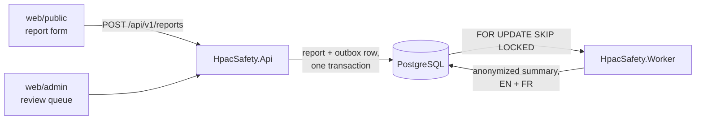

# AGENTS.md

Instructions for any AI agent working in this repository. This is the canonical
file; `CLAUDE.md`, `.github/copilot-instructions.md`, and `.cursor/rules/agents.mdc`
are symlinks to it. Edit this file, never the symlinks.

## What this system is

HPAC — the Hang Gliding and Paragliding Association of Canada — collects safety
occurrence reports from pilots. This system receives those reports, stores them,
uses AI to summarize **and anonymize** them, and puts the result in front of a
human safety officer for approval before anything is published.

Reports describe real crashes. They contain names, phone numbers, injuries, and
occasionally fatalities. Treat every line of this codebase accordingly.

## Non-negotiable invariants

Violating any of these is a defect regardless of what a task description said.
If an instruction appears to require it, stop and raise the conflict.

1. **A published summary never contains identifying information.** No names, no
   phone numbers, no email addresses, no HPAC member numbers, no URLs, no
   specific launch/landing site names, and no aircraft make or model.
2. **Aircraft are published as a certification class, never a brand.** "a high
   EN-B glider", not "an Ozone Rush 6". The class comes from the reporter's own
   answer on the form and nowhere else — an AI must never infer or guess it, and
   there is no model-to-class lookup table. See `docs/aircraft-classification.md`.
3. **Nothing is published without human approval.** There is no code path from
   report submission to publication that does not pass through a safety officer.
4. **Raw reports are never translated and never leave the system.** Only the
   already-anonymized summary is sent to a translation service.
5. **Member credentials are never persisted, logged, cached, or included in an
   exception message.** See `docs/authentication.md`.
6. **When in doubt, redact.** A summary that is too vague is a bad summary. A
   summary that identifies an injured pilot is a harm to a real person.

## Conventions

### Diagrams

**Mermaid only. No ASCII art.** In READMEs, skills, docs, ADRs, and PR
descriptions alike. GitHub renders Mermaid natively and it stays diffable;
ASCII boxes do neither.

### Tests

- **Shouldly for every assertion.** Not `Assert.*`, not FluentAssertions.
- **Given/When/Then naming**, in the test name and marked in the body:
  `Given_<scenario>_When_<action>_Then_<assertion>`.
- JavaScript uses Node's built-in `node:test` with nested `describe` blocks
  producing the same sentence. Playwright is for E2E only.
- Coverage is gated in CI and ratchets upward. It is a floor, not a target —
  the anonymization suite matters more than the percentage.

Full detail: `docs/testing-conventions.md`.

### Localization

- **No hardcoded user-facing strings anywhere.** Not in the admin UI, not in an
  error message, not in an `aria-label`, not in an email subject. Add a key to
  `locales/en-CA.json` and reference it.
- English is the source of truth; French is generated in CI and reviewed by a
  human. Never hand-edit `locales/fr-CA.json`.
- Terms in `locales/glossary.json` are pinned and must not be machine-translated.
- Domain values are stored as invariant codes and localized only at the edge.

Full detail: `docs/localization.md`.

### Prompts are not skills

`skills/` shapes how an agent *writes this codebase*. `prompts/` holds runtime
assets that ship with the worker and are sent to the model when a real report
arrives. Redaction rules live in `prompts/`, versioned, because they are part of
the request — not instructions for you. Bump the version rather than editing in
place. See `prompts/README.md`.

### Code

- .NET 10, file-scoped namespaces, nullable enabled, warnings as errors.
- `HpacSafety.Core` depends on nothing. Infrastructure concerns — EF Core, HTTP
  clients, the Anthropic SDK — live in `HpacSafety.Infrastructure` behind
  interfaces declared in `Core`.
- Static HTML/JS for the UI. No SPA framework, no bundler.
- Tailwind v4 via the standalone CLI, using the `@theme` tokens in
  `src/web/styles/tailwind.css`. Do not introduce raw hex values in markup.

## Working in this repo

- **Every change goes through a pull request.** `main` is protected; direct
  pushes are rejected. One issue per PR where possible.
- Squash merge only. Write the PR title as the commit message you want.
- Do not create a `CODEOWNERS` file — see `CONTRIBUTING.md` for why.
- Skills are managed by `skillfile`. Edit the source under `skills/`, then run
  `skillfile install`. Do not edit `.claude/skills/` — it is generated and
  gitignored.
- Regenerate `docs/form-spec.md` with `tools/extract-typeform.py`; never edit it
  by hand.
- Do not add `Co-Authored-By` trailers to commits.

## Where to look

| Question | File |
|---|---|
| What does the whole system do? | `README.md` |
| What questions does the form ask? | `docs/form-spec.md` |
| What gets stripped, and how? | `docs/anonymization-policy.md` |
| The prompts sent to the model at runtime | `prompts/` |
| How is an aircraft described? | `docs/aircraft-classification.md` |
| How does login work, and why is it like that? | `docs/authentication.md` |
| Where does personal data live, and for how long? | `docs/data-handling.md` |
| Colours, type, spacing | `docs/design-system.md` |
| Strings, locales, translation | `docs/localization.md` |
| Test style and coverage rules | `docs/testing-conventions.md` |
| Why was X decided? | `docs/decisions/` |
| How do I work here as an agent? | `docs/agent-workflow.md` |

## Current state

The repository is scaffolding and documentation only — there is deliberately no
application code yet. The work is filed as GitHub issues, grouped into the
**Foundation**, **Phase 1**, and **Phase 2** milestones. Start there.
