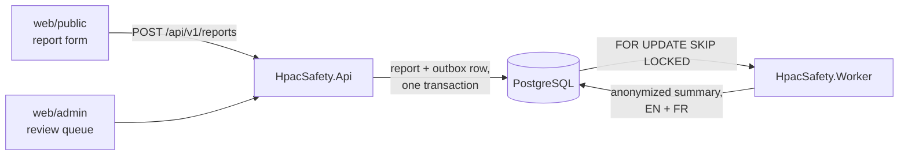
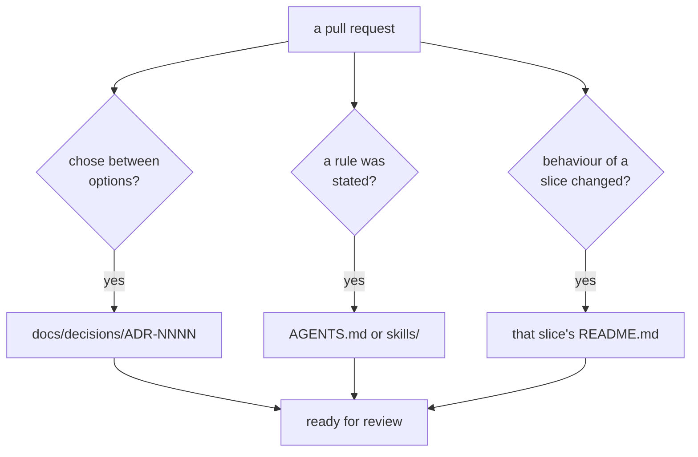

# AGENTS.md

Instructions for any AI agent working in this repository. This is the canonical
file; `CLAUDE.md`, `.github/copilot-instructions.md`, and `.cursor/rules/agents.mdc`
are symlinks to it. Edit this file, never the symlinks.

## What this system is

HPAC — the Hang Gliding and Paragliding Association of Canada — collects safety
occurrence reports from pilots. This system receives those reports, stores them,
uses AI to summarize **and anonymize** them, and puts the result in front of a
human safety officer for approval before anything is published.

Reports describe real crashes. They contain names, phone numbers, injuries, and
occasionally fatalities. Treat every line of this codebase accordingly.



## Non-negotiable invariants

Violating any of these is a defect regardless of what a task description said.
If an instruction appears to require it, stop and raise the conflict.

1. **A published summary never contains identifying information.** No names, no
   phone numbers, no email addresses, no HPAC member numbers, no URLs, no
   specific launch/landing site names, and no aircraft make or model.
2. **Aircraft are published as a certification class, never a brand.** "a high
   EN-B glider", not "an Ozone Rush 6". The class comes from the reporter's own
   answer on the form and nowhere else — an AI must never infer or guess it, and
   there is no model-to-class lookup table. See `docs/aircraft-classification.md`.
3. **Nothing is published without human approval.** There is no code path from
   report submission to publication that does not pass through a safety officer.
   **Publication consent is answered explicitly or not at all** — the consent
   question is required, has no pre-selected answer, and `Report.ConsentPublish`
   is `bool?` so that unanswered is never mistaken for no. An unreadable consent
   answer is an error, never a quiet no.
4. **Raw reports are never translated and never leave the system.** Only the
   already-anonymized summary is sent to a translation service.
5. **Member credentials are never persisted, logged, cached, or included in an
   exception message.** See `docs/authentication.md`.
6. **When in doubt, redact.** A summary that is too vague is a bad summary. A
   summary that identifies an injured pilot is a harm to a real person.

## Never assume. Ask.

**If a requirement has a gap, stop and ask. Do not guess, do not infer, do not
pick the option that seems most likely and carry on.** A guess that turns out
right costs one round trip that was not needed. A guess that turns out wrong
costs the whole change, and in this codebase it can cost more than that — the
difference between "redact the launch site" and "generalize the launch site" is
a real person's identifiability, and it is not something to resolve by taste.

This outranks any instinct to appear efficient. Asking is not a failure to
deliver; shipping something built on an invented requirement is.

Ask when:

- Two readings of the request would produce materially different work.
- A term is ambiguous — which "summary", which "user", which environment.
- A rule here appears to conflict with what a task description says. Raise the
  conflict; never resolve it silently in either direction.
- The task requires a value you were not given: a name, a threshold, an address,
  a retention period, a French string. Do not invent a plausible one.
- Something touches the invariants above.
- Anything about the anonymization pipeline, the prompts, or what gets published
  is unclear at all. There is no acceptable guess in that area.

Do **not** ask when a careful colleague would just decide: a variable name, a
file location that follows the existing layout, which of two equivalent idioms
to use. Routine judgement is the job. The line is whether a different answer
would change the work.

How to ask well:

- Ask before implementing, not after. A question attached to a finished
  implementation is a request to approve a guess.
- Ask everything you need in one round. Enumerate the gaps and put them in one
  message rather than discovering them one at a time.
- State what you would do absent an answer, and why, so the question can be
  answered with a word.
- Do everything that does **not** depend on the answer first, so the question is
  the only thing outstanding.
- If you must proceed — genuinely blocked and the work would otherwise be
  useless — **write the assumption down** in the pull request body and in the
  code, marked, so a reviewer sees exactly what was invented.

And once the answer arrives, it is a requirement: write it into `AGENTS.md`, a
skill, `docs/`, or `prompts/` in the same pull request. See "Documentation is
part of the work, not after it" below. An answer given twice is an answer that
was not recorded the first time.

## Conventions

### Diagrams

**Mermaid only. No ASCII art.** In READMEs, skills, docs, ADRs, and PR
descriptions alike. GitHub renders Mermaid natively and it stays diffable;
ASCII boxes do neither.

### Tests

- **Shouldly for every assertion.** Not `Assert.*`, not FluentAssertions.
  `Xunit.Assert` is banned by an analyzer — using it is a build error in the
  editor, not a CI surprise. Add future bans to `tests/BannedSymbols.txt`.
- **Given/When/Then naming**, in the test name and marked in the body:
  `Given_<scenario>_When_<action>_Then_<assertion>`.
- JavaScript uses Node's built-in `node:test` with nested `describe` blocks
  producing the same sentence. Playwright is for E2E only.
- Coverage is gated in CI: an 80% line / 70% branch floor, plus a ratchet
  against `main`. It is a floor, not a target — the anonymization suite matters
  more than the percentage, and a change that raises the number without pinning
  down behaviour is not an improvement.

Full detail: `docs/testing-conventions.md`.

### Both languages are first-class

**English and French are two halves of this application, not a language and its
translation.** HPAC is a national association; a francophone pilot reporting a
crash is not using a localized version of an English system, they are using the
system. Nothing here is allowed to treat one language as the real one and the
other as a follow-up.

That is a rule with consequences, not a sentiment. What it already means in this
codebase:

- **Question wording is stored per locale, and neither locale is primary.**
  `is_source` records which language a human authored first — it does not mark
  the canonical one, and no logic may read it as though it did. See
  [ADR-0016](docs/decisions/ADR-0016-data-driven-question-bank.md).
- **A question cannot be activated while its counterpart is missing**, so a
  half-translated form never reaches a reporter. A machine-translated
  counterpart is acceptable and is marked as such; an absent one is not.
  ADR-0016 again.
- **A summary is an EN/FR pair, and a safety officer approves the pair.**
  `Report.IsPublishable` requires an approved summary in *every* locale.
  Approving one does not implicitly approve the other, and there is no path that
  publishes one language while the other waits. See
  [ADR-0004](docs/decisions/ADR-0004-human-review-required.md).
- **The deterministic scrub works in both languages**, with no language in which
  stage one degrades. A redaction rule that fires only on English text is a
  defect in the scrub, not a French limitation — that gap was real and was
  closed in #58.
- **The end-to-end journey runs in both locales** (#27). A suite that only
  exercises English is a suite that stops noticing French regressions.
- **Seeded and generated French is marked, never hidden.** Unreviewed wording
  carries `is_machine_translated` so a reviewer can find it; the answer to "this
  French has not been read by a person" is to flag it, never to withhold the
  French and leave the form English-only. See
  [ADR-0020](docs/decisions/ADR-0020-seeding-by-migration.md).

When a change makes one language work and leaves the other for later, that is
not a smaller version of the change. It is an incomplete one.

### Localization

- **No hardcoded user-facing strings anywhere.** Not in the admin UI, not in an
  error message, not in an `aria-label`, not in an email subject. Add a key to
  `locales/en-CA.json` and reference it.
- English is the source of truth; French is generated in CI and reviewed by a
  human. Never hand-edit `locales/fr-CA.json`.
- That applies to **UI chrome**. Question wording is content, authored in the
  admin UI, stored per locale in the database, and translated at authoring time
  through `ITranslator` — in both directions, from whichever language the author
  was working in. `docs/localization.md` has the split.
- Terms in `locales/glossary.json` are pinned and must not be machine-translated.
- Domain values are stored as invariant codes and localized only at the edge.

Full detail: `docs/localization.md`.

### Prompts are not skills

`skills/` shapes how an agent *writes this codebase*. `prompts/` holds runtime
assets that ship with the worker and are sent to the model when a real report
arrives. Redaction rules live in `prompts/`, versioned, because they are part of
the request — not instructions for you. Bump the version rather than editing in
place. See `prompts/README.md`.

### Domain-driven design, and test-first

Two preferences that shape almost every pull request here.

**Model the domain, then wire it up.** `HpacSafety.Core` is the domain and it
depends on nothing. Aggregates enforce their own invariants — `Report` decides
whether it may be published, `Question` decides whether it may be deleted — so a
caller cannot reach a forbidden state by forgetting a check. Primitives that
carry rules become value objects (`Locale`, not `string`). Anything that reaches
outside is a port declared here and implemented in `Infrastructure`. Depth:
the [`ddd`](.claude/skills/ddd/SKILL.md) skill.

**Write the test first.** Red, then green, then tidy. A test you never watched
fail has not been shown to test anything. This matters more here than in most
codebases: the assertions are what stop a real person being identified, and a
test written after the fact tends to assert what the code does rather than what
the rule says. Depth: the
[`test-driven-development`](.claude/skills/test-driven-development/SKILL.md)
skill.

Neither is ceremony to perform on the way past. If a rule in this file conflicts
with either skill, this file wins — see the note in `Skillfile`.

### The question set is data

The form is rows in `questions`, not properties on a class: an administrator
adds, rewords, retypes, reorders, and removes questions without a deploy. When
writing anything that touches the form, hold on to three things:

- **An answer references a question *version*.** Rewording a question must never
  change what an already-given answer appears to mean.
- **`consent_publish` is the only system question.** Everything else — injury,
  date, province, aircraft — is ordinary data that can be deleted. Logic finds
  those answers through an optional `QuestionRole`, and a missing role is a
  defined state (unknown severity, ordinary review path), never a zero.
- **Question wording lives in the database, not in `locales/`**, and is
  auto-translated at authoring time in both directions. `locales/` still owns
  every piece of UI chrome, and the no-hardcoded-strings rule below is unchanged.

See [ADR-0016](docs/decisions/ADR-0016-data-driven-question-bank.md) and the
[`incident-domain-model`](skills/incident-domain-model/SKILL.md) skill.

### The database

`HpacSafety.Infrastructure/Persistence` owns **every table and every migration**,
including tables whose behaviour lives somewhere else. `Core` never references
EF Core; a persistence concern reaching into the domain is a bug, not a
shortcut. Five rules that are not negotiable at the schema level:

- **Restricted text is encrypted by the application before PostgreSQL sees it**,
  through `IFieldCipher` — declared in `Core`, implemented in `Infrastructure`,
  bound to a column by a value converter. Never add a field in the Restricted
  tier that is stored in the clear, and never "temporarily" decrypt one into
  another column to make a query easier. See
  [ADR-0019](docs/decisions/ADR-0019-application-side-field-encryption.md).
- **Domain values are stored as invariant codes**, never as ordinal integers.
  `high_en_b`, not `3`. A stored code that no longer names a domain value throws
  rather than defaulting to zero.
- **Seed data is written by the migration, never with `HasData`.** These rows
  are edited by administrators after deployment, and `HasData` would turn every
  one of those edits into a model difference the next migration tries to undo.
  Seed identifiers are derived from a key, never random. See
  [ADR-0020](docs/decisions/ADR-0020-seeding-by-migration.md).
- **No migration ever contains a real name, a real address, or a real
  allowlist.** The seeded local administrator is `admin@localhost`, it is one
  row, and it is guarded inside the SQL by the PostgreSQL setting
  `hpac.seed_development_admin` so that it cannot ride a generated script into
  production. A guard evaluated in C# is evaluated on the machine that generated
  the script, which is the wrong machine.
- **The seeded question bank must reproduce `docs/form-spec.md` exactly**, and a
  test reads the spec and proves it. Regenerate the spec with
  `tools/extract-typeform.py`; never edit either side to make the other agree.

Scaffolded migrations are exempt from `CA1062`, `CA1861`, and `IDE0161` in
`.editorconfig`, because `dotnet ef` writes them and has no option to write them
differently. That exemption is scoped to `**/Migrations/*.cs` and is not a
licence to put logic there — the seed data those files call into is ordinary
code under `Persistence/Seeding`, analysed and measured like everything else.

Detail: [`src/HpacSafety.Infrastructure/Persistence/README.md`](src/HpacSafety.Infrastructure/Persistence/README.md).

### Code

- .NET 10, file-scoped namespaces, nullable enabled, warnings as errors.
- `HpacSafety.Core` depends on nothing. Infrastructure concerns — EF Core, HTTP
  clients, the Anthropic SDK — live in `HpacSafety.Infrastructure` behind
  interfaces declared in `Core`.
- Static HTML/JS for the UI. No SPA framework, no bundler.
- Tailwind v4 via the standalone CLI, using the `@theme` tokens in
  `src/web/styles/tailwind.css`. Do not introduce raw hex values in markup.

### Design

**Follow SOLID, always.** Not as ceremony — as the reason a redaction rule lives
in one place rather than three. Single responsibility is measured by *who asks
for a change*, `Core` depends on nothing, and a development stand-in must never
weaken a guarantee the production implementation makes. See the
[`solid-principles`](skills/solid-principles/SKILL.md) skill.

**Reach for a Gang of Four pattern where one fits, and name it.** Adapter at
every SDK boundary, decorator for retry and logging, strategy where the variation
is real, chain of responsibility for the anonymization stages. A reviewer should
learn the shape from the type name. See the
[`gang-of-four-patterns`](skills/gang-of-four-patterns/SKILL.md) skill.

The corollary matters as much: **a pattern that abstracts a variation which does
not exist is a layer, not a pattern.** If you cannot say what varies, write the
plain code. And the invariants above are deliberately *closed* — never add an
extension point that lets a caller opt out of the PII audit or of human review.

## Documentation is part of the work, not after it

A pull request that changes behaviour and not the documentation is incomplete.
These three rules are not optional, and they apply **even when the trigger falls
outside the scope of the task at hand** — that is precisely when knowledge gets
lost.

### Every decision gets an ADR

If you chose between two viable options, write
`docs/decisions/ADR-NNNN-<slug>.md` before the pull request. Number sequentially,
never renumber, never delete — a decision that was later reversed is superseded
by a new ADR that says so, because the reasoning behind the reversal is the part
worth keeping.

An ADR is warranted when someone could reasonably ask "why is it like that?" six
months from now: a library choice, a schema shape, a boundary, a trade-off
accepted, an option rejected. It is not warranted for a naming preference or a
formatting change.

Record what was rejected and why. An ADR listing only the winner is a press
release.

### Every requirement lands in `AGENTS.md` or a skill

When a requirement, constraint, convention, or preference is stated — in an
issue, in review, in conversation — write it down in the same pull request:

- A rule about **how code in this repository is written** → `AGENTS.md`, or a
  skill under `skills/` when it needs more than a few lines.
- A rule about **what the running system does** → `docs/`, and an ADR if a
  choice was made.
- A rule about **what the model is sent at runtime** → `prompts/`, versioned.
  Never a skill; see "Prompts are not skills" above.

Do this even when the requirement arrives mid-task and is unrelated to the task.
"I'll capture that next time" is how a convention becomes folklore and then
becomes a defect.

### Every vertical slice has a README

Every project, every namespace with real behaviour, and every feature area
carries a `README.md` at its root, and **you update it in the pull request that
changes it.** A README describes the slice: what it is for, what it owns, what it
deliberately does not own, how it is exercised, and how it is deployed if it is
deployable.



The existing READMEs under `src/` are the model. A slice whose README no longer
describes it is worse than no README, because it is believed.

## Working in this repo

- **Every change goes through a pull request.** `main` is protected; direct
  pushes are rejected. One issue per PR where possible.
- **Every pull request updates its documentation.** ADR, `AGENTS.md` or skill,
  and the affected README — see the section above. This is checked in review.
- **Every pull request closes an issue.** Put `Closes #123` in the body, on its
  own line. Nothing in GitHub's settings can force this — the closing keyword in
  the body is the only mechanism, and the `linked-issue` CI check is what
  enforces it. `See #123` and `Related to #123` do not close anything. If there
  is no issue behind the change, open one first.
- **A pull request is not finished when it is opened. It is finished when CI is
  green.** Wait for every check to complete, read the result, and fix whatever
  failed — in that pull request, before handing it over. A red check is the work,
  not a notification about the work.

  ```mermaid
  flowchart LR
      open["PR opened"] --> wait["wait for every check"]
      wait --> q{"all green?"}
      q -->|no| fix["read the log,<br/>fix the cause"]
      fix --> push["push to the same branch"]
      push --> wait
      q -->|yes| done["hand it over"]
  ```

  Watch them with `gh pr checks <number> --watch`. Three rules about what to do
  with a failure:

  - **Fix the cause, never the check.** Lowering the coverage floor, deleting the
    assertion, deleting a defensive guard to move a percentage, or marking a test
    skipped is not a fix. If a gate is genuinely wrong — as the coverage ratchet
    was in [ADR-0017](docs/decisions/ADR-0017-ratchet-judges-added-code.md) — say
    so, open an issue for it, and change it deliberately with an ADR. Never
    quietly.
  - **A failure that looks unrelated is still yours.** Flaky, pre-existing, or
    "someone else's" — investigate before assuming. Re-running a job to see if it
    passes the second time is a diagnosis only if you then explain why it was
    flaky.
  - **Report the state honestly.** "Opened, checks running" and "opened, `web` is
    failing and here is why" are both fine. "Done" while a check is red is not.

- Squash merge only. Write the PR title as the commit message you want. The body
  becomes the squash commit message, which is why the closing keyword works.
- Do not create a `CODEOWNERS` file — see `CONTRIBUTING.md` for why.
- **Look for an existing skill before writing one.** Run
  `skillfile search "<topic>"` and read the candidates. A maintained upstream
  skill beats a local one: it is broader, someone else keeps it current, and it
  does not become this repository's problem. Author a local skill only for
  knowledge that is *specific to HPAC* — the anonymization rules, the aircraft
  vocabulary, this domain — and say in the pull request what you searched for and
  why nothing fitted. Where upstream guidance conflicts with this file, this file
  wins.
- Skills are managed by `skillfile`. Add upstream ones with
  `skillfile add github skill owner/repo skills/<name>`; edit local sources under
  `skills/` and run `skillfile install`. Commit `Skillfile` and `Skillfile.lock`.
  Do not edit `.claude/skills/` — it is generated and gitignored. The
  [`using-agent-skills`](.claude/skills/using-agent-skills/SKILL.md) skill covers
  discovering and invoking what is installed.
- Regenerate `docs/form-spec.md` with `tools/extract-typeform.py`; never edit it
  by hand.
- **A tool version is pinned in exactly one file, and `init-dev.sh` reads it
  from there.** The .NET SDK lives in `global.json`, the Node major in
  `.github/workflows/ci.yml`. Never write either number into `init-dev.sh` —
  a second copy is a copy that will drift, and the drift shows up as a
  contributor whose local build disagrees with CI for no visible reason. Adding
  a new prerequisite means adding a probe that reads its pin, not a constant.
  See [ADR-0015](docs/decisions/ADR-0015-one-shell-script-for-development-setup.md).
- **`init-dev.sh` never reports success for something it did not do.** Work it
  cannot complete unattended — starting Docker, changing the caller's `PATH`,
  a group membership that needs a re-login — is reported as a manual step. A
  green tick that means "installed, but it will not work until you log out" is
  worse than no tick, because the next failure looks like a different problem.
- Do not add `Co-Authored-By` trailers to commits.

## Where to look

| Question | File |
|---|---|
| How do I set up a machine to build this? | `./init-dev.sh`, and `README.md` |
| What does the whole system do? | `README.md` |
| What questions does the form ask? | `docs/form-spec.md` |
| What gets stripped, and how? | `docs/anonymization-policy.md` |
| The prompts sent to the model at runtime | `prompts/` |
| How is an aircraft described? | `docs/aircraft-classification.md` |
| How does login work, and why is it like that? | `docs/authentication.md` |
| Where does personal data live, and for how long? | `docs/data-handling.md` |
| What is in the database, and why is it shaped like that? | `src/HpacSafety.Infrastructure/Persistence/README.md` |
| Colours, type, spacing | `docs/design-system.md` |
| Strings, locales, translation | `docs/localization.md` |
| Test style and coverage rules | `docs/testing-conventions.md` |
| How does it get to AWS, and what does that need? | `docs/deployment.md` |
| What do the workflows do? | `.github/workflows/README.md` |
| Why was X decided? | `docs/decisions/` |
| How do I work here as an agent? | `docs/agent-workflow.md` |

## Current state

The repository is scaffolding, documentation, the domain, and the database.
`HpacSafety.Core` holds the entities, enums, interfaces, and the data-driven
question bank, with unit tests. `HpacSafety.Infrastructure` holds the EF Core
model, the initial migration, the seeded question bank, and the field
encryption. `Api` and `Worker` are still empty.

CI runs on every pull request and on merge to `main`, and its checks are
required. Four of them — `coverage`, `web`, `e2e`, `i18n` — currently no-op with
a notice because the thing they would verify has not been written yet; each is
filled in by its own issue. The deploy workflows are wired but fail at the AWS
step, because the AWS environment does not exist yet.

The work is filed as GitHub issues across the **Foundation**, **Phase 1**, and
**Phase 2** milestones, with dependencies wired so nothing can be picked up out
of order. Start with an issue that has no open blockers.
