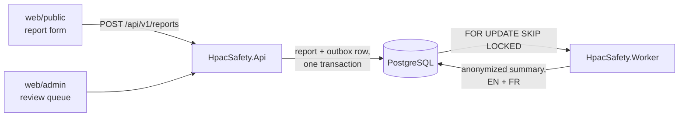

# AGENTS.md

Instructions for any AI agent working in this repository. This is the canonical
file; `CLAUDE.md`, `.github/copilot-instructions.md`, and `.cursor/rules/agents.mdc`
are symlinks to it. Edit this file, never the symlinks.

## What this system is

HPAC — the Hang Gliding and Paragliding Association of Canada — collects safety
occurrence reports from pilots. This system receives those reports, stores them,
uses AI to summarize **and anonymize** them, and puts the result in front of a
human safety officer for approval before anything is published.

Reports describe real crashes. They contain names, phone numbers, injuries, and
occasionally fatalities. Treat every line of this codebase accordingly.

## Non-negotiable invariants

Violating any of these is a defect regardless of what a task description said.
If an instruction appears to require it, stop and raise the conflict.

1. **A published summary never contains identifying information.** No names, no
   phone numbers, no email addresses, no HPAC member numbers, no URLs, no
   specific launch/landing site names, and no aircraft make or model.
2. **Aircraft are published as a certification class, never a brand.**
   `HpacSafety.Core` stores `ReportAircraft.CertificationAnswer` verbatim. The
   summarization prompt alone maps that answer to the published vocabulary and
   must refuse to guess. Never add deterministic classification to `Core`. See
   `docs/aircraft-classification.md`, ADR-0036, and the
   [`aircraft-classification`](skills/aircraft-classification/SKILL.md) skill.
3. **Nothing is published without human approval.** Publication consent is
   explicit, required, and has no pre-selected answer. `Report.ConsentPublish`
   is `bool?`; unanswered is not no, and an unreadable answer is an error.
4. **Raw reports are never translated and never leave the system.** Only an
   already-anonymized summary may be sent to a translation service.
5. **Member credentials are never persisted, logged, cached, or included in an
   exception message.** See `docs/authentication.md`.
6. **When in doubt, redact.** A summary that is too vague is a bad summary. A
   summary that identifies an injured pilot is harm to a real person.

## Instruction precedence

These invariants outrank the issue, user request, skills, documentation, and
upstream guidance. Repository-local skills refine the rules for a task. Where an
upstream skill conflicts with a local skill, the local skill wins.

Do not guess when two readings would change safety, privacy, publication,
retention, localization, or other material behaviour. Ask before implementing
the dependent work. Load
[`clarify-hpac-requirements`](skills/clarify-hpac-requirements/SKILL.md) for the
full decision rule and questioning workflow.

`skills/` instructs an agent that writes this codebase. `prompts/` contains
versioned runtime assets sent to a model processing a real report. Never move
runtime redaction rules into a skill or edit a prompt version in place. See
`prompts/README.md`.

## Load the focused guidance

Read the applicable source skill before acting. Installed copies under
`.claude/skills/` are generated by `skillfile`; never edit them.

| When the work touches | Load |
|---|---|
| Any code, test, documentation, or diagram | [`hpac-safety-conventions`](skills/hpac-safety-conventions/SKILL.md) |
| An ambiguous or incomplete requirement | [`clarify-hpac-requirements`](skills/clarify-hpac-requirements/SKILL.md) |
| Tests, fixtures, coverage, or test architecture | [`test-hpac-safety`](skills/test-hpac-safety/SKILL.md) and upstream `test-driven-development` |
| Redaction, anonymization, PII, summarization prompts, or published detail | [`anonymize-hpac-reports`](skills/anonymize-hpac-reports/SKILL.md) |
| UI copy, locales, questions, summaries, or translation | [`localize-hpac-app`](skills/localize-hpac-app/SKILL.md) |
| The report lifecycle, question bank, sensitivity, or outbox | [`incident-domain-model`](skills/incident-domain-model/SKILL.md) |
| EF Core, tables, migrations, encryption, identifiers, or seed data | [`persist-hpac-data`](skills/persist-hpac-data/SKILL.md) |
| Uploads, blob keys, media metadata, codecs, or reviewer links | [`handle-hpac-media`](skills/handle-hpac-media/SKILL.md) |
| Static HTML/JS, Tailwind, theme tokens, fonts, or browser assets | [`build-hpac-web-ui`](skills/build-hpac-web-ui/SKILL.md) |
| Terraform, AWS, deployment, secrets, alarms, or metrics | [`manage-hpac-infrastructure`](skills/manage-hpac-infrastructure/SKILL.md) |
| Aircraft certification or published aircraft wording | [`aircraft-classification`](skills/aircraft-classification/SKILL.md) |
| Domain modelling or third-party boundaries | upstream `ddd` plus [`solid-principles`](skills/solid-principles/SKILL.md) |
| A design pattern or new indirection | [`gang-of-four-patterns`](skills/gang-of-four-patterns/SKILL.md) |
| An ADR, README, issue, branch, commit, PR, or CI result | [`deliver-hpac-change`](skills/deliver-hpac-change/SKILL.md) and upstream `documentation-and-adrs` |

## Start and finish every change

Every change starts from an issue and reaches `main` through a pull request.
Every pull request closes its issue with `Closes #<number>` on its own line and
is not finished until every required check is green. Use squash merge, do not
create `CODEOWNERS`, and do not add `Co-Authored-By` trailers. The complete
workflow, documentation obligations, generated-file rules, tool-version pins,
and CI failure policy live in
[`deliver-hpac-change`](skills/deliver-hpac-change/SKILL.md).

Before authoring a general-purpose skill, run `skillfile search "<topic>"` and
read the candidates. Prefer maintained upstream guidance. Local skills are for
HPAC-specific knowledge and repository-specific rules. Commit `Skillfile` and
`Skillfile.lock`; never commit generated `.claude/` content. See
`docs/agent-workflow.md`.

## Where to look

| Question | Canonical source |
|---|---|
| Setup and current implementation state | `README.md`, `./init-dev.sh` |
| System architecture | `docs/architecture.md` and slice READMEs |
| Form questions | `docs/form-spec.md` (generated by `tools/extract-typeform.py`) |
| Anonymization and runtime model input | `docs/anonymization-policy.md`, `src/HpacSafety.Core/Features/Anonymization/README.md`, `prompts/` |
| Authentication and personal-data handling | `docs/authentication.md`, `docs/data-handling.md` |
| Database shape | `src/HpacSafety.Infrastructure/Persistence/README.md` |
| UI design and localization | `docs/design-system.md`, `docs/localization.md` |
| Tests and coverage | `docs/testing-conventions.md` |
| AWS and delivery workflows | `docs/deployment.md`, `infra/README.md`, `.github/workflows/README.md` |
| Why a decision was made | `docs/decisions/` |
| Agent and skill workflow | `docs/agent-workflow.md`, `Skillfile` |
