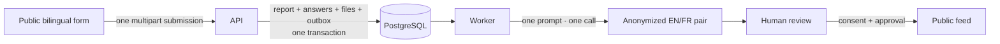

# HPAC Safety Occurrence Reporting

HPAC Safety is the bilingual occurrence-reporting system for the Hang Gliding
and Paragliding Association of Canada. It collects database-driven reports,
creates an anonymized English/French safety-summary pair with one AI call, and
requires human approval before publication.

> **Implementation status:** the repository contains substantial domain,
> persistence, media, web-asset, CI, and infrastructure scaffolding, but the
> complete target flow is not implemented. The audited gaps are listed in
> [`docs/implementation-status.md`](docs/implementation-status.md). Do not infer
> feature completion from an old closed issue or README.

## Canonical specification

[`features/README.md`](features/README.md) is the design authority and index for every
feature, boundary, DTO, lifecycle rule, and implementation gap. Older ADRs and
GitHub issues are historical context when they disagree with `/features`.

The target flow is deliberately small:



- Questions are complete immutable English/French database revisions. Every
  question is optional except explicit publication consent.
- An unfinished report exists only in the respondent's browser for 15 days.
  Nothing is written to the API, database, or attachment storage until the one
  final multipart submission.
- Private answers help the one model call recognize identifying text; they are
  never facts for publication. A repeated private name becomes a role such as
  “the pilot” / “le pilote,” with no name fragment left behind.
- Images and videos receive safe reviewer derivatives. Documents are validated
  private originals and are never anonymized, parsed, sent to AI, or published.
- Public output contains only the report ID, both approved summary texts, and
  publication time.

The system has no separate PII-audit or translation call, deterministic text
scrubber, specialized aircraft processing, application-managed field
encryption, email-notification pipeline, pre-submit upload session, or external
publication channels.

## Technology

| Area | Choice |
|---|---|
| API and Worker | .NET 10 / ASP.NET Core |
| Database | PostgreSQL with EF Core |
| Web | React 18 + TypeScript, built with Vite; Tailwind v4 via `@tailwindcss/vite`; `@dnd-kit` for reordering, behind one owned component ([ADR-0059](docs/decisions/ADR-0059-dnd-kit-for-reordering.md)) |
| Authentication | Bearer JWT from an external OAuth/OIDC provider — Auth0 or AWS Cognito, not yet chosen — with three roles read from a claim and no user records stored ([ADR-0064](docs/decisions/ADR-0064-jwt-bearer-authentication-with-three-roles.md), [ADR-0065](docs/decisions/ADR-0065-no-user-records-identity-is-the-token-subject.md)). Development signs its own tokens ([ADR-0066](docs/decisions/ADR-0066-a-development-identity-provider-signed-with-a-dev-key.md)) |
| Tests | xUnit, Shouldly, Testcontainers, `node:test`, Playwright |
| Hosting target | AWS `ca-central-1`, deployed through GitHub OIDC |

One Vite/React app serves the report form as its default route and the
review queue at `/admin`; the API's role-claim authorization is the security
boundary, not the delivery path
([ADR-0048](docs/decisions/ADR-0048-one-website-admin-as-a-route.md)). The API
runs as a container image on Lambda behind the ALB, sized for sparse traffic
with a Fargate migration path if that changes
([ADR-0042](docs/decisions/ADR-0042-lambda-hosted-api-with-fargate-migration-path.md)).
The Worker and the one web container run as ECS Fargate services; CloudFront
sits in front of the ALB. Runtime data stays in Canada, object storage remains
private, and migrations run as an explicit deployment step.

## Getting started

You need Git. The setup script checks or installs the repository-pinned tools:

```bash
git clone git@github.com:HPAC-Safety/safety-report.git
cd safety-report
./init-dev.sh
```

On Windows, run it from Git Bash. To inspect without installing anything:

```bash
./init-dev.sh --check
```

Common verification commands:

```bash
dotnet build HpacSafety.slnx
dotnet test HpacSafety.slnx
node --test $(find tests/js -name '*.test.mjs')
npm --prefix src/web ci && npm --prefix src/web run build
```

Integration tests require Docker. See [`tests/README.md`](tests/README.md) and
[`CONTRIBUTING.md`](CONTRIBUTING.md).

Before pushing, run the same coverage gate CI runs, so a regression is caught
locally rather than in the PR:

```bash
./check-coverage.sh
```

It collects coverage, fetches main's last successful run as the ratchet
baseline (via `gh`), and runs `tools/coverage-gate.mjs` — the same floor
(80%/70%) and ratchet CI enforces. `./check-coverage.sh --no-baseline` skips
the `gh` fetch and enforces only the floor.

## Repository map

| Path | Purpose |
|---|---|
| [`features/`](features/README.md) | Canonical product and system specification |
| [`src/`](src/HpacSafety.Core/README.md) | Core, Infrastructure, API, Worker, and the React/Vite web app |
| [`tests/`](tests/README.md) | Unit, integration, contract, JS, and browser tests |
| [`skills/`](skills/hpac-safety-conventions/SKILL.md) | Focused project-specific coding-agent guidance |
| [`docs/`](docs/architecture.md) | Concise operational notes and historical ADRs |
| [`infra/`](infra/README.md) | Terraform and AWS bootstrap scaffolding |
| [`locales/`](locales/en-CA.json) | Reviewed application UI catalogues |

Runtime AI instructions live with the Worker under
`src/HpacSafety.Worker/Prompts/`.

## Security

Never put real report content in an issue, PR, test, fixture, or log. Report
vulnerabilities privately as described in [`SECURITY.md`](SECURITY.md).

## Licence

MIT — see [`LICENSE`](LICENSE).
