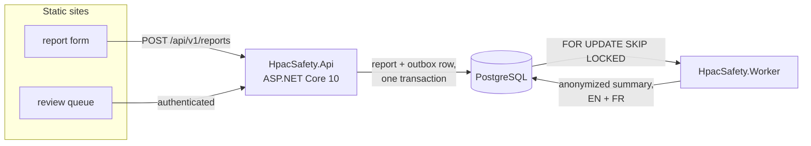
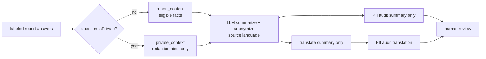
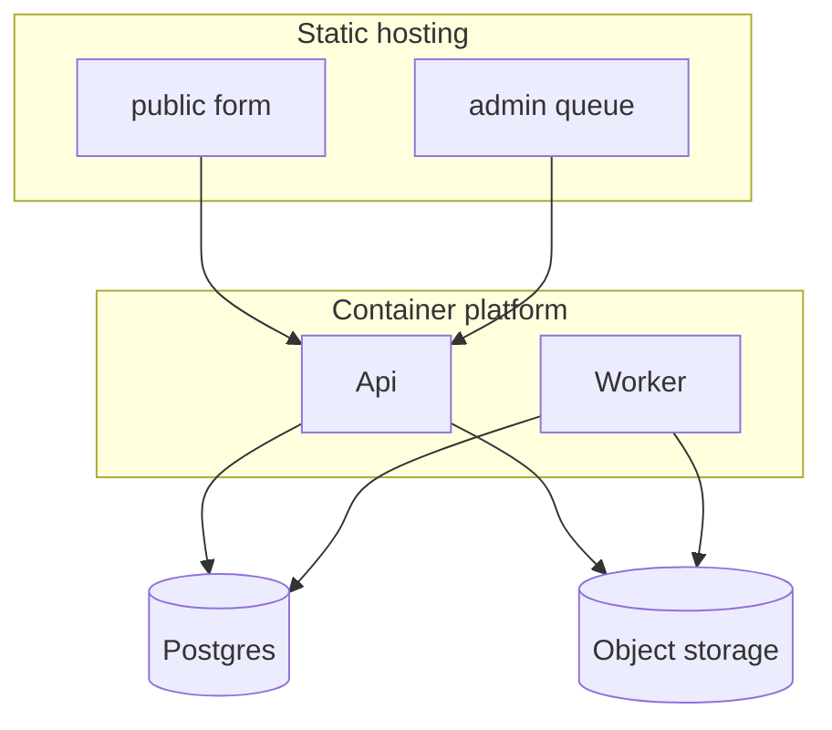

# HPAC Safety Occurrence Reporting

A reporting system for the **Hang Gliding and Paragliding Association of
Canada**. Pilots file reports about incidents and accidents; the system stores
them, uses AI to summarize **and anonymize** each one, and puts the result in
front of a human safety officer before anything is published.

HPAC runs a **non-punitive** reporting system. Pilots report their own mistakes
so that others can learn from them, on the understanding that what gets
published cannot identify anyone. This repository exists to keep that promise
mechanically rather than by hand.

> **Status: scaffolding.** There is no application code yet — deliberately. The
> design lives in `docs/`, and the work is filed as issues across the
> **Foundation**, **Phase 1**, and **Phase 2** milestones.

## How it works



A pilot submits a report. The API stores it and, in the same transaction, writes
an outbox row. A separate worker picks that up and runs the anonymization
pipeline. The result waits for a safety officer.

## The anonymization flow



Question privacy is chosen once, when an administrator creates a question, and
cannot be changed later. The summarization LLM is the only textual anonymizer:
it receives private fields in a separate context so it can recognize the same
details inside a non-private narrative without treating them as summary facts.
There is no regex scrub layer. Audit and translation receive summary text only.

## What this system will never publish

- A name — reporter, pilot, passenger, instructor, or witness
- A phone number, email address, or HPAC member number
- The make or model of an aircraft. A summary says "a high EN-B glider", never
  "an Ozone Rush 6"
- A specific launch or landing site
- An uploaded photo or video
- Anything at all without a safety officer's approval
- Anything at all where the reporter did not consent to publication

The last two are absolute: there is no code path around them.

Details in [`docs/anonymization-policy.md`](docs/anonymization-policy.md).

## Bilingual

`en-CA` and `fr-CA` throughout — form, admin UI, API messages, emails, and
published summaries. The browser's language selects the locale, English is the
fallback, and a toggle is always visible.

A report is stored in the language it was written in and **never translated** —
it is the reporter's own account. The *summary* is generated in that language
and then translated, so both versions exist for every report. A safety officer
approves the pair.

Details in [`docs/localization.md`](docs/localization.md).

## Stack

| Layer | Choice |
|---|---|
| API | ASP.NET Core, .NET 10 |
| Worker | .NET 10 background service, outbox consumer |
| Database | PostgreSQL + EF Core |
| Web | Plain HTML + JavaScript, no bundler; Tailwind v4 standalone CLI |
| AI | Anthropic API behind `ISummarizer` / `IPiiAuditor` |
| Tests | xUnit + Shouldly + Testcontainers; `node:test`; Playwright |
| Local dev | Docker Compose |
| Hosting | AWS `ca-central-1` — ECS Fargate, RDS, S3 + CloudFront, SES |
| Deploys | GitHub Actions via OIDC role assumption; no stored AWS keys |
| Infrastructure | Terraform in `infra/`, planned on PRs and applied on merge |
| CI | GitHub Actions — `build`, `test`, `coverage`, `web`, `e2e`, `agent-config`, `i18n`, `infra`, `linked-issue`, all required |

Storage and email still sit behind `IBlobStore` and `IEmailSender`, so local
development runs on the filesystem and a logging mailer without touching AWS.

## Layout

```
init-dev.sh        one-command development environment setup
AGENTS.md          canonical agent instructions (CLAUDE.md et al. symlink to it)
Skillfile          declarative skill management
skills/ agents/    authored skills — sources for `skillfile install`
HpacSafety.slnx    solution (.NET 10)
src/               Core · Infrastructure · Api · Worker · web  (README in each)
tests/             unit · integration · privacy/model contracts · js · e2e
prompts/           versioned runtime prompts sent to the model
locales/           en-CA.json (source), fr-CA.json (generated)
docs/              design, policy, ADRs
infra/             the AWS environment as Terraform, plus the one-time bootstrap
tools/             generators and build scripts
```

## Deployables

Four things ship, and they ship independently. Each has its own README with the
deployment specifics.

| Component | Deployable | How |
|---|---|---|
| [`src/HpacSafety.Api`](src/HpacSafety.Api/README.md) | Yes | Container, long-running service |
| [`src/HpacSafety.Worker`](src/HpacSafety.Worker/README.md) | Yes | Container, long-running service — not a cron job |
| [`src/web/public`](src/web/README.md) | Yes | Static site — the report form |
| [`src/web/admin`](src/web/README.md) | Yes | Static site — the review queue, separate origin |
| [`src/HpacSafety.Core`](src/HpacSafety.Core/README.md) | No | Class library. Depends on nothing. |
| [`src/HpacSafety.Infrastructure`](src/HpacSafety.Infrastructure/README.md) | No | Class library |



Hosting is **AWS, `ca-central-1`** — ECS Fargate for the API and Worker, RDS
PostgreSQL, S3 and CloudFront for the static sites, SES for mail. The Canadian
region is deliberate: reports contain personal information about identifiable
people. See [ADR-0009](docs/decisions/ADR-0009-hosting-on-aws.md).

Deploys run from GitHub Actions using **OIDC role assumption — no AWS access
keys are stored anywhere.** CloudFront Functions provide the URL rewrites the
static sites need for clean URLs, which is why GitHub Pages was not an option;
see [`src/web/README.md`](src/web/README.md).

Two deployment rules worth stating up front:

- **Migrations run as their own step before the new API version takes traffic**,
  never automatically at startup — that races when more than one instance boots.
- **The public and admin sites deploy separately.** Different audiences,
  different risk. The admin surface can then sit behind extra network controls
  without affecting a pilot's ability to file a report.

## Getting started

You need `git`. Everything else is installed for you.

```bash
git clone git@github.com:HPAC-Safety/safety-report.git
cd safety-report
./init-dev.sh
```

That is the whole setup. On Windows, run the same command from **Git Bash** —
the shell that ships with Git for Windows — not from PowerShell or `cmd`.

`init-dev.sh` reports what it found, installs what is missing, and finishes by
telling you either that you are ready or exactly what is left for you to do:

```
safety-report — development environment
  · platform: macos, package manager: brew
  · required: .NET SDK 10.0.100 (global.json), Node 22 (.github/workflows/ci.yml)

git
  ✓ git 2.54.0

.NET SDK
  ✓ .NET SDK 10.0.302 satisfies global.json

Docker
  ✓ Docker 29.5.2 is running
  ✓ docker compose plugin

...

summary
  Ready. Build and test with:
    dotnet build HpacSafety.slnx
    dotnet test  HpacSafety.slnx
```

Then read [`AGENTS.md`](AGENTS.md) and pick an issue from the Foundation
milestone.

### What it installs

Every version below is read out of the file that already pins it, at the moment
the script runs. There is no second copy of a version number inside the script,
so bumping the pinning file is all it takes to change what a new contributor
gets.

| Tool | Version | Read from | Needed for |
|---|---|---|---|
| .NET SDK | `10.0.100` | `global.json` | building and testing everything |
| Docker | current | — | Testcontainers integration tests, local `compose` |
| Node.js | 22 or newer | `.github/workflows/ci.yml` | `node:test`, the coverage gate, Playwright |
| .NET local tools | pinned | `.config/dotnet-tools.json` | the merged coverage report |
| Python 3 | any | — | *optional* — `tools/extract-typeform.py`, serving `src/web` |
| `skillfile` | latest | `Skillfile.lock` | *optional* — agent skills into `.claude/` |

Packages come from your platform's own manager — `winget` or Chocolatey on
Windows, Homebrew on macOS, `apt`, `dnf`, or `pacman` on Linux. The one
exception is the .NET SDK, which uses Microsoft's official installer because no
package manager can pin an exact SDK version, and pinning is the point.

### Options

| Command | What it does |
|---|---|
| `./init-dev.sh` | Install whatever is missing, then restore the repository |
| `./init-dev.sh --check` | Report only. Installs nothing, touches nothing, exits non-zero if a required tool is missing |
| `./init-dev.sh --help` | Usage |

The script is **idempotent** — running it twice does the same thing as running
it once, and the second run installs nothing. Run it again any time: after a
`global.json` bump, after a machine rebuild, or when a build fails for a reason
you cannot place.

### Things the script cannot do for you

These are reported as numbered steps at the end of a run rather than silently
skipped. The script never claims to have done something it did not do.

- **Start Docker.** Docker Desktop cannot be launched unattended on macOS or
  Windows. Install completes; starting it once is yours.
- **Change your `PATH`.** A script cannot alter the shell that invoked it. If
  the .NET SDK lands in `~/.dotnet`, the script prints the exact `export` line
  to add to `~/.zshrc` or `~/.bashrc`.
- **Join you to the `docker` group.** On Linux this takes effect at your next
  login.
- **Enable symlinks on Windows.** Windows contributors need
  `git config core.symlinks true` and Developer Mode, or the agent instruction
  symlinks arrive as plain text files containing a path. See
  [`docs/agent-workflow.md`](docs/agent-workflow.md).

If your platform has no package manager the script can use, it says so up front
and prints where to get one, rather than failing later with
`command not found`.

Why one shell script rather than PowerShell, a `.sh`/`.ps1` pair, or a
devcontainer: [ADR-0015](docs/decisions/ADR-0015-one-shell-script-for-development-setup.md).

## Built by agents

This project is built primarily by AI agents, and the configuration is
deliberately tool-agnostic: `AGENTS.md` is the only always-loaded instruction
file, and `CLAUDE.md`, `.github/copilot-instructions.md`, and
`.cursor/rules/agents.mdc` are symlinks to it. It keeps the safety contract in
view and routes task-specific detail to skills. Skills are pinned in
`Skillfile.lock` so every contributor and every tool gets the same setup.

## Documentation

| Topic | Where |
|---|---|
| Setting up a machine to build this | [Getting started](#getting-started) |
| System design | [`docs/architecture.md`](docs/architecture.md) |
| What the form asks | [`docs/form-spec.md`](docs/form-spec.md) *(generated)* |
| Redaction policy | [`docs/anonymization-policy.md`](docs/anonymization-policy.md) |
| Runtime prompts | [`prompts/`](prompts/) |
| Aircraft classes | [`docs/aircraft-classification.md`](docs/aircraft-classification.md) |
| Login, and why it's like that | [`docs/authentication.md`](docs/authentication.md) |
| Personal data | [`docs/data-handling.md`](docs/data-handling.md) |
| Colours and type | [`docs/design-system.md`](docs/design-system.md) |
| Strings and translation | [`docs/localization.md`](docs/localization.md) |
| Test conventions | [`docs/testing-conventions.md`](docs/testing-conventions.md) |
| Deployment and secrets | [`docs/deployment.md`](docs/deployment.md) |
| What is in the AWS account | [`infra/README.md`](infra/README.md) |
| CI and deploy workflows | [`.github/workflows/README.md`](.github/workflows/README.md) |
| Why things are the way they are | [`docs/decisions/`](docs/decisions/) |

## Roadmap

**Foundation** — CI, solution skeleton, dev environment, coverage gate.

**Phase 1** — the report form, the API, the database, the anonymization
pipeline, bilingual strings, and the moderation UI. This is the working system.

**Phase 2** — the public feed, publication channels, deployment, and cutover
from the existing Typeform.

## Reporting a security issue

See [`SECURITY.md`](SECURITY.md). This system holds personal information about
real accidents; please report privately rather than in a public issue.

## Licence

MIT — see [`LICENSE`](LICENSE).
