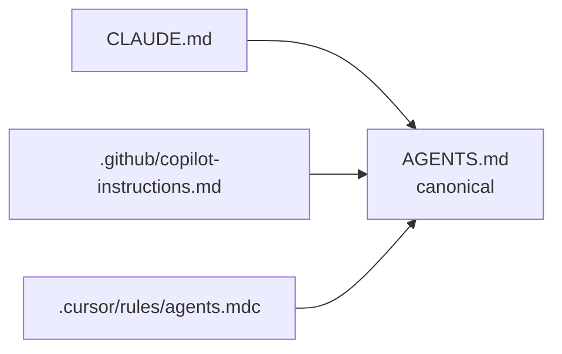

# Working here with an AI agent

This project is built primarily by AI agents. That is a deliberate choice, and
it shapes how the repository is laid out.

## Start here

1. `./init-dev.sh` — installs the .NET SDK, Docker, and Node at the pinned
   versions, then pulls the skills into `.claude/`. Idempotent, so run it
   whenever something looks wrong; `./init-dev.sh --check` reports without
   installing. See [Getting started](../README.md#getting-started).
2. Read `AGENTS.md`. The invariants in it outrank any task description.
3. Pick an issue. Work is filed in the **Foundation**, **Phase 1**, and
   **Phase 2** milestones, sized to one PR each.
4. Open a PR. `main` is protected; an administrator approves.

## Agent-agnostic by design

`AGENTS.md` is the only real instruction file. Everything else is a symlink:



Switching from Claude to Codex, Copilot, or Cursor requires no migration —
whatever the tool reads, it resolves to the same file. Skills are managed by
[`skillfile`](https://github.com/eljulians/skillfile), which installs the same
set into whichever tools are configured.

**Windows contributors:** git stores symlinks, but checkout needs
`git config core.symlinks true` and Developer Mode enabled. Without it the
symlinks arrive as text files containing a path, and your agent silently reads
nothing. CI asserts they resolve.

## Adding a skill

**Search before you author.** A maintained upstream skill is broader than
anything written here in an afternoon, and it stays current without this
repository doing the work.

```bash
skillfile search "some topic"
skillfile add github skill owner/repo skills/thing
skillfile install
```

Write a local skill only for knowledge specific to HPAC — the anonymization
rules, the aircraft vocabulary, this domain model. Everything general — TDD, DDD,
SOLID, C# idiom — comes from upstream. Say in the pull request what you searched
for and why nothing fitted.

Where upstream guidance conflicts with `AGENTS.md`, `AGENTS.md` wins.

Authored here: add a directory under `skills/`, then a `local` line in
`Skillfile` **with an explicit name** — every file is called `SKILL.md`, so
without a name they all infer the same one and overwrite each other on install.

Commit `Skillfile` and `Skillfile.lock`. Do not commit `.claude/` — it is
generated and gitignored.

## Generated files

Never hand-edit these:

| File | Regenerate with |
|---|---|
| `docs/form-spec.md` | `tools/extract-typeform.py` |
| `locales/fr-CA.json` | `tools/translate-locale.mjs` (CI) |
| `.claude/skills/`, `.claude/agents/` | `skillfile install` |
| `src/web/styles/site.css` | `tools/build-css.sh` |

## What agents get wrong here

Observed and worth stating:

- **Hardcoding a user-facing string.** Add a key to `locales/en-CA.json`.
- **Reaching for `Assert.*` out of habit.** This repository uses Shouldly.
- **Drawing an ASCII diagram.** Mermaid only.
- **Softening a redaction rule** from "never" to "avoid" while rewording a
  prompt. Bump the prompt version and expect the auditor to check it.
- **Asserting on exact model output**, producing a test that breaks on drift and
  then gets muted. Assert absence of the identifier instead.
- **Inferring an aircraft class** from a model name. The reporter's answer is
  the only source; `class not determined` is a valid outcome.

## The auditor

`agents/anonymization-auditor.md` is an adversarial reviewer for anything
touching redaction, prompts, or PII. Run it on changes labelled `area:security`
and before bumping a prompt version. It assumes the change leaks and tries to
prove it.

## Related

- `AGENTS.md`
- `CONTRIBUTING.md`
- `skills/hpac-safety-conventions/SKILL.md`
