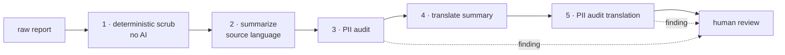

# Anonymization policy

HPAC runs a **non-punitive** reporting system. Pilots file reports about their
own mistakes on the understanding that the result is used to teach, not to
blame or identify. This document is that promise expressed as system behaviour.

The governing document is **SOP 405 — Accident / Incident Reporting**.

## The rule

> A published summary must not allow a reader to identify the pilot, the
> reporter, or the specific site.

When usefulness and anonymity conflict, anonymity wins.

## Five stages

Stage 1 is deterministic and runs first on purpose: never ask a language model
to remove something a regular expression removes reliably. Stages 3 and 5 read
only the generated summary and return structured findings — they flag, they do
not silently rewrite.

Stage 5 exists because translation is another generative step, and a model
asked to produce fluent French can reintroduce a detail the scrub removed.

## Stage 1 in detail

The deterministic scrub lives in `HpacSafety.Core`, has no dependencies, and is
the only stage whose behaviour is fully determined. What it does, category by
category:

| Category | What stage 1 does |
|---|---|
| Reporter and pilot names | The structured answers are dropped. The same names found in free text become a **role word** — see below. |
| Phone, email, address, social handle | Structured answers dropped. Emails, URLs, and phone numbers in the common written formats are stripped from free text. |
| HPAC member number | Structured answer dropped. In free text, matched on the word — `HPAC #48213`, `member number 48213` — because HPAC publishes no number format and stripping every run of digits would delete altitudes and airspeeds along with it. |
| Launch, landing zone, club | The site is replaced by the **province**. The same words are removed from free text. |
| Aircraft manufacturer and model | Dropped, and removed from free text. The published class comes from the reporter's own certification answer and from nowhere else. |
| Everything else | Kept, and passed through every stripping rule anyway. |

Matching a name or a place is **case- and accent-insensitive**, and names split
on hyphens and apostrophes: "Renée" in the name field is found as "Renee" in the
narrative and the other way round, and "Sarah-Jane" is found as "Sarah". Parts
shorter than three characters (names) or four (places and aircraft) are not
matched on their own, so a French narrative keeps its "de" and "la" and a flying
report keeps the word "air"; the full answer and the surname are matched
regardless.

Anything removed that has no natural replacement leaves a `[removed]` marker, so
the sentence stays readable for stage 2 and a reviewer can tell "this was taken
out" from "the reporter never said".

### A name becomes a role word

A reporter or pilot name found in the narrative is replaced by the role the
structured field it came from gives that person — **"the pilot"**, **"the
reporter"** — and not by `[redacted]` or `[name]`.

> Sarah spiralled in from 200 feet → the pilot spiralled in from 200 feet

The scrubbed text still reads as prose, so the stage 2 summary is not degraded by
a sentence with a hole in it. **When the reporter is the pilot, one role word
covers both** and it is "the pilot". Role words are per language and are supplied
to the scrub rather than built into it. See
[ADR-0028](decisions/ADR-0028-role-words-in-place-of-names.md).

### The region is the province

`Where:` is generalized to the **province**, and nothing finer. There is no other
region vocabulary in this system: the province comes from the reporter's own
structured answer, next to the free-text site on the same form.

The scrub never derives a province from a site name. That would be inferring a
location rather than reading one — the same class of mistake as inferring a
certification class from a model name. **If no province was answered, the
location is dropped entirely** rather than guessed at.

### What stage 1 cannot catch

Stage 1 finds an identifier when it matches a pattern, or when the reporter also
typed it into a structured answer. A launch named **only** in the narrative is
not something a regular expression can recognise, and no tuning changes that.
That residual risk is the reason stages 3 and 5 exist and the reason a human
approves every publication. It is not to be closed by shipping a list of Canadian
site names — a lookup table of every site in the country is itself a map of where
every reporter flies.

Over-redaction is the accepted failure mode in the other direction, and it is
deliberate. See [ADR-0027](decisions/ADR-0027-deterministic-scrub-design.md).

## Always removed

| Category | Examples |
|---|---|
| Names | reporter, pilot, passenger, instructor, witnesses, rescuers |
| Contact details | phone, email, address, social handles |
| Identifiers | HPAC member number, licence or insurance numbers |
| Aircraft identity | manufacturer, model, colour, serial |
| Precise location | launch name, LZ name, club, named landmark |
| Precise timing | narrowed to month and year |
| Media | never attached to a published summary |
| Small-community tells | roles, named events, unusual equipment |

## Always kept

Phase of flight, conditions, certification class, sequence of events, injury at
the severity-scale level, reserve deployment, contributing factors, and the
reporter's own prevention notes. Province is kept; the site is not.

## The identifiability problem nobody expects

Canadian free-flight sites are small. A detail that is not personal information
on its own — "the club's only tandem instructor", "during the annual fly-in",
"flying a rigid" — can name one specific person to the fifty people who fly
there.

Aggregation is the same risk: province plus exact date plus aircraft type plus
injury severity can be unique even when each field alone is harmless. This is
why the date is narrowed to month and year, and why reviewers are asked to read
a summary as a local would.

## Consent

The form asks whether the reporter agrees to publication of a de-identified
version. **A report without consent is never published.** It is still stored,
still summarized, and still counted in HPAC's internal analysis — the consent
flag gates publication only.

## Human review is not optional

There is no code path from submission to publication that does not pass through
a safety officer, and the officer approves the **English and French pair**.
Approving one does not implicitly approve the other.

## Failure modes we accept

- A summary too vague to be useful. Recoverable — a reviewer can edit it.
- `class not determined` on the aircraft. Recoverable.
- A false positive from the PII audit. Costs a reviewer ten seconds.

## Failure modes we do not accept

- A name, number, or site in a published summary.
- Publication without consent.
- Publication without human approval.

## Related

- `prompts/` — the runtime prompts that implement this policy
- `src/HpacSafety.Core/Features/Anonymization/README.md` — stage 1, the code
- `tests/HpacSafety.Anonymization.Tests` — the golden-file suite that proves it
- [ADR-0027](decisions/ADR-0027-deterministic-scrub-design.md),
  [ADR-0028](decisions/ADR-0028-role-words-in-place-of-names.md)
- `docs/aircraft-classification.md`
- `docs/data-handling.md`
