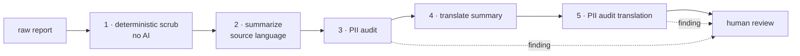

# Anonymization policy

HPAC runs a **non-punitive** reporting system. Pilots file reports about their
own mistakes on the understanding that the result is used to teach, not to
blame or identify. This document is that promise expressed as system behaviour.

The governing document is **SOP 405 — Accident / Incident Reporting**.

## The rule

> A published summary must not allow a reader to identify the pilot, the
> reporter, or the specific site.

When usefulness and anonymity conflict, anonymity wins.

## Five stages

Stage 1 is deterministic and runs first on purpose: never ask a language model
to remove something a regular expression removes reliably. Stages 3 and 5 read
only the generated summary and return structured findings — they flag, they do
not silently rewrite.

Stage 5 exists because translation is another generative step, and a model
asked to produce fluent French can reintroduce a detail the scrub removed.

## Always removed

| Category | Examples |
|---|---|
| Names | reporter, pilot, passenger, instructor, witnesses, rescuers |
| Contact details | phone, email, address, social handles |
| Identifiers | HPAC member number, licence or insurance numbers |
| Aircraft identity | manufacturer, model, colour, serial |
| Precise location | launch name, LZ name, club, named landmark |
| Precise timing | narrowed to month and year |
| Media | never attached to a published summary |
| Small-community tells | roles, named events, unusual equipment |

## Always kept

Phase of flight, conditions, certification class, sequence of events, injury at
the severity-scale level, reserve deployment, contributing factors, and the
reporter's own prevention notes. Province is kept; the site is not.

## The identifiability problem nobody expects

Canadian free-flight sites are small. A detail that is not personal information
on its own — "the club's only tandem instructor", "during the annual fly-in",
"flying a rigid" — can name one specific person to the fifty people who fly
there.

Aggregation is the same risk: province plus exact date plus aircraft type plus
injury severity can be unique even when each field alone is harmless. This is
why the date is narrowed to month and year, and why reviewers are asked to read
a summary as a local would.

## Consent

The form asks whether the reporter agrees to publication of a de-identified
version. **A report without consent is never published.** It is still stored,
still summarized, and still counted in HPAC's internal analysis — the consent
flag gates publication only.

## Human review is not optional

There is no code path from submission to publication that does not pass through
a safety officer, and the officer approves the **English and French pair**.
Approving one does not implicitly approve the other.

## Failure modes we accept

- A summary too vague to be useful. Recoverable — a reviewer can edit it.
- `class not determined` on the aircraft. Recoverable.
- A false positive from the PII audit. Costs a reviewer ten seconds.

## Failure modes we do not accept

- A name, number, or site in a published summary.
- Publication without consent.
- Publication without human approval.

## Related

- `prompts/` — the runtime prompts that implement this policy
- `docs/aircraft-classification.md`
- `docs/data-handling.md`
