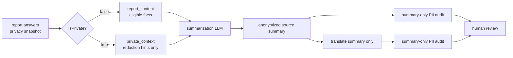

# Anonymization policy

HPAC publishes safety lessons, not identities. Reports describe real accidents
in a small community, so a summary must remove both direct identifiers and
combinations of details that let local readers identify a person.

When usefulness and anonymity conflict, anonymity wins. A human safety officer
reviews both official-language summaries before anything is published.

## One classification at question creation

Every answer-producing question has an `IsPrivate` checkbox in question
administration:

- Checked means the answer is private redaction context.
- Unchecked means the answer is non-private report content eligible to inform a
  summary.
- New questions default checked.

Privacy is immutable after creation. Administrators may revise wording, type,
options, order, role, and activation under the question-bank rules, but they
cannot change `IsPrivate`. Reclassification requires deactivating the old
question and creating a new question identity. Each `ReportAnswer` snapshots the
question's value when submitted.

This prevents an edit to today's form from silently changing the handling of
historical reports.

## The model boundary

The Worker loads labeled answers and calls `SummarizationInput.Partition`:

`report_content` is the only source of publishable facts. It includes narrative,
general damage and injury descriptions, prevention notes, aircraft type and
certification answer, province, and other fields explicitly classified
non-private.

`private_context` contains labeled values such as pilot/reporter names and
contact details, precise location and date, pilot rating, aircraft make/model,
media references, and publication consent. The summarizer may use it only to
recognize those details inside report content. A private pilot name repeated in
the narrative becomes “the pilot” / “le pilote”; it does not become a fact in
the summary.

Only the configured summarization provider receives private context. The PII
auditor receives a candidate summary only. The translator receives the
anonymized source summary only. Public endpoints, notifications, logs, metrics,
traces, and exception messages receive neither model-input section.

There is no deterministic text scrub, regex redaction pass, identifier harvester,
or replacement-stage chain. The LLM performs textual anonymization. Media type
validation, malware controls, and metadata stripping remain deterministic
because they operate on files, not report prose.

## What never appears in a summary

- Names, initials, nicknames, contact details, social handles, or URLs.
- Member, licence, insurance, registration, or serial identifiers.
- Aircraft make, model, colour, or another distinctive aircraft identity.
- Named launch/landing sites, clubs, addresses, landmarks, or coordinates.
- Exact dates and times.
- Unique occupations, club roles, named events, unusual equipment, or personal
  circumstances that identify someone in combination.
- Private-context facts, even when they seem harmless or could be generalized.
- Redaction placeholders or commentary about omitted information.

People are described by role when useful and known from report content or a
matching private label: “the pilot”, “the passenger”, “the reporter”, “a
witness”. Otherwise the identity is omitted. French uses stable generic role
wording and must not add gender or other identifying agreement.

## What should survive

- Phase of flight, broadly stated conditions and terrain, and event sequence.
- Reserve deployment and outcome.
- Injury severity at the form's scale and damage in general terms.
- Contributing factors and prevention lessons reported by the submitter.
- Aircraft type and a certification class explicitly supported by non-private
  report content, never inferred from private make/model.

The model never invents missing causes, conditions, intentions, or classes.
Omission is safer than a confident guess.

## Language, audit, and approval

The summarizer writes in the report's submitted language. Raw report sections
are never translated. The anonymized source summary is translated into the
other official language, and each candidate summary is independently PII
audited. Findings route the report to a person; an audit does not approve or
publish anything.

Publication requires explicit reporter consent, both language summaries, and
human safety-officer approval. Consent is itself private context, not summary
content.

## Testing and prompt versions

Runtime policy lives in versioned files under `prompts/`. Versions 1 and 2 are
historical; version 3 implements this design. Never edit an active historical
version in place.

Tests must prove:

- privacy defaults to true and cannot be mutated;
- answers snapshot classification;
- partitioning places private and non-private fields in the correct sections;
- non-summarizer ports cannot accept private context;
- synthetic identifiers present in recorded model input are absent from output;
- important non-private safety details survive;
- English and French obey the same publication policy.

See ADR-0038, `prompts/README.md`, `agents/anonymization-auditor.md`, and
`skills/anonymize-hpac-reports/SKILL.md`.
