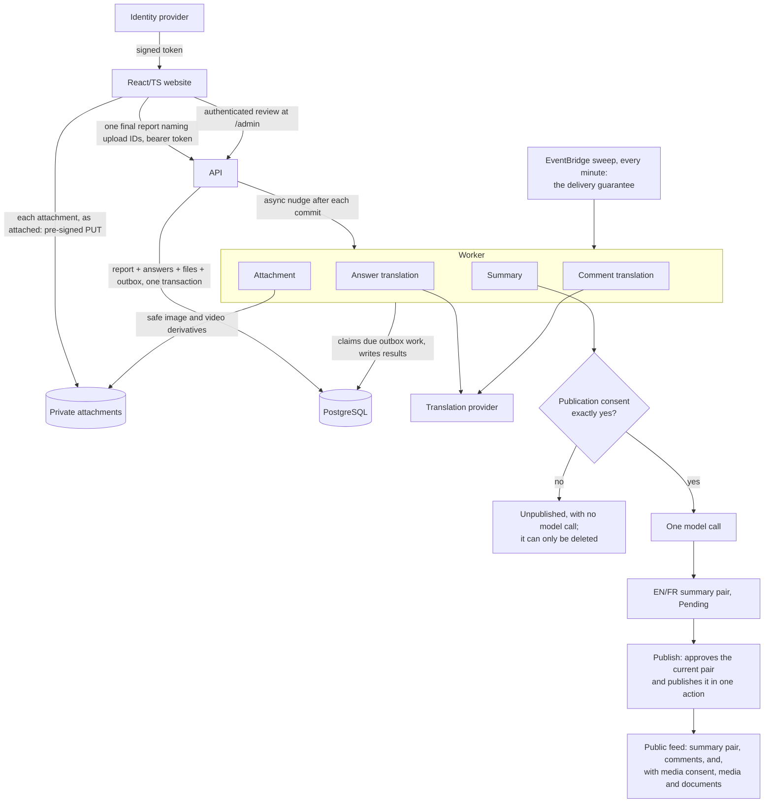

# Architecture

The complete target is specified in
[`system-overview.md`](system-overview.md) and
[`interfaces-and-data-flow.md`](interfaces-and-data-flow.md). This
page is a short orientation only.

This is the one diagram of how a report flows through the system. Other pages
link here rather than drawing their own.

- `HpacSafety.Core` owns small domain rules and ports for genuine external
  boundaries.
- `HpacSafety.Infrastructure` owns EF Core, private storage, attachment
  processing, and the model adapter.
- `HpacSafety.Api` exposes public and admin HTTP DTOs, and owns token
  validation and the role policies. It does no AI work.
- `HpacSafety.Worker` consumes four kinds of typed outbox work: the one-call
  summary, per-file attachment processing, answer translation, and comment
  translation
  ([ADR-0123](decisions/ADR-0123-the-worker-runs-on-lambda-and-the-website-on-s3-and-cloudfront.md)).
  The API nudges it after each commit, and a sweep every minute guarantees
  delivery.
- `src/web` is one React/TypeScript/Vite application, built once, with the
  admin review queue as an authenticated `/admin` route
  ([ADR-0043](decisions/ADR-0043-react-typescript-vite-web-front-end.md),
  [ADR-0048](decisions/ADR-0048-one-website-admin-as-a-route.md)).

Questions are complete immutable bilingual database revisions. Unfinished
answers remain only in the browser; no report data is stored server-side until
one final request, except each attachment, which uploads to private quarantine
when it is attached and is claimed by that request. A report without
publication consent never reaches the model: the Worker marks it Unpublished
([ADR-0125](decisions/ADR-0125-a-report-is-pending-published-or-unpublished.md)).
For a consented report, the Worker produces one bilingual row, and a reviewer's
Publish approves it and makes it public in one action
([ADR-0105](decisions/ADR-0105-approving-a-consented-pair-publishes-it.md),
[ADR-0125](decisions/ADR-0125-a-report-is-pending-published-or-unpublished.md)).
What the public sees is the
[public DTO](interfaces-and-data-flow.md#publicreporting-api) and
[the public feed and report page](../features/moderation-authentication-and-publication/README.md#the-public-feed-and-report-page-329).

Keep only useful boundaries. The target has no server drafts, upload-slot API,
application field cipher, summary-translation stage, PII auditor, email sender,
external publication channel, or specialized aircraft service. It also has no
user table, allowlist, session store, or credential handling: an identity
provider signs a token, the API validates it and reads two claims, and nothing
about a person is written down
([ADR-0064](decisions/ADR-0064-jwt-bearer-authentication-with-three-roles.md),
[ADR-0065](decisions/ADR-0065-no-user-records-identity-is-the-token-subject.md)).

Current-main gaps are explicit in
[`implementation-status.md`](implementation-status.md); component
READMEs must not describe a target feature as already implemented.
