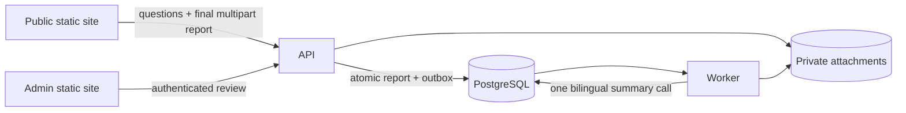

# Architecture

The complete target is specified in
[`spec/system-overview.md`](../spec/system-overview.md) and
[`spec/interfaces-and-data-flow.md`](../spec/interfaces-and-data-flow.md). This
page is a short orientation only.

- `HpacSafety.Core` owns small domain rules and ports for genuine external
  boundaries.
- `HpacSafety.Infrastructure` owns EF Core, private storage, authentication,
  attachment processing, Turnstile, and the model adapter.
- `HpacSafety.Api` exposes public and admin HTTP DTOs. It does no AI work.
- `HpacSafety.Worker` consumes typed outbox work for the one-call summary and
  per-file attachment processing.
- `src/web/public` and `src/web/admin` are separate static sites.

Questions are complete immutable bilingual database revisions. Submission is
one final multipart request. The Worker produces one bilingual row, and human
review plus positive consent gates a minimal public DTO.

Keep only useful boundaries. The target has no server drafts, upload-slot API,
application field cipher, runtime translator, PII auditor, email sender,
external publication channel, or specialized aircraft service.

Current-main gaps are explicit in
[`spec/implementation-status.md`](../spec/implementation-status.md); component
READMEs must not describe a target feature as already implemented.
