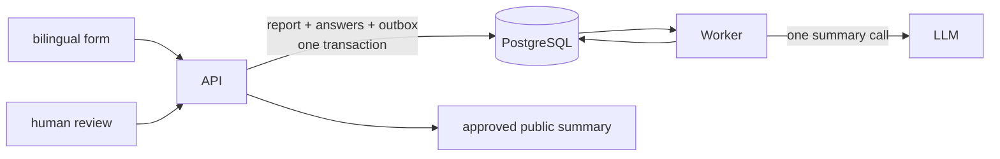

# Architecture

## Scope

HPAC Safety collects the current incident questions, stores exactly what was
asked and answered, and produces one de-identified summary for human review.

## Questions

Each `Question` row is one complete immutable revision containing its stable
key, revision number, English and French wording, input type, bilingual options,
sort order, privacy flag, active state, section metadata, and predecessor id.
Any change inserts a new row. The form selects the highest active revision for
each key and orders those rows by `SortOrder`.

All answer-producing questions can be skipped except `consent_publish`. That
stable system question is private, yes/no, active, and required.

## Submission and recall

The submission DTO carries the report language, exact question revision ids,
and nullable text or option-code answers. The API saves the report, answer rows,
and one `report.submitted` outbox row in a single transaction.

The Worker query returns `ReportForSummaryDto`:

- report id and language;
- each exact question id and key;
- the question label in the report language;
- the immutable privacy flag;
- the submitted answer, including null for a skip.

No ordinary answer is duplicated into a typed report property. Publication
consent is the sole projection because it is a system invariant.

## Summarization

`SummarizationInput` omits skips, puts non-private answers in `report_content`,
and puts private answers in `private_context`. The Worker loads one versioned
prompt and makes one LLM call, in the report's own language. It then translates
the candidate through `ITranslator` to produce the second official language.
Private context may recognize details in report content but cannot supply
summary facts. Both candidate summaries are stored for human editing and
approval. Once stored, the Worker notifies `safety@hpac.ca` that the report is
ready for review, riding the same outbox row.

There is no deterministic scrubber, second model audit, or generic
publication-channel abstraction. Add one only for a newly approved requirement.
Aircraft classification is not a subsystem: `aircraft_certification` is an
ordinary public question and `aircraft_manufacturer`/`aircraft_model` are
ordinary private ones, handled by the same partition as every other answer.

## Components

- `Core`: domain and DTO contracts; no infrastructure dependencies.
- `Infrastructure`: EF Core, PostgreSQL, encryption, migrations, and seed data.
- `Api`: submission, question, review, and approved-summary HTTP endpoints.
- `Worker`: outbox claim, DTO query, one model call, and candidate persistence.
- `web`: public form and authenticated review route.
