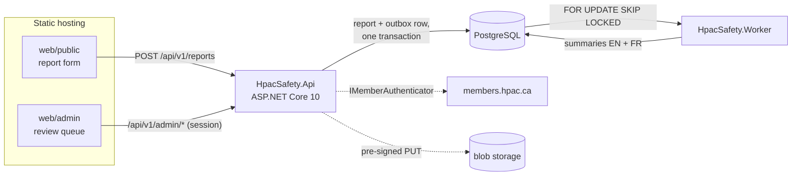
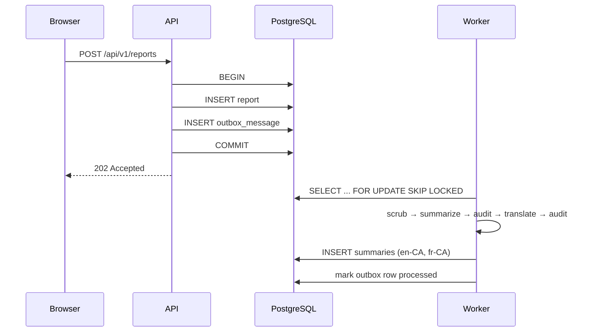

# Architecture

## The shape of it

Four deployables: two static sites, one API, one worker. The web apps are plain
HTML and JavaScript with no bundler, served independently of the API so either
can move hosts without touching the other.

## Why a separate worker

Summarization takes seconds, calls a third-party model, and fails in ways an
HTTP request should not have to care about. A pilot submitting a report after a
crash gets an immediate acknowledgement; the AI work happens behind that.

Splitting the process also means summarization can be restarted, scaled, or
switched off entirely without affecting the ability to *receive* reports — which
is the part that must never be down.

## Why an outbox

The API writes the report and its outbox row in a single transaction. There is
no "save, then notify" — that loses reports whenever the process dies between
the two, and a lost safety report is not recoverable from anywhere.

Everything asynchronous rides the same mechanism: summarization, translation,
notification email. `SKIP LOCKED` lets more than one worker run without
coordination. Failures back off exponentially and move aside after a poison
threshold rather than retrying forever.

Postgres `LISTEN/NOTIFY` may be added later purely to cut latency. Polling
stays the source of truth — a notification delivered while the worker is
restarting is a notification nobody hears.

## Projects

| Project | Responsibility | Depends on |
|---|---|---|
| `HpacSafety.Core` | Entities, enums, interfaces, the question bank, the deterministic scrub | nothing |
| `HpacSafety.Infrastructure` | EF Core, Anthropic, blob storage, HPAC auth, email. **Owns every table and every migration** | Core |
| `HpacSafety.Api` | HTTP surface, validation, sessions | Core, Infrastructure |
| `HpacSafety.Worker` | Outbox consumer | Core, Infrastructure |

`Core` depending on nothing is the rule that keeps the anonymization logic
testable without a database, a network, or a model. The deterministic scrub in
particular must be provable in a plain unit test.

Inside it, code is organised by **feature** — `Features/Reporting`,
`Features/QuestionBank`, `Features/Moderation`, `Features/Outbox` — with the
handful of genuinely cross-cutting types in `SharedKernel/`. Each feature owns
its entities, its enums, and the ports it calls out through. See
[ADR-0018](decisions/ADR-0018-feature-folders-in-core.md).

## Why the questions are in the database

The form HPAC asks is a table, not a class. Questions carry a type, an order,
their own options, and per-locale wording; answers reference the question
*version* they were given under. A safety officer changes the form without a
deploy, and a report from two seasons ago still renders the question it was
actually answering.

The answers that logic reads — consent above all — additionally project onto
typed columns on `reports`, so the invariants stay enforceable in `Core` with no
database. See
[ADR-0016](decisions/ADR-0016-data-driven-question-bank.md).

## Where the schema lives

Every table, every index, and every migration is in
`HpacSafety.Infrastructure/Persistence`, including tables whose behaviour lives
elsewhere. Restricted columns are encrypted there too, by the application, behind
a port declared in `Core` — PostgreSQL never sees the plaintext of a contact
detail or a raw narrative. See
[ADR-0019](decisions/ADR-0019-application-side-field-encryption.md) and
[ADR-0020](decisions/ADR-0020-seeding-by-migration.md).

## Deliberately deferred

- Publication to the website, WhatsApp, or Telegram. `IPublicationChannel` is
  declared and unimplemented.
- Hosting choice. Everything host-shaped sits behind `IBlobStore` and
  `IEmailSender`.
- Postgres `LISTEN/NOTIFY`.

## Related

- `docs/anonymization-policy.md`
- `docs/authentication.md`
- `docs/data-handling.md`
- `docs/decisions/`
