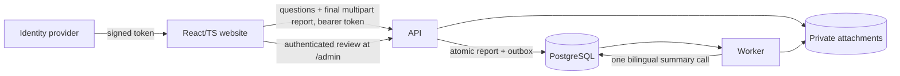

# Architecture

The complete target is specified in
[`system-overview.md`](system-overview.md) and
[`interfaces-and-data-flow.md`](interfaces-and-data-flow.md). This
page is a short orientation only.

- `HpacSafety.Core` owns small domain rules and ports for genuine external
  boundaries.
- `HpacSafety.Infrastructure` owns EF Core, private storage, attachment
  processing, and the model adapter.
- `HpacSafety.Api` exposes public and admin HTTP DTOs, and owns token
  validation and the role policies. It does no AI work.
- `HpacSafety.Worker` consumes typed outbox work for the one-call summary and
  per-file attachment processing.
- `src/web/public` and `src/web/admin` are separate React/TypeScript
  applications, each built with Vite and served from its own container
  ([ADR-0043](decisions/ADR-0043-react-typescript-vite-web-front-end.md),
  [ADR-0044](decisions/ADR-0044-containerized-web-hosting.md)).

Questions are complete immutable bilingual database revisions. Unfinished
answers remain only in the browser; no report data is stored server-side until
one final multipart request. The Worker produces one bilingual row, and human
review plus positive consent gates a minimal public DTO.

Keep only useful boundaries. The target has no server drafts, upload-slot API,
application field cipher, runtime translator, PII auditor, email sender,
external publication channel, or specialized aircraft service. It also has no
user table, allowlist, session store, or credential handling: an identity
provider signs a token, the API validates it and reads two claims, and nothing
about a person is written down
([ADR-0064](decisions/ADR-0064-jwt-bearer-authentication-with-three-roles.md),
[ADR-0065](decisions/ADR-0065-no-user-records-identity-is-the-token-subject.md)).

Current-main gaps are explicit in
[`implementation-status.md`](implementation-status.md); component
READMEs must not describe a target feature as already implemented.
