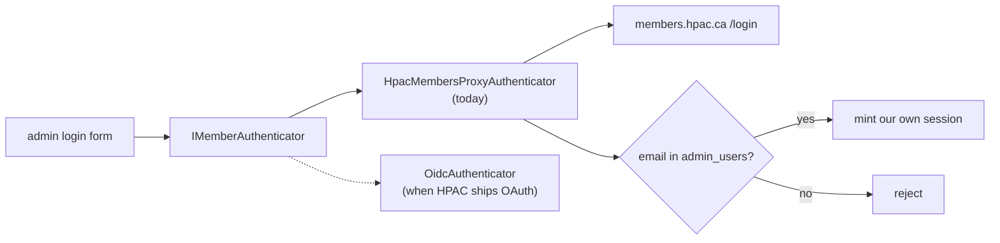

# Authentication and authorization

## Summary

- **Reporting is anonymous.** No login, no account, no tracking. Contact details
  are optional fields on the form.
- **Only the admin surface is authenticated**, and it serves a handful of HPAC
  safety officers.

## members.hpac.ca has no OAuth

Investigated directly. `members.hpac.ca` is a Rails application using classic
form and session authentication:

- `authenticity_token` CSRF meta tag
- `session[email]` / `session[password]` POSTed to `/login`
- Sprockets asset fingerprints

All of these return **404**: `/.well-known/openid-configuration`,
`/.well-known/oauth-authorization-server`, `/oauth/authorize`,
`/users/auth/saml`, `/api`.

There is no SSO, no OIDC discovery, no SAML, and no public API to integrate
with.

## Current approach: credential proxy

Behind `IMemberAuthenticator`, with two implementations:

`HpacMembersProxyAuthenticator` fetches `/login` for the CSRF token, POSTs the
credentials, and treats a redirect plus session cookie as success.

### Non-negotiable handling rules

Credentials belong to real HPAC members, and this application handles them only
because there is currently no alternative:

1. They exist in a local variable for the duration of one call. **Never**
   persisted, cached, written to a session, or held in a field.
2. **Never logged**, at any level, and scrubbed from every exception path — no
   request body in a log line, no credential in a stack trace.
3. Sent over TLS only, to a hardcoded host. Never proxied to a configurable URL.
4. The whole path is behind a single config flag and can be switched off.
5. Rate-limited with lockout, because this endpoint can otherwise be used to
   brute-force the real member database.

### Known risks, stated plainly

This design means a bug or a log leak here exposes member credentials for the
upstream system, not just ours. It also depends on the exact markup of a page
we do not control, so an upstream redesign breaks login without warning.

It is in place because the alternative — HPAC members having a second password
for this system — is worse, and because the migration path is short.

## Authorization is entirely ours

A successful upstream login proves **membership**, not that someone is a safety
officer.

`admin_users(email, member_number, role, created_at)` is the allowlist. A
successful login with no matching row is rejected. Roles live in our database,
which is what makes the eventual switch to OIDC a change to *authentication*
only.

On success the API mints its own short-lived session cookie — HttpOnly, Secure,
SameSite set for the split-origin deployment. The upstream session cookie is
discarded immediately and never forwarded.

## Migration to OIDC

When `members.hpac.ca` gains OAuth:

1. Implement `OidcAuthenticator`.
2. Switch the registration.
3. Delete `HpacMembersProxyAuthenticator` and its config flag.
4. `admin_users` is untouched — authorization does not change.

Nothing outside `Infrastructure` should need editing. If it does, the
abstraction leaked and that is a bug worth fixing before the migration.

## Related

- `docs/data-handling.md`
- `docs/decisions/ADR-0005-authentication.md`
