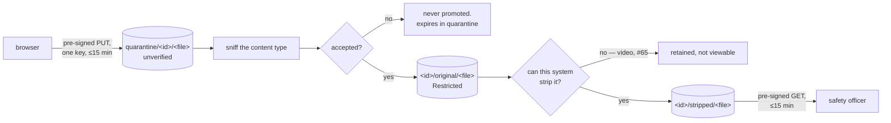
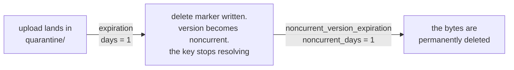

# Data handling

This system stores accounts of real accidents, including names, phone numbers,
injuries, and occasionally fatalities. Canadian personal information law
(PIPEDA) applies, and so does the promise the reporting form makes.

## Three tiers

A field's tier is a property of the field, not of the screen it appears on.

| Tier | Contents | Rules |
|---|---|---|
| **Restricted** | Reporter and pilot names, phone, email, member number, raw narrative, original media | Encrypted at rest. Admin-only. Never logged. Never sent to a translation service. |
| **Internal** | Manufacturer, model, precise site | Retained for HPAC trend analysis. Never published. |
| **Publishable** | Approved summary, certification class, province, severity, month and year | Public once a safety officer approves and consent was given. |

If you are unsure which tier something belongs to, it is Restricted.

Because the question set is data rather than code (
[ADR-0016](decisions/ADR-0016-data-driven-question-bank.md)), a **question
carries its own tier**, and a question added through the admin UI is
**Restricted** until someone decides otherwise. Nobody has to remember to
classify a new question for it to be handled safely; they have to remember in
order to *relax* it.

An answer copies the tier it was given under. Reclassifying a question later
therefore cannot retroactively downgrade the handling of text a reporter already
trusted us with.

## Retention

Raw reports are **retained**, with contact fields column-encrypted and readable
only by administrators. They are kept because a summary can later be disputed,
corrected, or needed for a fatality investigation, and because deleting the
source makes every downstream error unfixable.

A scheduled purge of raw narrative and contact fields after a fixed window is a
reasonable future tightening. It is not implemented, and doing so is a policy
decision for HPAC rather than an engineering one.

## Uploads

One photo or video per report, matching the existing form.

- Private bucket, no public object URLs, ever. Admin views use short-lived
  pre-signed GETs.
- **EXIF is stripped on ingest** — GPS above all. A crash photo identifies a
  person and a site regardless of how clean the text is.
- Original bytes stay in the Restricted record; the stripped derivative is what
  a reviewer sees.
- Content type is sniffed, not trusted from the client.
- Media is **never** attached to a published summary. Publishing an image is a
  separate human decision, not in scope.

### Where a report's media lives

All of a report's media lives in a directory named with that report's id, so
everything belonging to one report is a single literal prefix.

```
quarantine/<report id>/<file>   unverified. Expired by lifecycle rule.
<report id>/original/<file>     the Restricted record. Never shown to anyone.
<report id>/stripped/<file>     the derivative a reviewer sees.
```

Report ids are **tiny ids**: 11 characters of `A-Za-z0-9-_`, cryptographically
random, encoding no timestamp. **File names are minted the same way, never taken
from the client.** A camera roll name is Restricted data in its own right —
`mt-7-tandem-dave.jpg` names a site and a person — and a key ends up in bucket
access logs, in CloudTrail, and in every pre-signed URL. The reporter's name for
the file is of no use to this system, so it is not carried.

Quarantine is the one deliberate departure from "report id first", and it is
there because an S3 lifecycle filter matches a **literal** prefix — `*/quarantine/`
is not expressible. The report id is still the next segment, so per-report
enumeration is one prefix either way. See
[ADR-0026](decisions/ADR-0026-presigned-urls-and-private-blob-storage.md).

An unguessable id is **not** a substitute for the private bucket. It means a
report's directory cannot be found by walking ids, which is a useful
reinforcement and nothing more: every object is still private and still reached
only through a pre-signed URL. Treating the id as sufficient protection on its
own is exactly the mistake this paragraph exists to prevent.

### How a photo travels



Nothing leaves quarantine until this system has decided what it is. The original
is never modified and never shown. The derivative is the only thing a reviewer's
browser ever fetches, and it is fetched from storage directly — **no route in
the API serves blob bytes**, which is asserted by a test that walks the live
route table.

### Accepted, but not yet viewable

A **video is accepted and retained** — the original is the Restricted record like
any other upload — but nothing in this system can strip a video's metadata yet,
so **no derivative is produced and no reviewer link can be issued for it**. A
reviewer sees nothing for that report's media rather than something unsafe.

This is a distinct, explicit state in the domain (`MediaIngestStatus.AwaitingStripping`),
not an absence. Asking for a derivative that does not exist throws; it never
falls through to the original. Media is never published in any case, so nothing
reaches the public path either way.

**[Issue #65](https://github.com/HPAC-Safety/safety-report/issues/65)** adds the
ffmpeg-based stripping step that turns this state into a viewable derivative.

### Accepted formats

| Format | Derivative |
|---|---|
| JPEG, PNG, WebP | the same format, stripped |
| HEIC | a stripped **JPEG** — the imaging library decodes HEIC but cannot encode it, and a reviewer needs something every browser renders |
| MP4, QuickTime | none yet. Retained, not viewable. See #65 |

HEIC is accepted because it is an iPhone's default and one of the most common
carriers of GPS this system will see. It needs libheif, and a runtime without it
would refuse every iPhone upload as unrecognisable content with nothing in the
logs to say why — so the codecs are **checked at startup and a missing one is a
failure to start**, never a silent degradation.

### Size limit

**50 MB.** Generous headroom, so no realistic photo is refused for size. The
number is configured (`MediaPolicyOptions`); `MediaPolicy` itself takes it as a
constructor argument with no default, because a size limit nobody chose is a
size limit nobody owns.

**Video may force this number to be revisited.** 50 MB is ample for a photo and
tight for anything but a short clip.

### Refused uploads expire; nothing deletes them

A refused upload is simply never promoted. It stays where the browser put it and
is expired by a **bucket lifecycle rule**, not by application code — there is
deliberately no delete on `IBlobStore`, so no code path exists that could later
be pointed at a real report's media.

The rule the uploads bucket needs, owned by
[issue #32](https://github.com/HPAC-Safety/safety-report/issues/32):

| | |
|---|---|
| **Bucket** | the private uploads bucket, `ca-central-1`. **Versioned** |
| **Filter** | prefix `quarantine/` — literal, no wildcards |
| **Expiration** | 1 day |
| **Noncurrent version expiration** | 1 day |
| **Also** | abort incomplete multipart uploads after 1 day |
| **Status** | enabled |

```hcl
resource "aws_s3_bucket_lifecycle_configuration" "uploads" {
  bucket = aws_s3_bucket.uploads.id

  rule {
    id     = "expire-quarantine"
    status = "Enabled"

    filter { prefix = "quarantine/" }

    expiration { days = 1 }

    # The bucket is versioned, so the clause above only writes a delete marker.
    # Without this one the noncurrent version falls to the bucket-wide 90-day
    # policy, and an unverified crash photograph sits there for three months.
    noncurrent_version_expiration { noncurrent_days = 1 }

    abort_incomplete_multipart_upload { days_after_initiation = 1 }
  }
}
```

**The bucket is versioned, so expiry is a two-hop process.** This is the part
that is easy to get wrong, and getting it wrong is not a small mistake:



On a versioned bucket, `expiration` does **not** delete anything. It writes a
delete marker and makes the current version noncurrent. Without
`noncurrent_version_expiration` on the same rule, that noncurrent version then
falls through to whatever bucket-wide noncurrent policy exists — **90 days** on
this bucket. An unverified crash photograph would have sat there for three
months, in a bucket whose lifecycle claimed to clear it in a day. Both clauses
are load-bearing; neither is optional.

**Be honest about what that guarantees.** Both hops are day-granular and run
asynchronously, so there are two different moments worth separating:

| | Floor | In practice |
|---|---|---|
| The key stops resolving — a GET returns the delete marker | 24 hours | up to ~48 |
| The bytes are permanently gone | **48 hours** | up to ~96 |

Between the two hops the noncurrent version is still fetchable **by version id**
by anything holding `s3:GetObjectVersion` on the bucket. The application cannot
do this — a pre-signed URL names a key and no version — so this is about direct
bucket credentials, not about the report path.

None of these is a deadline. That is acceptable because quarantined bytes are
never linked from a report, never served to a reviewer, and never published —
but nothing should be written that claims a hard 24-hour destruction guarantee,
and after this change the honest floor for destruction is 48 hours, not 24.

The same rule is what cleans up an upload for a report that was never submitted.

### Rules a reviewer can rely on

| Rule | Where it is enforced |
|---|---|
| A pre-signed URL works for exactly one key | `S3BlobStore` (SigV4) and `FileSystemBlobStore` (HMAC), one shared contract suite |
| Every URL expires within 15 minutes | `BlobUrlLifetime` in `Core`, called by both adapters |
| An upload can only ever land in quarantine | `MediaUploadSlot`, which never names the compartment |
| The declared content type is never believed | the sniffer chain, then `MediaPolicy` |
| A refused upload is never promoted | `MediaIngestor`; `MediaIngestOutcome.OriginalKey` throws on a rejection |
| A reviewer link can only ever name a derivative | `ReviewerMediaLink` refuses any compartment but `stripped` |
| Only those two types pre-sign anything | an architecture test walks `src/` and fails on any other call site |
| A persisted `ReportFile` fails closed too | `ReportFile.ViewableKey` throws while `AwaitsStripping`, which checks both the key and the timestamp |
| No client-supplied file name reaches a key | `MediaUploadSlot` mints it; there is no parameter to pass one through |
| A file with no derivative fails closed | `MediaIngestOutcome.DerivativeKey` throws rather than returning the original |
| A missing image codec stops the process | `ImagingCapabilities.EnsureCanDecode`, at startup |
| No client-supplied value reaches an exception message | `BlobKey`, `MediaType`, and `FileSystemBlobStore` all refuse without echoing the input |

The development store signs its URLs exactly as S3 does, so the guarantee holds
in the environment contributors actually run. See
[ADR-0026](decisions/ADR-0026-presigned-urls-and-private-blob-storage.md).

### Telling a reporter why

Rejections are a **code**, never a sentence: `MediaRejectionReason` in the domain,
mapped by `MediaRejection.LocalizationKeyFor` to a key under `upload.rejected.`
in `locales/en-CA.json`. English and French are both first-class, so no rejection
wording is written in `Core` or in `Infrastructure`. See
[`localization.md`](localization.md).

### What the API still has to enforce

`MediaUploadSlot` takes a report id **on trust**. It is a capability check, not
an identity check: it verifies the id's shape and that the URL can only write
into that report's quarantine, and nothing more.

**The route that calls it must establish that the caller owns that report
first.** Nothing in the storage layer can do this, and the unguessable id is not
a substitute — that is precisely the reliance this document disclaims above.
This is a requirement on
[#14](https://github.com/HPAC-Safety/safety-report/issues/14), written here so it
is inherited rather than rediscovered.

### When the report id has to exist

A pre-signed PUT is scoped to a key, and every key is namespaced by a report id.
So **the report id must be minted before the upload slot is issued**, not
assigned when the report is submitted. The API mints the id, issues the slot
against it, and the submitted report carries that same id.

The consequence is deliberate and small: a slot can be issued for a report that
is never submitted, leaving unverified bytes in quarantine — which the lifecycle
rule above expires without anything having to notice.

## What is sent to a third-party model

Only scrubbed text reaches Anthropic, and only the already-anonymized summary
reaches a translation step. The raw report never leaves the system.

The deterministic scrub running *before* the first model call is what makes that
statement true, which is why it lives in `Core` with no dependencies and is
provable in a plain unit test.

## Logging

- Never log request bodies on the report endpoints.
- Never log credentials, at any level.
- Log report **identifiers**, not report content.
- Notification emails carry a link, never the report — an inbox is outside this
  system's access controls.

## Access and audit

Admin access is an allowlist in `admin_users`. Every moderation action — view of
a raw report, edit, approval, rejection — is written to `audit_log` with who and
when. In a non-punitive reporting system, being able to show who saw what is
part of keeping the promise.

## Residency

Reports are filed by Canadians about incidents mostly in Canada. Hosting is
**AWS `ca-central-1`** — database, uploads bucket, and mail all in region. See
[ADR-0009](decisions/ADR-0009-hosting-on-aws.md).

**Do not relocate any of them to a US region** for cost or latency without
revisiting this document. Region choice is a data-protection decision here, not
an infrastructure preference.

## Related

- `docs/anonymization-policy.md`
- `docs/authentication.md`
