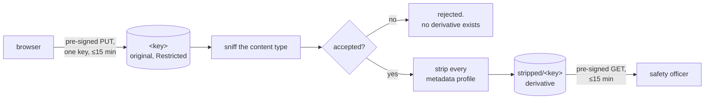

# Data handling

This system stores accounts of real accidents, including names, phone numbers,
injuries, and occasionally fatalities. Canadian personal information law
(PIPEDA) applies, and so does the promise the reporting form makes.

## Three tiers

A field's tier is a property of the field, not of the screen it appears on.

| Tier | Contents | Rules |
|---|---|---|
| **Restricted** | Reporter and pilot names, phone, email, member number, raw narrative, original media | Encrypted at rest. Admin-only. Never logged. Never sent to a translation service. |
| **Internal** | Manufacturer, model, precise site | Retained for HPAC trend analysis. Never published. |
| **Publishable** | Approved summary, certification class, province, severity, month and year | Public once a safety officer approves and consent was given. |

If you are unsure which tier something belongs to, it is Restricted.

Because the question set is data rather than code (
[ADR-0016](decisions/ADR-0016-data-driven-question-bank.md)), a **question
carries its own tier**, and a question added through the admin UI is
**Restricted** until someone decides otherwise. Nobody has to remember to
classify a new question for it to be handled safely; they have to remember in
order to *relax* it.

An answer copies the tier it was given under. Reclassifying a question later
therefore cannot retroactively downgrade the handling of text a reporter already
trusted us with.

## Retention

Raw reports are **retained**, with contact fields column-encrypted and readable
only by administrators. They are kept because a summary can later be disputed,
corrected, or needed for a fatality investigation, and because deleting the
source makes every downstream error unfixable.

A scheduled purge of raw narrative and contact fields after a fixed window is a
reasonable future tightening. It is not implemented, and doing so is a policy
decision for HPAC rather than an engineering one.

## Uploads

One photo per report, matching the existing form.

- Private bucket, no public object URLs, ever. Admin views use short-lived
  pre-signed GETs.
- **EXIF is stripped on ingest** — GPS above all. A crash photo identifies a
  person and a site regardless of how clean the text is.
- Original bytes stay in the Restricted record; the stripped derivative is what
  a reviewer sees.
- Content type is sniffed, not trusted from the client.
- Media is **never** attached to a published summary. Publishing an image is a
  separate human decision, not in scope.

### How a photo travels

The original is never modified and never shown. The derivative is the only thing
a reviewer's browser ever fetches, and it is fetched from storage directly —
**no route in the API serves blob bytes**, which is asserted by a test that walks
the live route table.

### Rules a reviewer can rely on

| Rule | Where it is enforced |
|---|---|
| A pre-signed URL works for exactly one key | `S3BlobStore` (SigV4) and `FileSystemBlobStore` (HMAC), one shared contract suite |
| Every URL expires within 15 minutes | `BlobUrlLifetime` in `Core`, called by both adapters |
| The declared content type is never believed | `MagickNetMediaSniffer`, then `MediaPolicy` |
| A refused upload produces no derivative | `MediaIngestor`; `MediaIngestOutcome.DerivativeKey` throws on a rejection |
| Original bytes are retained untouched | asserted in the contract suite against MinIO and the filesystem |

The development store signs its URLs exactly as S3 does, so the guarantee holds
in the environment contributors actually run. See
[ADR-0026](decisions/ADR-0026-presigned-urls-and-private-blob-storage.md).

### Formats deliberately not accepted yet

Accepted today: **JPEG, PNG, WebP**. A format is added only once this system can
strip its metadata — a file whose EXIF cannot be removed has no derivative that
is safe to show, and refusing the upload is the safe failure. See
[ADR-0025](decisions/ADR-0025-magick-net-for-exif-stripping.md).

Two gaps are known and are **policy questions for HPAC, not engineering
decisions**:

- **Video.** The form's wording allows a video. Nothing here can strip metadata
  from one, so video is refused rather than stored un-stripped. Accepting video
  means adding a metadata-stripping step for it first.
- **HEIC.** An iPhone's default camera format, and a common carrier of GPS.
  Browsers usually transcode on upload, but not always.

### Size limit

`MediaPolicy` takes its maximum as a constructor argument and has no default:
a size limit nobody chose is a size limit nobody owns. **The number HPAC wants
has not been decided**, and it belongs in this document once it is.

## What is sent to a third-party model

Only scrubbed text reaches Anthropic, and only the already-anonymized summary
reaches a translation step. The raw report never leaves the system.

The deterministic scrub running *before* the first model call is what makes that
statement true, which is why it lives in `Core` with no dependencies and is
provable in a plain unit test.

## Logging

- Never log request bodies on the report endpoints.
- Never log credentials, at any level.
- Log report **identifiers**, not report content.
- Notification emails carry a link, never the report — an inbox is outside this
  system's access controls.

## Access and audit

Admin access is an allowlist in `admin_users`. Every moderation action — view of
a raw report, edit, approval, rejection — is written to `audit_log` with who and
when. In a non-punitive reporting system, being able to show who saw what is
part of keeping the promise.

## Residency

Reports are filed by Canadians about incidents mostly in Canada. Hosting is
**AWS `ca-central-1`** — database, uploads bucket, and mail all in region. See
[ADR-0009](decisions/ADR-0009-hosting-on-aws.md).

**Do not relocate any of them to a US region** for cost or latency without
revisiting this document. Region choice is a data-protection decision here, not
an infrastructure preference.

## Related

- `docs/anonymization-policy.md`
- `docs/authentication.md`
