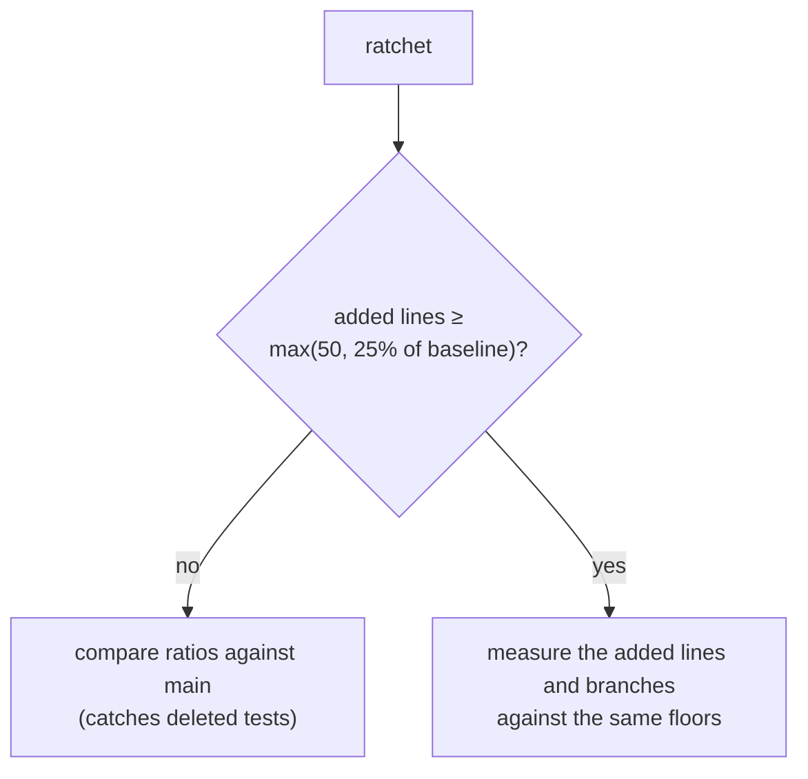

# ADR-0017: The coverage ratchet judges added code, not the whole-repository ratio

**Status:** Accepted
**Date:** 2026-08-22
**Amends:** [ADR-0014](ADR-0014-coverage-gate.md)

## Context

[ADR-0014](ADR-0014-coverage-gate.md) put two checks on coverage: an absolute
floor, and a ratchet comparing the branch's percentage against `main`'s. The
ratchet exists to catch the pull request that adds a lot of untested code while
staying just above the floor.

Comparing whole-repository ratios assumes both sides are roughly the same size.
When #6 — the first feature in this repository — was opened, they were not:

| | `main` | the branch |
|---|---|---|
| Coverable lines | 30 | 480 |
| Line coverage | 100.00% | 100.00% |
| Branch coverage | 100.00% | 98.35% |

`main` was scaffolding: thirty trivial lines, no branching worth the name, and
therefore a perfect score. Under a ratio comparison the branch failed, and the
only ways to pass were to delete the three defensive guards no test can reach
through the public API — "a question always has at least one version", "a version
has exactly one source translation" — or to contort the code until they were
reachable.

A gate that can only be satisfied by removing an invariant check is pushing in
the wrong direction. The number is not the thing being protected; the reporter
is.

## Decision

The ratchet keeps the floor untouched and gains a second mode. Which one runs
depends on how much the branch grew the codebase.

- **Ordinary changes** — including every deletion — are compared as a ratio,
  exactly as before. Dropping a test suite still fails.
- **A branch that grows the codebase materially** is judged on the coverage of
  the lines it added. Below either floor, it fails, and the message names the
  added lines rather than the repository percentage.

The threshold is `max(50, 25% of the baseline)`. A quarter is a lot of new code;
below it the existing body still dominates the percentage and a drop really does
mean tests went missing. The floor of fifty lines stops a tiny baseline — thirty
lines of scaffolding — from making an eight-line change look structural.

Added coverage is inferred from the two reports' totals: the difference in
`lines-valid` and `lines-covered`. Attributing coverage per line would mean
diffing both reports against the diff itself. This answers the same question at
the resolution the gate needs, from data already in both files.

The pull request comment says which mode ran and why, because a gate whose
reasoning is invisible gets argued with rather than trusted.

## Consequences

- The first feature can land without deleting a guard to satisfy an arithmetic
  comparison.
- A large, untested addition still fails, and now fails with a more specific
  message: "the 450 lines this branch adds are 20.00% covered".
- Both floors still apply to the whole repository, in both modes. Nothing here
  lowers them.
- The inference is approximate. A branch that simultaneously adds well-tested
  code and deletes covered code can flatter itself. The floor still catches the
  outcome, and the alternative — a real per-line diff — is a lot of machinery
  for a gate that is deliberately a floor, not a target.
- `tools/coverage-gate.mjs` now exports its two decisions as pure functions, so
  `tests/js` can exercise the mode selection and the arithmetic directly.

## Alternatives rejected

**Lower the floors.** Would have let #6 through and permanently weakened the
gate for every change after it. The floors were not the problem.

**Delete or restructure the unreachable guards.** The gate would go green and
the domain would lose three invariant checks. This is the failure mode the
change exists to prevent, not an acceptable way to satisfy it.

**Mark defensive guards `[ExcludeFromCodeCoverage]`.** Honest for genuinely
unreachable code, and still available where it fits, but it treats every future
structural change as a case of annotating code until the number moves.

**Seed `main` with a realistic baseline.** A one-time fix for a recurring shape:
any large refactor or new subsystem hits the same wall.

**Drop the ratchet entirely and keep only the floors.** Loses the check that
catches a pull request adding untested code while sitting just above the floor —
the exact thing ADR-0014 added it for.

## Related

- [ADR-0014](ADR-0014-coverage-gate.md) — the gate this amends
- `tools/coverage-gate.mjs`, `tests/js/coverage-gate.test.mjs`
- `docs/testing-conventions.md`
- Issues #53, #6
