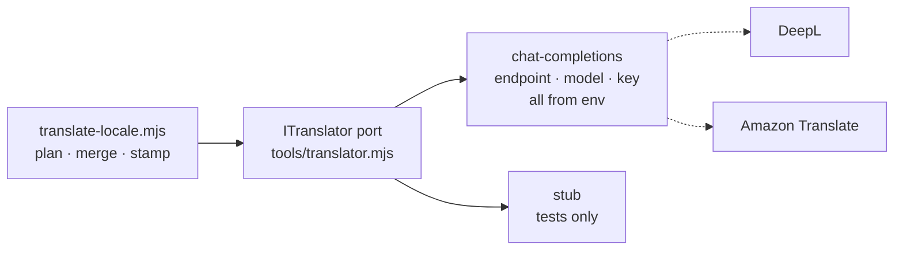

# ADR-0022 — GitHub Models is retired; the translation provider is configuration behind a one-file adapter

**Status:** Proposed — the adapter is decided and built; **which provider to
configure is an open question for HPAC.** See "What is still open".

Supersedes the provider clause of [ADR-0007](ADR-0007-localization.md) — and
only that clause. Everything else ADR-0007 decided still stands: English is the
source of truth, French is generated in CI, the glossary is pinned, raw reports
are never translated.

## Context

ADR-0007 chose **GitHub Models** on the free tier for the CI translation job.
The reasoning was good: `permissions: models: read`, the runner's built-in
`GITHUB_TOKEN` already carries that scope, no API key, no vendor, no secret to
rotate.

**GitHub Models was fully retired on 30 July 2026.** From GitHub's own changelog:

> As of July 30, 2026, GitHub Models is now retired. The playground, model
> catalog, inference API, and bring your own key (BYOK) are no longer available
> to any customer, including existing customers with active usage.

— [GitHub Changelog, 30 July 2026](https://github.blog/changelog/2026-07-30-github-models-is-now-retired/)

So the provider named in ADR-0007 does not exist, there is no free
already-authenticated substitute inside GitHub Actions, and #10 could not be
built as written. Retirement announcements are also not a one-off: whatever is
chosen next can be retired too, and the cost of that should not be a rewrite of
the translation job.

## Decision

**The provider is configuration. The code names no vendor.**

`tools/translator.mjs` is the whole of it — the one file to change to swap
provider — and it declares the same port as
`HpacSafety.Core.SharedKernel.ITranslator`:

```
translate(items, { source, target }) -> Promise<Map<key, string>>
```

Two ports rather than one shared type because the two run in different runtimes:
the .NET one runs in the worker in production, this one runs in GitHub Actions.
The contract is deliberately identical.



Two adapters ship:

| Provider | What it is |
|---|---|
| `chat-completions` | Any OpenAI-shaped `/chat/completions` endpoint. `TRANSLATION_ENDPOINT`, `TRANSLATION_MODEL`, and `TRANSLATION_API_KEY` come from the workflow. This adapter names no vendor and hardcodes no model id. |
| `stub` | Offline stand-in for the test suite. Stamps `provider: "stub"`, which `--check` rejects, so its output can never reach `main`. |

**There is no default provider.** `createTranslator({})` throws
`TranslatorNotConfiguredError`. A job that quietly picked one would put
unattributed French in front of a reviewer with no way to know which machine
wrote it — and `fr-CA.meta.json` records the provider per key precisely so that
question always has an answer.

**Nothing configured is not a build failure.** With no provider set, the
generate run prints a `::warning::`, lists the keys that are waiting, changes
nothing, and exits 0. A red build on every push to `main` for a decision nobody
has made yet is a red build that gets muted, and then the next real failure is
invisible too.

No model id is written down anywhere in this repository. That is deliberate —
see below.

## Alternatives

- **GitHub Models.** The decision this supersedes. Retired; not available at any
  price.
- **`actions/ai-inference@v3`.** Already rejected in ADR-0007 for needing a
  Copilot seat, and it was backed by the same retired service.
- **Hardcode a specific vendor and model id in the tool.** The obvious thing,
  and it is exactly what just broke. A vendor named in code is a vendor whose
  retirement is a code change; a vendor named in a repository variable is a
  vendor whose retirement is a settings change. It would also have meant
  inventing a model id nobody chose — `AGENTS.md` is explicit that a value you
  were not given is not a value to invent.
- **Reuse the worker's Anthropic client, with `ANTHROPIC_API_KEY` in Actions.**
  Genuinely attractive: the key already exists in AWS Secrets Manager for the
  worker, so no new vendor relationship. But it puts a production runtime
  credential into GitHub Actions, which today holds exactly one secret
  (`AWS_DEPLOY_ROLE_ARN`, inert without its OIDC trust policy) and no runtime
  secret at all. That is a security posture change, not a plumbing choice, and
  it is not one to make unilaterally. It is question 1 below.
- **DeepL.** Best raw French of the candidates and the reason `chat-completions`
  is an adapter rather than the interface itself — DeepL's API is not
  OpenAI-shaped, so it is a second adapter in the same file, not a config
  change. Adds a vendor and a key.
- **Amazon Translate.** In-region now that hosting is AWS, and reachable from
  Actions with the OIDC role that already exists — arguably the cheapest answer
  on credentials, since it needs no new secret at all. Weakest French of the
  three for short interface labels.
- **Drop machine translation; a human writes all the French.** Correct, and
  blocking. Rejected in ADR-0007 for the same reason it is rejected here: the
  machine draft plus human review reaches the same place without stalling
  development.

## What is still open

The adapter is built, tested, and wired. Configuring it needs three answers that
are HPAC's to give, not a maintainer's to guess:

1. **Which provider**, and therefore whether GitHub Actions may hold an
   inference credential at all. Reusing the worker's `ANTHROPIC_API_KEY`, adding
   DeepL, and using Amazon Translate over the existing OIDC role have different
   security postures, not just different French.
2. **Which model id**, if the answer to 1 is a chat-completions provider. There
   is no defensible default: model ids are vendor-specific and change, and this
   one is stamped into `fr-CA.meta.json` as provenance for every key.
3. **Whether to add `TRANSLATION_PR_TOKEN`**, the fine-grained token that lets
   CI run on the translation pull request. See the consequences in
   [ADR-0021](ADR-0021-ci-translation-opens-a-pull-request.md).

Until then the job runs on every push to `main`, reports exactly which keys are
waiting for a translator, and writes nothing.

## Consequences

- Swapping provider is one file and three repository settings. Retirement number
  two costs an afternoon, not a rewrite.
- `fr-CA.meta.json` records the provider per key, and the adapter puts the model
  id in that name (`chat-completions:vendor/a-model`), so "which machine
  wrote this French" is answerable after the fact, including after a swap.
- The `chat-completions` adapter asks for `temperature: 0` where the provider
  honours it. The same English twice should not produce two different French
  strings and a spurious diff.
- A provider reply that is not JSON fails the run rather than being written into
  a locale file. A fenced reply is unwrapped first — models fence more often than
  not, and burning a run over decoration helps nobody.
- The error body from a failed provider call is **never logged**, only the status
  code. The request carries UI labels, not report data, but a reply can echo a
  header.
