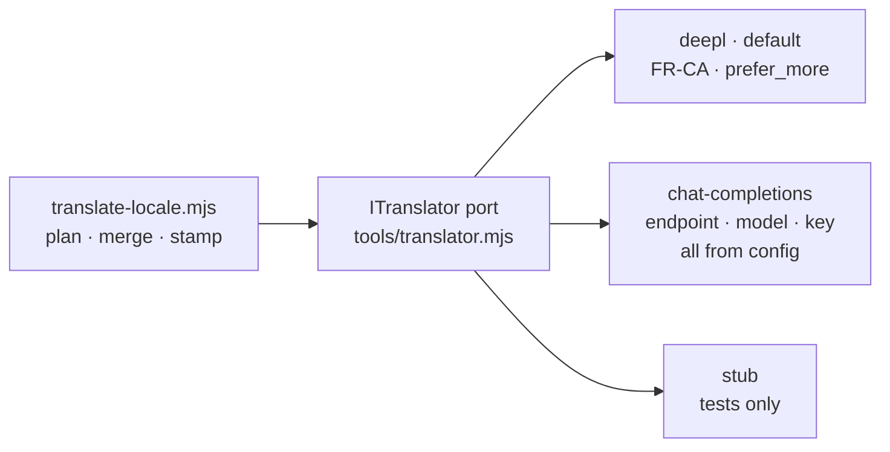

# ADR-0022 — DeepL, behind a one-file adapter, after GitHub Models was retired

**Status:** Accepted only for application UI catalogue generation. Runtime
question and summary translation clauses are superseded by the
[localization specification](../../spec/web-localization-and-design.md).

Supersedes the provider clause of [ADR-0007](ADR-0007-localization.md) — and
only that clause. Everything else ADR-0007 decided still stands: English is the
source of truth, French is generated in CI, the glossary is pinned, raw reports
are never translated.

## Context

ADR-0007 chose **GitHub Models** on the free tier for the CI translation job.
The reasoning was good: `permissions: models: read`, the runner's built-in
`GITHUB_TOKEN` already carries that scope, no API key, no vendor, no secret to
rotate.

**GitHub Models was fully retired on 30 July 2026.** From GitHub's own changelog:

> As of July 30, 2026, GitHub Models is now retired. The playground, model
> catalog, inference API, and bring your own key (BYOK) are no longer available
> to any customer, including existing customers with active usage.

— [GitHub Changelog, 30 July 2026](https://github.blog/changelog/2026-07-30-github-models-is-now-retired/)

So the provider named in ADR-0007 does not exist, and there is no free
already-authenticated substitute inside GitHub Actions. Retirement is also not a
one-off: whatever is chosen next can be retired too, and the cost of that should
not be a rewrite of the translation job.

## Decision

**DeepL**, targeting `FR-CA`, behind an adapter that is the one file to change
to swap provider.

`tools/translator.mjs` declares the same port as
`HpacSafety.Core.SharedKernel.ITranslator`:

```
translate(items, { source, target }) -> Promise<Map<key, string>>
```

Two ports rather than one shared type because the two run in different runtimes:
the .NET one runs in the worker in production, this one runs in GitHub Actions.
The contract is deliberately identical.



| Provider | What it is |
|---|---|
| `deepl` | **The default.** Only `DEEPL_API_KEY` is required. |
| `chat-completions` | Any OpenAI-shaped `/chat/completions` endpoint. Kept so that a future swap is a settings change, not a rewrite — and it is what proves the port abstracts a variation that actually exists. |
| `stub` | Offline stand-in for the test suite. Stamps `provider: "stub"`, which `--check` rejects, so its output can never reach `main`. |

Three details that are decisions, not plumbing:

- **The endpoint is derived from the key.** DeepL identifies Free-tier keys by a
  `:fx` suffix, and Free and Pro have different hosts. Choosing the host from
  the key means the owner adds one secret rather than a secret and a matching
  host, and gets a working job either way. Getting it wrong yields a 403 that
  reads like a bad key.
- **Formality defaults to `prefer_more`.** A national safety authority
  addressing pilots uses *vous*. `more` would say that more firmly, but `more`
  and `less` fail with **HTTP 400** on a target language that does not support
  formality, whereas the `prefer_` variants degrade to default. `FR` documents
  formality support; `FR-CA` does not. A whole run lost to a 400 over a nicety
  is not a trade worth making. Override with `TRANSLATION_FORMALITY`.
- **`preserve_formatting: true`.** These are interface labels. DeepL
  "correcting" a label's capitalisation or trailing space is a change nobody
  asked for.

### Provenance, when there is no model id

DeepL has no model id, so `fr-CA.meta.json` records the two things that actually
determine the output:

```
provider: "deepl:FR-CA:prefer_more"
```

Target variant and formality. Change either and every key's provenance says so,
which is the question provenance exists to answer. The chat-completions adapter
uses the same slot for `chat-completions:<model-id>`.

## `FR-CA` is real, and it was worth checking

The concern raised when DeepL was chosen was that DeepL offers only `FR`, which
would mean `locales/fr-CA.json` quietly containing metropolitan French under a
Canadian name.

**It does not.** DeepL's supported-languages table lists, distinctly:

| Code | Language | Translation |
|---|---|---|
| `FR` | French | source and target |
| `FR-CA` | French (Canadian) | **Target Only** |
| `FR-FR` | French (France) | Target Only |

The adapter uses `FR-CA`. "Target Only" means it cannot be a *source* language,
which never matters here — English is the source of truth for UI chrome, and the
mapping refuses rather than guessing for any locale it has no code for.

So there is no metropolitan-French gap to document. What remains true, and is
the reason human review still matters, is narrower and worth stating plainly:
`FR-CA` is DeepL's Canadian French, not HPAC's. It will not know that this
association says *parapente* rather than *deltaplane* for a given wing, or which
of two defensible renderings of a rating name the membership actually uses. That
is what `glossary.json` and a human reviewer are for — see below.

## DeepL's glossary feature, and why the pinned-glossary rule does not change

DeepL has its own glossary feature: a stored resource of term pairs, referenced
by `glossary_id`, applied *during* translation. It is available for `FR-CA`.

It is **not** a substitute for the pinned-key rule, and the observable behaviour
in [ADR-0021](ADR-0021-ci-translation-opens-a-pull-request.md) is unchanged: a
glossary-pinned key is dropped before the call and never modified. The two
mechanisms answer different questions:

| | `locales/glossary.json` (this repo) | DeepL glossaries |
|---|---|---|
| Granularity | A whole key's French | A term inside a string |
| Guarantee | The string is never sent and never altered | The term is *preferred*, and the rest is still machine output |
| Where the French comes from | HPAC, by hand | HPAC's term, DeepL's sentence |

"Serious injury (secondary medical aid)" is close to a defined term, and the
requirement is that a machine does not decide it *at all* — not that a machine
decides it with a hint. A DeepL glossary would still send the string and still
return a machine-composed result, which is a weaker guarantee wearing the same
name. Dropping the key before the call is the only version that cannot silently
degrade.

DeepL glossaries would be a genuine improvement for a different problem —
**term consistency inside strings that are not pinned**, so that "glider"
renders the same way across forty labels. That needs a glossary resource
lifecycle (create, version, reference by id) that nothing here has, and it is
deliberately not in this change. Worth its own issue.

## Alternatives

- **GitHub Models.** The decision this supersedes. Retired; unavailable at any
  price.
- **`actions/ai-inference@v3`.** Already rejected in ADR-0007 for needing a
  Copilot seat, and backed by the same retired service.
- **Amazon Translate.** The cheapest answer on credentials: hosting is already
  AWS, so it is reachable from Actions over the OIDC role that exists today and
  needs **no new secret at all**. Rejected on output quality — it is the weakest
  of the three for short interface labels, where there is no surrounding
  sentence to disambiguate a word like "Submit" or "Clear", and it has no
  equivalent of the formality control. Credential convenience is worth less than
  the French a bilingual membership actually reads.
- **Reuse the worker's Anthropic client, with `ANTHROPIC_API_KEY` in Actions.**
  Attractive because the key already exists in AWS Secrets Manager, so no new
  vendor relationship. Rejected: it puts a **production runtime credential**
  into GitHub Actions, which today holds exactly one secret
  (`AWS_DEPLOY_ROLE_ARN`, inert without its OIDC trust policy) and no runtime
  secret at all. That is a security-posture change, and a translation job is not
  a good reason to make it. A separate, narrowly scoped DeepL key can be revoked
  without touching production.
- **Human translation only.** Correct, and blocking. Rejected in ADR-0007 for
  the same reason it is rejected here: the machine draft plus human review
  reaches the same place without stalling development. It is also not the
  either/or it looks like — every generated key lands as `reviewed: false`, so
  the human step is preserved, just not on the critical path.
- **Hardcode the vendor in the tool rather than behind an adapter.** The obvious
  thing, and exactly what just broke. A vendor named in code is a vendor whose
  retirement is a code change.

## Consequences

- **A new secret, `DEEPL_API_KEY`**, added by the repository owner. It is the
  first inference credential in this repository's Actions. It is scoped to one
  vendor and one purpose, and revoking it stops translation and nothing else.
- Swapping provider again is one file and a repository variable.
- **Placeholder preservation is checked after every translation**, for every
  provider, in `translate-locale.mjs` rather than in an adapter — a French
  string that lost `{count}` fails the run rather than shipping a label with a
  hole in it. Order is not compared; French word order differs.
- DeepL maps translations to inputs **by position**, with no keys in the
  response. A length mismatch would shift every key by one and stamp each with a
  hash asserting it is correct, so the adapter refuses on any mismatch rather
  than mapping.
- The error body of a failed provider call is **never logged**, only the status
  code. The request carries UI labels, not report data, but a reply can echo a
  header.
- DeepL bills by character. Per-key hash detection means an edit to one label
  re-sends one label, so the steady-state cost is close to zero.
