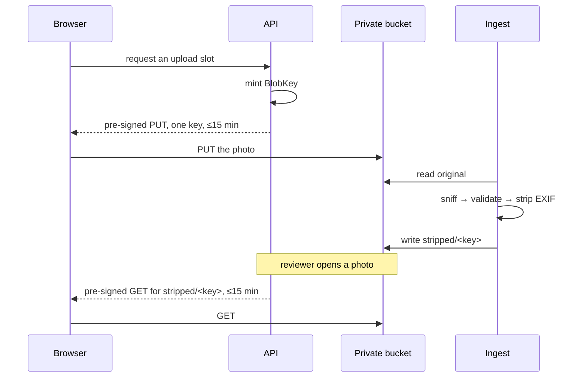

# ADR-0026: Every blob is reached through a short-lived pre-signed URL

**Status:** Accepted
**Date:** 2026-08-22

## Context

`docs/data-handling.md` is unambiguous: uploaded media is **Restricted**,
the bucket is **private**, and there are **no public object URLs, ever**. A
reporter uploads one photo; a safety officer later needs to look at it. Those
are the only two moments a blob is touched from outside the system.

The obvious shape — the browser POSTs the file to the API, the API stores it,
and an admin route streams it back — is the wrong one twice over. It puts
multi-megabyte bodies through the API and its request-size limits, and it makes
the API a second door onto Restricted media with its own access-control story to
get wrong.

## Decision

**Uploads and reads both go directly to storage through a pre-signed URL scoped
to one key, and no route in the API ever serves blob bytes.**

### One port, two adapters, one test suite

`IBlobStore` lives in `Core/SharedKernel`. `S3BlobStore` is an **Adapter** over
the AWS S3 SDK — S3-compatible rather than AWS-specific, so it also covers
Cloudflare R2 and MinIO. `FileSystemBlobStore` is an Adapter over the local
filesystem, for a contributor with no AWS account.

The development store **signs its URLs too**, with an HMAC over the operation,
the key, the content type, and the expiry. That is not decoration. AGENTS.md
says a development stand-in must never weaken a guarantee the production
implementation makes, and the guarantee here — a URL is a capability for one
object, not a key to the bucket — is worth nothing if it is only true in the
environment nobody develops against. `BlobStoreContractTests` is therefore one
suite, run unchanged against MinIO in a container and against the filesystem.

### A key is a value object

`BlobKey` parses or throws: no empty segments, no `.`, no `..`, no backslashes,
no spaces or control characters, 512 characters at most. A key is
attacker-influenced and ends up as a path on disk, so the string is validated
once at the boundary and the store can never be handed a raw one.
`FileSystemBlobStore` re-checks that the resolved path is inside its root
anyway — two cheap checks beat one clever one.

### Fifteen minutes, enforced in `Core`

`BlobUrlLifetime.Maximum` is 15 minutes and both adapters run every lifetime
through `BlobUrlLifetime.Validate`. The cap lives in `Core` because a rule each
implementation re-states is a rule one of them will eventually re-state
differently.

### The derivative lives under its own prefix

`stripped/<original key>`. Two keyspaces that cannot collide, and "which one is
safe to show a reviewer" is answerable from the key alone.

### Nothing is written for a file that was refused

`MediaIngestor` sniffs, validates, strips, then writes, in that order. A refused
upload never acquires a derivative, and `MediaIngestOutcome.DerivativeKey`
throws rather than returning a key when the outcome is a rejection — a caller
that asks for something to show a reviewer after a rejection has a bug worth
failing loudly.

### The API is guarded against growing a blob route

`NoBlobIsServedDirectlyTests` walks the live route table and fails if a route
appears whose pattern reads like blob delivery. The rule is about what the API
is *not*, and that is only cheap to enforce at the moment someone adds one.

## Alternatives rejected

**Upload through the API.** Simple, and it puts video-sized bodies through the
request pipeline, needs the limits raised, and doubles the number of places
Restricted bytes exist in memory. It also gives the API a reason to hold the
whole file, which is exactly what pre-signing avoids.

**An admin route that streams the blob.** Convenient, and it is a second access
path to Restricted media, permanently. Every authorization bug in it is a leak.
Pre-signed GETs put that logic in one place — whether to mint a URL at all.

**A public bucket with unguessable keys.** Security by URL secrecy. URLs end up
in browser history, in referrer headers, in a screenshot pasted into a chat.
Rejected outright; `docs/data-handling.md` already forecloses it.

**No signature on the development store — return a `file://` path.** Shorter,
and it would mean the "a pre-signed PUT cannot be reused for a different key"
test could only run where Docker runs. The stand-in would then be a weaker
implementation of the same interface, which is the SOLID violation AGENTS.md
names explicitly.

**A longer expiry, an hour or a day.** A reviewer's session is minutes. A URL
that outlives the reason it was minted is a public object URL with extra steps.

## Consequences

- `HpacSafety.Infrastructure` depends on `AWSSDK.S3`. `Core` does not, and must
  not.
- The MinIO contract suite carries `[Trait("Category", "Integration")]`, so a
  machine with no Docker daemon skips it with `--filter "Category!=Integration"`.
  CI runs it. It is pinned to a release tag for the same reason the Postgres
  container is.
- Ingest buffers the whole file in memory to hash, sniff, and strip it.
  `MediaPolicy.MaxByteSize` is what bounds that cost, and it is a constructor
  argument with no default — a size limit nobody chose is a size limit nobody
  owns. The maximum upload size HPAC wants is an open question in
  `docs/data-handling.md`.
- Rejection reasons are an enum, never a sentence. The edge localizes them; no
  user-facing string is written in `Core` or `Infrastructure`.

## Related

- [ADR-0025](ADR-0025-magick-net-for-exif-stripping.md)
- [ADR-0009](ADR-0009-hosting-on-aws.md)
- `docs/data-handling.md`, `docs/architecture.md`
- `src/HpacSafety.Infrastructure/Storage/README.md`
