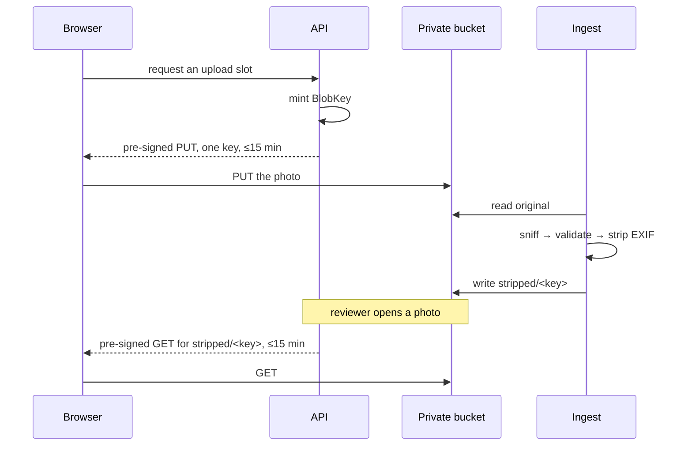

# ADR-0026: Every blob is reached through a short-lived pre-signed URL

**Status:** Superseded for submission by the
[final multipart design](../../spec/report-submission.md). Private storage and
short-lived authorized reviewer reads remain; pre-submit upload slots do not.
**Date:** 2026-08-22

## Context

`docs/data-handling.md` is unambiguous: uploaded media is **private**,
the bucket is **private**, and there are **no public object URLs, ever**. A
reporter uploads one photo; a safety officer later needs to look at it. Those
are the only two moments a blob is touched from outside the system.

The obvious shape — the browser POSTs the file to the API, the API stores it,
and an admin route streams it back — is the wrong one twice over. It puts
multi-megabyte bodies through the API and its request-size limits, and it makes
the API a second door onto private media with its own access-control story to
get wrong.

## Decision

**Uploads and reads both go directly to storage through a pre-signed URL scoped
to one key, and no route in the API ever serves blob bytes.**



### One port, two adapters, one test suite

`IBlobStore` lives in `Core/SharedKernel`. `S3BlobStore` is an **Adapter** over
the AWS S3 SDK — S3-compatible rather than AWS-specific, so it also covers
Cloudflare R2 and MinIO. `FileSystemBlobStore` is an Adapter over the local
filesystem, for a contributor with no AWS account.

The development store **signs its URLs too**, with an HMAC over the operation,
the key, the content type, and the expiry. That is not decoration. AGENTS.md
says a development stand-in must never weaken a guarantee the production
implementation makes, and the guarantee here — a URL is a capability for one
object, not a key to the bucket — is worth nothing if it is only true in the
environment nobody develops against. `BlobStoreContractTests` is therefore one
suite, run unchanged against MinIO in a container and against the filesystem.

### The layout is a rule, not a convention

All of a report's media lives in a directory named with that report's id, so
everything belonging to one report is a single literal prefix:

```
quarantine/<report id>/<file>   unverified. Expired by lifecycle rule.
<report id>/original/<file>     the private source record.
<report id>/stripped/<file>     the derivative a reviewer sees.
```

`BlobKey` parses or throws, and it parses **only those three shapes**. A key that
is not namespaced by a well-formed report id is unrepresentable rather than
merely discouraged — there is no constructor that produces one. It also refuses
what it always refused: empty segments, `.`, `..`, backslashes, spaces, control
characters, and leading dots in a file name. A key is attacker-influenced and
ends up as a path on disk, so it is validated once at the boundary and the store
can never be handed a raw one. `FileSystemBlobStore` re-checks that the resolved
path is inside its root anyway — two cheap checks beat one clever one.

Report ids are **tiny ids**: 11 characters of `A-Za-z0-9-_`, cryptographically
random, encoding no timestamp. The shape is duplicated inside `BlobKey` today
only because the shared `TinyId` value object is still in flight (#62); switch to
it when that merges, because two implementations of one format is how they drift
apart.

An 11-character random id is not enumerable, so a report's media directory
cannot be discovered by walking ids. **That is a reinforcement of the
private-bucket rule and not a replacement for it.** Every object is still
private, and still reached only through a short-lived pre-signed URL. The failure
mode worth naming: someone later notices the key is unguessable and concludes
that a public bucket would now be fine. It would not be. URLs end up in browser
history, in referrer headers, and in screenshots pasted into chats, and an
unguessable name that has been guessed once stays guessed forever.

### Quarantine sits at the top level, and why not a tag

Every upload lands in `quarantine/`, and nothing leaves it until this system has
decided what the bytes are. A refused upload is simply never promoted: it expires
where it landed, through a bucket lifecycle rule, so **no delete is needed and
none exists**. That is the point — no code path exists that could later be
pointed at a real report's media.

Putting expiry in the bucket rather than in code has a cost worth naming: the
guarantee now lives in Terraform, in another pull request, and this repository
cannot test it. That is why the rule is specified precisely in
`docs/data-handling.md` rather than described loosely — and it is exactly how the
first version of it turned out to be wrong. The uploads bucket is **versioned**,
where `expiration` writes a delete marker instead of deleting bytes; the
noncurrent version it leaves behind would have fallen to the bucket-wide 90-day
policy. `noncurrent_version_expiration { noncurrent_days = 1 }` on the same rule
is what actually destroys the bytes, and both clauses are load-bearing. Caught by
the agent implementing #32, against the spec written here.

An S3 lifecycle filter matches a **literal** prefix. With the report id first,
`*/quarantine/` is not expressible, so a per-report quarantine directory could
not be expired by a prefix rule at all. Two ways out, and this is the one not
taken:

**A tag filter**, keeping `<report id>/quarantine/`. Rejected because both ways
of applying the tag fail *open*. Tagging at upload means signing an
`x-amz-tagging` header into the pre-signed PUT and trusting the browser to send
it — a client that omits it produces an object that never expires. Tagging after
ingest means an object whose ingest never ran never gets tagged, which is exactly
the case the rule exists for. The prefix fails *closed*: an object is in
`quarantine/` because that is the only place an upload URL can write, and nothing
has to remember anything for it to expire.

The cost is one departure from "report id first", for unverified files only. The
report id is still the next segment, so per-report enumeration is one literal
prefix either way (`quarantine/<id>/`), and nothing operational is lost.

The exact rule #32 implements — bucket, prefix, both expiry clauses, and an
honest note that each hop is day-granular and therefore a floor rather than a
deadline — is written out in `docs/data-handling.md`. On a versioned bucket the
floor for *destruction* is two days, not one, because the two hops run in
sequence.

### The report id exists before the upload does

A pre-signed PUT is scoped to a key and every key is namespaced by a report id,
so **the id is minted when the upload slot is issued, not when the report is
submitted.** The API mints it, issues the slot against it, and the submitted
report carries the same id. #14 inherits that as a decided contract rather than
discovering it.

The consequence is deliberate and small: a slot can be issued for a report that
is never submitted, leaving unverified bytes in quarantine that nothing
references. The lifecycle rule above expires them without anything having to
notice, which is the same mechanism that handles a refused upload.

### Fifteen minutes, enforced in `Core`

`BlobUrlLifetime.Maximum` is 15 minutes and both adapters run every lifetime
through `BlobUrlLifetime.Validate`. The cap lives in `Core` because a rule each
implementation re-states is a rule one of them will eventually re-state
differently.

### An upload can only ever land in quarantine

`MediaUploadSlot` is the only thing that mints an upload URL, and it never names
the compartment — it is always `Quarantine`. A caller cannot accidentally hand
out a URL that writes straight into a report's private source record, because it has
no way to ask for one.

### Nothing is promoted for a file that was refused, and "accepted" is not "viewable"

`MediaIngestor` sniffs, validates, and only then promotes. `MediaIngestStatus`
has three states rather than two, because accepted and safe-to-look-at are not
the same thing:

| Status | Original retained | Derivative | Reviewer sees |
|---|---|---|---|
| `Rejected` | no — expires in quarantine | no | nothing |
| `AwaitingStripping` | yes | **no** — video, #65 | nothing |
| `Stripped` | yes | yes | the derivative |

`MediaIngestOutcome.DerivativeKey` throws on either of the first two. It does not
fall back to the original, which would be the leak, and it does not return null
for a caller to forget to check.

### A reviewer link can only name a derivative

`IBlobStore` will sign a URL for any key it is handed — it is generic storage and
knows nothing about which bytes are safe to look at. `ReviewerMediaLink`, in
`Core`, does: it issues a URL only for `MediaCompartment.Stripped`.

The check is on the **parsed compartment**, not on a substring of the key. That
survived the layout moving the report id to the front, which a prefix match would
not have: a check that silently passes a differently-shaped key is worse than one
that fails. It also means a video needs no special case — it has no stripped
compartment at all, so it is refused by the same rule as any other original.

Enforcing it in one type rather than at each call site is deliberate. The admin
route that will call this does not exist yet (#14); the rule should already be
impossible to get wrong when it arrives.

### Nothing client-supplied reaches an exception message

`BlobKey`, `MediaType`, and `FileSystemBlobStore` all refuse bad input without
echoing it. A key encodes a report identifier and a declared content type is a
raw client header — neither belongs in a message something downstream will log.
`docs/data-handling.md` says log identifiers, not content; an exception message
is a log line that has not happened yet.

### The chokepoints are enforced, not documented

`ReviewerMediaLink` and `MediaUploadSlot` are the only things that pre-sign
anything. `IBlobStore` is a public port with no guard of its own — it will sign a
GET for a report's unstripped original as readily as for its derivative — so
"only these two call it" is a rule an architecture test enforces by walking
`src/` and failing on any other call site. Convention is not enforcement, and the
next contributor has not read this ADR.

### File names are minted, never carried

A camera roll name is private data in its own right: `mt-7-tandem-dave.jpg`
names a site and a person, which is exactly the small-community identifiability
problem `docs/anonymization-policy.md` describes. A key reaches bucket access
logs, CloudTrail, and every pre-signed URL. `MediaUploadSlot` mints a random
name in the tiny-id alphabet and there is no parameter to pass one through, so
this cannot be got wrong by forgetting.

### The persisted row fails closed too

`MediaIngestOutcome` is transient; `ReportFile` is what an admin UI projects
from. So `ReportFile.ViewableKey` throws while `AwaitsStripping` rather than
exposing the original, `AwaitsStripping` checks the key *and* the timestamp, and
`RecordStripped` refuses a key outside the stripped compartment. A guarantee
proven only on the transient type holds until the first page is written.

### The API is guarded against growing a blob route

`NoBlobIsServedDirectlyTests` walks the live route table and fails if a route
appears whose pattern reads like blob delivery. The rule is about what the API
is *not*, and that is only cheap to enforce at the moment someone adds one.

## Alternatives rejected

**Upload through the API.** Simple, and it puts video-sized bodies through the
request pipeline, needs the limits raised, and doubles the number of places
Private bytes exist in memory. It also gives the API a reason to hold the
whole file, which is exactly what pre-signing avoids.

**An admin route that streams the blob.** Convenient, and it is a second access
path to private media, permanently. Every authorization bug in it is a leak.
Pre-signed GETs put that logic in one place — whether to mint a URL at all.

**A public bucket with unguessable keys.** Security by URL secrecy. URLs end up
in browser history, in referrer headers, in a screenshot pasted into a chat.
Rejected outright; `docs/data-handling.md` already forecloses it. Tiny ids make
the keys unguessable and change nothing about this.

**Refusing video outright, because we cannot strip it.** It would have kept the
invariant trivially, and it would have thrown away evidence a reporter chose to
give us after a crash. Retaining it while refusing to show it keeps both.

**No signature on the development store — return a `file://` path.** Shorter,
and it would mean the "a pre-signed PUT cannot be reused for a different key"
test could only run where Docker runs. The stand-in would then weaken the
production contract and stop the shared suite from proving it locally.

**A longer expiry, an hour or a day.** A reviewer's session is minutes. A URL
that outlives the reason it was minted is a public object URL with extra steps.

## Consequences

- `HpacSafety.Infrastructure` depends on `AWSSDK.S3`. `Core` does not, and must
  not.
- The MinIO contract suite carries `[Trait("Category", "Integration")]`, so a
  machine with no Docker daemon skips it with `--filter "Category!=Integration"`.
  CI runs it. It is pinned to a release tag for the same reason the Postgres
  container is.
- Ingest buffers an accepted file in memory to hash, sniff, and strip it.
  `MediaPolicy.MaxByteSize` bounds that cost, and it stays a constructor argument
  with no default — a size limit nobody chose is a size limit nobody owns. The
  configured value is **50 MB** (`MediaPolicyOptions`), which is generous for a
  photo and tight for video; see `docs/data-handling.md`.
- **The limit is enforced while the object streams in, not after it has been
  fully downloaded.** An earlier version of `MediaIngestor` read the whole
  quarantined object into memory with `CopyToAsync` and checked its length
  afterward — on a public upload endpoint with no other size gate, that is a
  denial-of-service surface: an attacker-supplied multi-gigabyte upload would be
  pulled entirely into memory before ever being refused. `CopyBoundedAsync`
  reads in `Stream.CopyToAsync`'s own chunk size and stops the moment more than
  `MaxByteSize` bytes have arrived, so an oversized object is never read past a
  few chunks beyond the configured limit. Caught in PR review; a test proves it
  by tracking bytes actually pulled from a 500&nbsp;MB synthetic source against a
  1&nbsp;KB policy limit, without allocating 500&nbsp;MB to make the point.
- **Defense in depth, not yet done:** S3 pre-signed POST supports a
  `content-length-range` policy condition, which would let S3 itself refuse an
  oversized PUT before it reaches this system at all. `CreateUploadUrlAsync`
  issues a pre-signed **PUT**, not a POST, and SigV4 PUT URLs have no equivalent
  bound — only a POST policy document can carry one. Moving to POST (or adding a
  POST-based upload path alongside PUT) to get that bound is a genuine
  improvement and is not done here; it is not a substitute for the streaming
  check above; even with a bucket-side bound, this application must not trust an
  unbounded read on any source, including `FileSystemBlobStore` in development,
  where no S3 policy applies at all.
- An accepted upload is copied once, from quarantine to the private source record.
  That is the price of deciding what bytes are before they land anywhere
  permanent, and it is worth paying.
- A submitted-late report loses its media: the quarantine key stops resolving
  about a day after upload — the first lifecycle hop — and
  ingest reads from there. Upload slots live 15 minutes and a form is filled in
  one sitting, so this is acceptable — but it is a real coupling between the
  lifecycle rule and the submission flow, and #14 should not lengthen the gap
  without revisiting it.
- Rejection reasons are an enum, never a sentence. The edge localizes them; no
  user-facing string is written in `Core` or `Infrastructure`.

## Related

- [ADR-0025](ADR-0025-magick-net-for-exif-stripping.md)
- [ADR-0009](ADR-0009-hosting-on-aws.md)
- `docs/data-handling.md`, `docs/architecture.md`
- `src/HpacSafety.Infrastructure/Storage/README.md`
