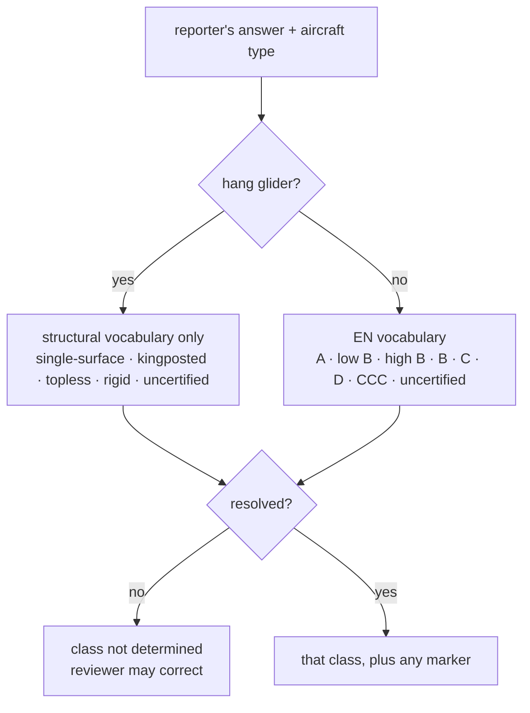
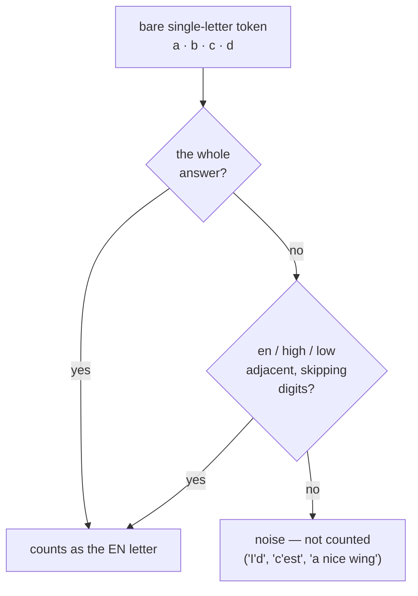

# ADR-0029: Aircraft classification is deterministic, synchronous, and refuses to guess

**Status:** Accepted
**Date:** 2026-08-22
**Revised:** 2026-08-22 — three questions raised with HPAC were ruled on, and an
independent review found a false-positive letter match; see "Four revisions, and
what they rejected".

## Context

Invariant 2 in `AGENTS.md` says an aircraft is published as a certification
class, that the class comes from the reporter's own answer and nowhere else,
that there is no model-to-class lookup table, and that an AI never infers it.
`docs/aircraft-classification.md` says the same thing at length and explains
why: a stale table row publishes a confident, wrong, permanent fact about a real
accident.

`IAircraftClassifier` existed as a port with an asynchronous signature:

```csharp
Task<AircraftClass> ClassifyAsync(string?, Discipline, CancellationToken);
```

Nothing implemented it. Today's Typeform collects `Certification:` as free text,
so the answers that have to be read are shapes like `"EN B"`, `"low B"`,
`"LTF 1-2"`, `"B (high)"`, `"topless"`, and `"n/a"`.

Two things had to be decided: where the implementation lives and what shape the
port takes, and what the classifier does with an answer it cannot resolve
cleanly.

## Decision

**One deterministic implementation, `VocabularyAircraftClassifier`, living in
`HpacSafety.Core.Features.Reporting` beside the port.** It reads two inputs —
the reporter's verbatim certification answer and the aircraft type the reporter
chose — and nothing else. No make, no model, no narrative, no pilot rating, no
table, no model call.

**The port is synchronous.** `Classify(string?, Discipline)` returns an
`AircraftClassification` directly.

> An implementation that had to await something would be reaching for a network
> call, and the only things on the other end of that call are a language model
> or a lookup service. Both are forbidden here. A synchronous signature makes
> the invariant structural rather than a comment: you cannot honour this
> interface and phone a model without the blocking call being obvious in review.

**Normalization is total, and the unresolved outcome is a first-class result.**
Every input produces either a vocabulary class or `NotDetermined`, which a
reviewer may correct by hand. Three refusals are deliberate:



- **LTF/DHV answers are `NotDetermined`.** LTF is a different certification
  scheme, and how its bands map onto EN bands is a judgement with a safety
  consequence that HPAC has not made. `"LTF 1-2"` in particular lands inside the
  B band without saying where, so even accepting the usual scheme equivalence
  would leave it undetermined.
- **A hang glider answer never resolves to an EN class.** Hang gliders are not
  EN-rated, so the two vocabularies are scoped by discipline and the paraglider
  one cannot leak across. `"EN B (low)"` on a hang glider is `NotDetermined`,
  not a translation attempt.
- **A make or model in the certification field resolves to nothing**, because
  there is no table to look it up in.

Refusing is not the same as discarding an answer the reporter actually gave —
see the three rulings below.

## Four revisions, and what they rejected

The first draft of this classifier refused three shapes that turned out to be
answerable. The questions went to HPAC rather than being settled by taste, and
the answers are requirements now. A fourth revision runs the other way: an
independent review found a shape the classifier accepted that it should have
refused, and closed it.

### 1. Plain `EN-B` is a class

**Ruled:** add `EN-B` to the vocabulary. `"EN B"` with no band publishes as
plain EN-B, and an answer naming *both* bands ("low or high B, not sure")
resolves to plain EN-B too — the reporter has told us it is a B.

**Never defaulted to low or high.** `AircraftClass.EnB` is a third value beside
`LowEnB` and `HighEnB`, not a stand-in for either, and nothing widens one into
the other in either direction.

Plain EN-B carries less safety signal than a banded answer — it spans nearly the
whole recreational market, which is why the low/high split exists — so the
*goal* for new reports is unchanged: the selection-scoped certification question
from #12, offering the band as a choice so it arrives banded. What changed is
the treatment of the historical free-text answers, where refusing a true answer
was the worse of the two errors.

*Rejected:* refusing bare `EN-B` as `NotDetermined`, the original behaviour. It
threw away an answer the reporter gave, and it made the review queue absorb
reports where nothing was actually wrong. *Also rejected:* defaulting bare
`EN-B` to `low` or to `high`, which is the guess this whole document exists to
prevent.

### 2. LTF and DHV stay undetermined

**Ruled:** unchanged. Every LTF/DHV answer, `"LTF 1-2"` included, stays
`NotDetermined`.

The scheme mapping is not HPAC-settled, and applying one would be inference —
precisely what invariant 2 forbids. Note the asymmetry with the ruling above and
why it is not inconsistent: a reporter who writes `"EN B"` has stated a value in
*this* vocabulary, while a reporter who writes `"LTF 1-2"` has stated a value in
a different one, and crossing between them is a conversion nobody has ratified.
A reviewer converts it by hand, on the record.

*Rejected:* the conventional LTF-to-EN equivalence. It is widely quoted and it
is still someone else's rule of thumb, and `"LTF 1-2"` would land inside the B
band without saying where in any case.

### 3. `uncertified` extends to hang gliders

**Ruled:** `uncertified` is part of the hang glider vocabulary as well as the
paraglider one. Uncertified hang gliders exist, and refusing the answer loses a
true one.

It stays the *fallback* within that vocabulary: `"topless, uncertified"` is
`topless`, because the structural class is the more useful answer where the
reporter gave one. And it is not an EN class, so the rule that a hang glider
answer never resolves to an EN class is untouched.

*Rejected:* keeping `uncertified` paraglider-only, on the grounds that
`docs/aircraft-classification.md` listed it under paragliders. That was a gap in
the document, not a decision — the document now lists it under both.

### 4. A bare letter only counts in a certification-shaped position

**Found in independent review, fixed in the same pull request.** `ReadEnLetter`
treated a single-character token — `"a"`, `"b"`, `"c"`, `"d"` — as a stated EN
letter wherever it occurred, with no requirement that it relate to a
certification word. The normalizer strips an apostrophe to a space, so `"I'd
guess it was fine"` tokenizes to include a bare `"d"`; a French sentence with no
certification content at all, `"c'est un bon jour"`, contains a bare `"c"`; the
indefinite article in ordinary English prose is a bare `"a"` in nearly every
paragraph. Each one resolved to a confident EN class from a sentence that never
named one — the exact failure invariant 2 exists to prevent, arrived at through
the mechanism meant to prevent it rather than around it.

**Ruled — this one did not go to HPAC, because it is not a vocabulary
judgement; it is a bug in reading the vocabulary.** The fix: a bare
single-letter token counts as the EN letter only where it sits in a
certification-shaped position:

- **It is the whole answer.** A one-word answer that is only `"B"` has no prose
  around it to be noise within, so it counts on its own.
- **A certification word — `en`, `high`, `hi`, `low`, `lo` — sits next to it**,
  in either direction, skipping over a purely numeric token in between so `"EN
  926 A"` still reaches "EN" past the size code. Anything else in between —
  another word, or nothing, once punctuation is already stripped — stops the
  search in that direction. Proximity has to be real, not "the letter and the
  word appear somewhere in the same sentence".

A token that already spells the letter attached to "EN" — `"ena"`, `"enb"` — was
never ambiguous and needed no context check; only the bare single-character
token did.



Golden cases pin the fix down both ways: the three sentences above resolve to
`NotDetermined`, and `"EN B"`, `"B (high)"`, `"low B"`, `"EN 926 A"` still
resolve to their classes.

*Rejected:* requiring the letter's own token to be exactly `"en"` + letter
(banning the bare single-letter form entirely). That would refuse `"EN A"`
itself, since normalizing splits it into two tokens, `"en"` and `"a"` — the most
common real answer shape, not the noise case.

*Rejected:* requiring a certification word to appear anywhere in the answer,
rather than adjacent to the letter. It would still admit "the wing is high
performance and I flew a bit erratically" as a hit on "high", proximity to the
stray letter or not — closer to the original bug than to a fix.

*Rejected:* a fixed word-distance window (for example, within two tokens either
side) instead of skipping only numeric tokens. It would admit "the wing was a
en route replacement" — an unrelated "en" two words from an unrelated "a" — on
distance alone. Skipping only digits keeps the one legitimate reason a
certification word and its letter are not literally adjacent (a size code
between them) without opening the check to arbitrary nearby words.

## Consequences

- The classifier is provable in a plain unit test with no database, no network,
  and no model — the same reason the deterministic scrub lives in `Core`.
- `NotDetermined` will still appear on historical free-text answers, though less
  often than the first draft produced it. That is the design working. The review
  queue absorbs it; a wrong published class does not.
- `AircraftClass` gains `EnB = 8`. Existing members keep their stored values —
  appended, never renumbered.
- Adding a recognised answer shape is a one-line vocabulary change with a test,
  not an integration.
- A caller cannot opt into inference, because there is nothing to opt into.

## Alternatives rejected

**Keep the asynchronous port.** It costs nothing today and reads as an invitation
tomorrow: the natural way to fill an `async` classification port is to call a
model, which is exactly what invariant 2 forbids. Async here would be an
extension point for the one extension that must not exist.

**Implement it in `Infrastructure` behind the port.** That is right for anything
that reaches outside — this reaches nowhere. Putting it outside `Core` would put
a published-content rule behind a swappable boundary, and a stand-in
implementation could then weaken the guarantee.

**A model-to-class lookup table, even a small curated one.** Rejected by
invariant 2 and by `docs/aircraft-classification.md`, and worth restating: the
maintenance burden is permanent, per-size differences make it wrong in detail,
and the failure mode is a confident wrong fact about a named accident. Browsing
manufacturer or certification sites to build one is the same decision wearing a
hat.

**Ask a language model to normalize the free text.** It would handle more
shapes, and it would also produce a plausible band for `"EN B"` — which is the
failure this whole design exists to prevent. The pipeline's own rule applies:
never ask a model to do something deterministic code does reliably.

**Default an unresolved answer to the most common class.** Silently publishing a
guess as fact. `NotDetermined` is a valid, visible, correctable state; a default
is invisible and wrong at unknown times.

**Map LTF to EN.** A defensible mapping exists in the wild, but it is HPAC's
call to make, not an implementation detail to settle by taste. Asked, and ruled
on: it stays undetermined. See "Never assume. Ask." in `AGENTS.md`, and ruling 2
above.

## Related

- [ADR-0030](ADR-0030-classification-carries-markers-with-the-class.md)
- `docs/aircraft-classification.md`, `docs/anonymization-policy.md`
- `skills/aircraft-classification/SKILL.md`
- `AGENTS.md` — invariant 2
