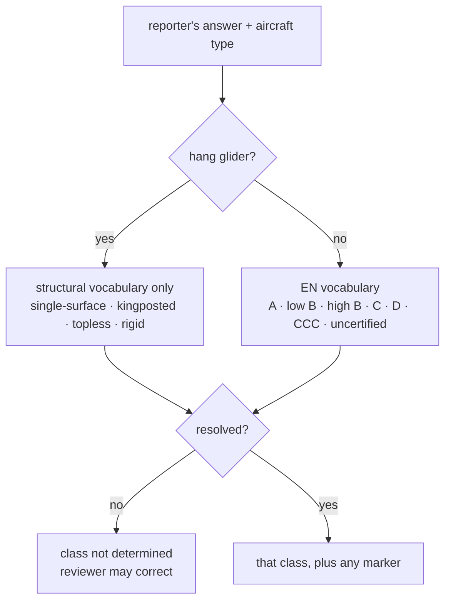

# ADR-0029: Aircraft classification is deterministic, synchronous, and refuses to guess

**Status:** Accepted
**Date:** 2026-08-22

## Context

Invariant 2 in `AGENTS.md` says an aircraft is published as a certification
class, that the class comes from the reporter's own answer and nowhere else,
that there is no model-to-class lookup table, and that an AI never infers it.
`docs/aircraft-classification.md` says the same thing at length and explains
why: a stale table row publishes a confident, wrong, permanent fact about a real
accident.

`IAircraftClassifier` existed as a port with an asynchronous signature:

```csharp
Task<AircraftClass> ClassifyAsync(string?, Discipline, CancellationToken);
```

Nothing implemented it. Today's Typeform collects `Certification:` as free text,
so the answers that have to be read are shapes like `"EN B"`, `"low B"`,
`"LTF 1-2"`, `"B (high)"`, `"topless"`, and `"n/a"`.

Two things had to be decided: where the implementation lives and what shape the
port takes, and what the classifier does with an answer it cannot resolve
cleanly.

## Decision

**One deterministic implementation, `VocabularyAircraftClassifier`, living in
`HpacSafety.Core.Features.Reporting` beside the port.** It reads two inputs —
the reporter's verbatim certification answer and the aircraft type the reporter
chose — and nothing else. No make, no model, no narrative, no pilot rating, no
table, no model call.

**The port is synchronous.** `Classify(string?, Discipline)` returns an
`AircraftClassification` directly.

> An implementation that had to await something would be reaching for a network
> call, and the only things on the other end of that call are a language model
> or a lookup service. Both are forbidden here. A synchronous signature makes
> the invariant structural rather than a comment: you cannot honour this
> interface and phone a model without the blocking call being obvious in review.

**Normalization is total, and the unresolved outcome is a first-class result.**
Every input produces either a vocabulary class or `NotDetermined`, which a
reviewer may correct by hand. Three refusals are deliberate:



- **`"EN B"` with no band is `NotDetermined`.** There is no plain EN-B in the
  vocabulary, and the low/high split is the part that carries the safety signal.
  Picking a band would be inventing the only thing the field is for. An answer
  naming *both* bands ("low or high B, not sure") is refused for the same
  reason.
- **LTF/DHV answers are `NotDetermined`.** LTF is a different certification
  scheme, and how its bands map onto EN bands is a judgement with a safety
  consequence that HPAC has not made. `"LTF 1-2"` in particular lands inside the
  B band without saying where, so even accepting the usual scheme equivalence
  would leave it undetermined. **This is an open question raised with HPAC; if
  the answer is that a mapping exists, it lands here, in the vocabulary tests,
  and in `docs/aircraft-classification.md`.**
- **A hang glider answer never resolves to an EN class.** Hang gliders are not
  EN-rated, so the two vocabularies are scoped by discipline and the paraglider
  one cannot leak across. `"EN B (low)"` on a hang glider is `NotDetermined`,
  not a translation attempt.

## Consequences

- The classifier is provable in a plain unit test with no database, no network,
  and no model — the same reason the deterministic scrub lives in `Core`.
- `NotDetermined` will be common on historical free-text answers. That is the
  design working. The review queue absorbs it; a wrong published class does not.
- Adding a recognised answer shape is a one-line vocabulary change with a test,
  not an integration.
- A caller cannot opt into inference, because there is nothing to opt into.

## Alternatives rejected

**Keep the asynchronous port.** It costs nothing today and reads as an invitation
tomorrow: the natural way to fill an `async` classification port is to call a
model, which is exactly what invariant 2 forbids. Async here would be an
extension point for the one extension that must not exist.

**Implement it in `Infrastructure` behind the port.** That is right for anything
that reaches outside — this reaches nowhere. Putting it outside `Core` would put
a published-content rule behind a swappable boundary, and a stand-in
implementation could then weaken the guarantee.

**A model-to-class lookup table, even a small curated one.** Rejected by
invariant 2 and by `docs/aircraft-classification.md`, and worth restating: the
maintenance burden is permanent, per-size differences make it wrong in detail,
and the failure mode is a confident wrong fact about a named accident. Browsing
manufacturer or certification sites to build one is the same decision wearing a
hat.

**Ask a language model to normalize the free text.** It would handle more
shapes, and it would also produce a plausible band for `"EN B"` — which is the
failure this whole design exists to prevent. The pipeline's own rule applies:
never ask a model to do something deterministic code does reliably.

**Default an unresolved answer to the most common class.** Silently publishing a
guess as fact. `NotDetermined` is a valid, visible, correctable state; a default
is invisible and wrong at unknown times.

**Map LTF to EN in this pull request.** A defensible mapping exists in the wild,
but it is HPAC's call to make, not an implementation detail to settle by taste.
See "Never assume. Ask." in `AGENTS.md`.

## Related

- [ADR-0030](ADR-0030-classification-carries-markers-with-the-class.md)
- `docs/aircraft-classification.md`, `docs/anonymization-policy.md`
- `skills/aircraft-classification/SKILL.md`
- `AGENTS.md` — invariant 2
