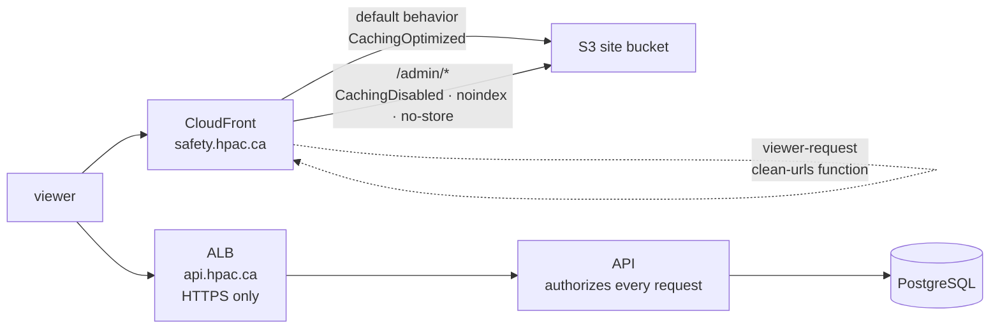
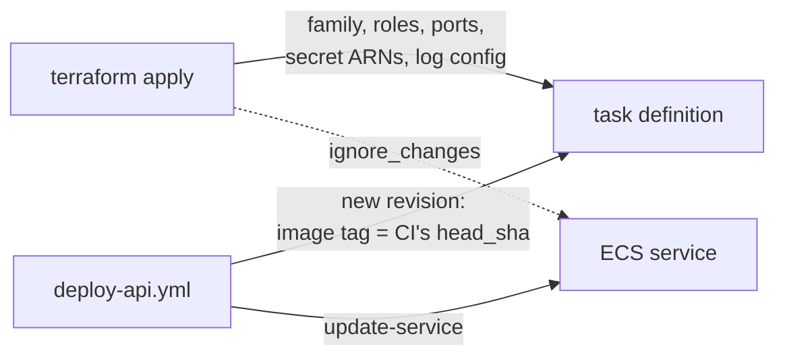

# ADR-0031 — The shape of the Terraform, and the topology it builds

**Status:** Superseded by the
[minimal infrastructure specification](../../features/infrastructure-and-operations/infrastructure-and-operations.md),
which requires separate public/admin sites and removes SES/email resources.

**Supersedes, in part:**

- [ADR-0009](ADR-0009-hosting-on-aws.md) — "one distribution each for public and
  admin". There is now **one** site bucket and **one** distribution, with the
  admin review queue served as a route on the website.
- [ADR-0010](ADR-0010-infrastructure-as-code.md) — "State in S3 with a DynamoDB
  lock table". Locking is now **S3-native**; there is no DynamoDB table.

Both reversals are recorded in full below rather than by editing the original
ADRs, per the rule in `AGENTS.md`: a decision that was later reversed is
superseded by a new ADR that says so, because the reasoning behind the reversal
is the part worth keeping.

## Context

[ADR-0010](ADR-0010-infrastructure-as-code.md) chose Terraform and a scripted
bootstrap. It did not say how the Terraform is laid out, and several of those
choices are ones somebody will otherwise re-litigate: how many environments
there are, who owns an ECS image tag, where a tool version is pinned, and what
happens to a resource whose value has to come from outside AWS.

This ADR records those. The plan-on-pull-request mechanics and what can be
verified without an AWS account are [ADR-0032](ADR-0032-terraform-ci-without-an-aws-account.md).

## Decision

### One root module in `infra/`, one environment

Flat `.tf` files at `infra/`, split by area — `network.tf`, `database.tf`,
`ecs.tf` — with no `modules/` directory and no workspaces.

There is one environment: production. HPAC receives dozens of reports a year and
has two administrators. A staging environment would double the RDS and Fargate
bill and, more to the point, would be the place someone pastes real report data
to reproduce a bug.

**Rejected: Terraform workspaces.** They share one configuration across
environments, so the difference between environments is invisible in the code
and lives in whoever remembers which workspace they are in. With one environment
they buy nothing and add a way to apply to the wrong one.

**Rejected: `environments/production/` plus `modules/`.** The standard shape for
a repository with three environments. With one, every module is called exactly
once, so the module boundary carries no reuse and every value makes two hops —
variable in, output out — for a reader to follow.

**Rejected: Terragrunt.** A second tool, a second DSL, and a second thing to keep
current, to solve a duplication problem that does not exist at one environment.

If a second environment is ever wanted, the extraction is mechanical and this ADR
is superseded rather than worked around.

### One website, with the admin review queue as a route on it

`https://safety.hpac.ca/` serves the public report form.
`https://safety.hpac.ca/admin/` serves the review queue. One S3 bucket, one
CloudFront distribution, one certificate, one hostname. The API is separate, at
`https://api.hpac.ca`.

ADR-0009 specified two distributions, "so the admin surface can take network
controls the public form must not have". That is reversed.

**What is genuinely lost.** In CloudFront, WAF association, geo restriction, and
IP allowlisting are **distribution-level**. With one distribution they can no
longer be applied to the admin area alone — any of them would hit a pilot filing
a report as well. Origin-level isolation between the two areas is gone.

**Why that is acceptable here.** The admin bundle is static HTML and JavaScript,
byte-identical for every visitor, and it contains **no report data**. Every piece
of report data a reviewer sees arrives from the API, which authorizes each
request against the `admin_users` allowlist (#24, [ADR-0005](ADR-0005-authentication.md)).
The delivery path was never the security boundary; serving the admin *shell*
publicly discloses the application's structure and its UI strings and nothing
else. This does mean the mitigation is load-bearing: **if the admin bundle ever
starts containing data, or the API's authorization is weakened, this decision
must be revisited, not worked around.**

**What still isolates the two, per path.** A cache behavior, a CloudFront
Function, and a response headers policy are all per-path-pattern, and all three
are used: `/admin/*` gets `CachingDisabled`, `X-Robots-Tag: noindex, nofollow` so
the queue is never indexed, `Cache-Control: no-store`, and `frame-ancestors`-style
headers via `X-Frame-Options: DENY`. Geo restriction is deliberately `none` — a
Canadian pilot files from wherever they crashed.

**Rejected: two distributions, as ADR-0009 had it.** It buys per-area WAF and IP
allowlisting for an asset that holds nothing worth allowlisting, at the cost of a
second bucket, a second certificate, a second hostname for HPAC's DNS
administrator to publish, a second invalidation on every deploy, and a
cross-origin boundary between two halves of one application.

**Rejected: admin on its own hostname pointing at the same bucket.** A second
name and a second certificate, with none of the isolation that was the point.

### The state lock is S3-native, not DynamoDB

`backend.tf` sets `use_lockfile = true`. Terraform takes the lock by writing a
`.tflock` object into the state bucket with a conditional `PutObject`, so the
bucket that holds the state also holds the lock. `bootstrap.sh` creates no
DynamoDB table and the deploy role has no DynamoDB permissions.

ADR-0010 and #32 both specified a DynamoDB lock table. `dynamodb_table` was
deprecated in Terraform 1.11 and warns on every `init` from 1.13 onward, and it
will be removed. **This is changed now, deliberately, because there is no live
state to migrate** — doing it after the first apply would mean a lock migration
on a state file that is the only record of what exists.

**Rejected: ship the deprecated parameter and migrate later.** A deprecation
warning on every run is a warning people stop reading, and the migration only
gets more expensive once state is real.

**Rejected: both mechanisms at once.** `dynamodb_table` alongside `use_lockfile`
still emits the deprecation warning and leaves a table nothing needs.

### Terraform owns the shape of a task definition; the deploy workflow owns the revision

The services declare `ignore_changes = [task_definition, desired_count]` and the
task definitions `ignore_changes = [container_definitions]`.

Without that, the two fight: a deploy sets the image to a commit SHA, the next
`terraform plan` reads it as drift, and `apply` rolls production back to
whatever tag is written in `ecs.tf`. Both tools would be correct and the result
would be a silent rollback on an unrelated infrastructure change.

**Rejected: Terraform sets the image tag from a variable.** Every deploy becomes
a Terraform apply behind a required reviewer, which turns a rollback — the thing
that has to be fast — into an approval queue.

**Rejected: the deploy workflow renders the whole task definition.** Then the
secret ARNs, the log group names, and the task role live in a workflow's YAML
rather than beside the resources they name, and Terraform no longer knows what
is deployed at all.

### No secret value, and no generated credential, reaches state

ADR-0010 already forbids Secrets Manager values in `.tfvars`. Two things follow
that are worth writing down because they look like omissions:

- There is no `aws_secretsmanager_secret_version` resource anywhere in `infra/`.
  A task whose secret has no value **fails to start**, loudly, in the ECS event
  log. That is correct — an API booting without its Turnstile key would accept
  unverified submissions — and it makes `put-secret-value` part of first deploy
  rather than a later tidy-up.
- The RDS master password uses `manage_master_user_password`, so RDS generates
  and rotates it into its own secret. Terraform never receives it. The
  alternative, `random_password`, writes the password into state in plaintext.

### A tool version is pinned in exactly one file

`infra/.terraform-version` pins Terraform; `infra/.tflint-version` pins tflint;
`.tflint.hcl` pins the AWS ruleset. The `infra` CI job reads each from its file.

`versions.tf` therefore has **no `required_version`**, and tflint's
`terraform_required_version` rule is disabled with a comment saying why. That
looks like a missing best practice, and it is a deliberate application of the
rule in `AGENTS.md`: a version written in two files is a version that will
drift, and the drift shows up as a contributor whose local run disagrees with CI
for no visible reason. The same rule is why `init-dev.sh` reads the .NET version
out of `global.json`. See [ADR-0015](ADR-0015-one-shell-script-for-development-setup.md).

The AWS **provider** version is a constraint (`~> 6.61`) plus a committed
`.terraform.lock.hcl` holding checksums for five platforms. That is one pin — the
lock file — with a range above it, which is how Terraform is designed to work.

### DNS on `hpac.ca` is an output, not a resource

`hpac.ca` is administered by HPAC, outside this AWS account, so Terraform cannot
create a Route 53 record for it. Every record a human must publish — SES
verification, three DKIM CNAMEs, the MAIL FROM MX and SPF TXT, DMARC, ACM
validation, and the CloudFront and ALB aliases — is collected into the single
`dns_records_to_publish` output, because an external dependency on another
organisation takes days and a value nobody can find takes longer.

The `aws_acm_certificate_validation` resources deliberately **block**, for up to
two hours, until those records appear. The alternative is a listener serving a
certificate that was never validated.

### One NAT gateway, not one per availability zone

A NAT gateway is the largest fixed cost here after RDS. One is a single point of
failure for **outbound** traffic only: report submission (viewer → CloudFront, or
viewer → ALB → API → RDS) never traverses it. Losing that AZ delays
summarization, which is already asynchronous behind the outbox, until the NAT is
recreated.

## Consequences

- Adding a second environment means extracting modules, and supersedes this ADR.
- A reviewer reading `ecs.tf` sees `:latest` as the image and must know it is
  never what is running. The comment at the top of that file says so; this is the
  cost of the split above.
- The first `terraform apply` on a fresh account does **not** produce a working
  system on its own. Nothing has been pushed to ECR and no secret has a value, so
  the services do not stabilise until the first deploy and the first
  `put-secret-value`. The order is in `docs/deployment.md`; it is a property of
  bootstrapping, not a defect.
- **Admin protection is entirely the application's**, plus the per-path edge
  rules above. There is no network control in front of the review queue, and the
  next person to add one has to add it to the whole distribution or not at all.
- HPAC's DNS administrator publishes two alias records rather than three, and one
  certificate validation set rather than two.
- `S3_BUCKET_PUBLIC`, `S3_BUCKET_ADMIN`, `CLOUDFRONT_DISTRIBUTION_PUBLIC`, and
  `CLOUDFRONT_DISTRIBUTION_ADMIN` — named in #32 and in an earlier revision of
  `docs/deployment.md` — do not exist. `S3_BUCKET_SITE`,
  `CLOUDFRONT_DISTRIBUTION_SITE`, and `SITE_ADMIN_PREFIX` replace them.
- One CloudFront invalidation per deploy covers both areas, so an admin-only
  change invalidates the public form's cache too. At this deploy rate that costs
  nothing.
- **`aws s3 sync --delete` on the public subtree would delete the admin prefix**,
  because they now share a bucket. The deploy workflow has to scope the delete,
  and `deploy-web.yml` says so where the sync will be written (#30). This hazard
  did not exist with two buckets and is the one real operational cost of the
  change.

## Related

- [ADR-0009](ADR-0009-hosting-on-aws.md), [ADR-0010](ADR-0010-infrastructure-as-code.md)
- [ADR-0032](ADR-0032-terraform-ci-without-an-aws-account.md)
- `infra/README.md`, `docs/deployment.md`
