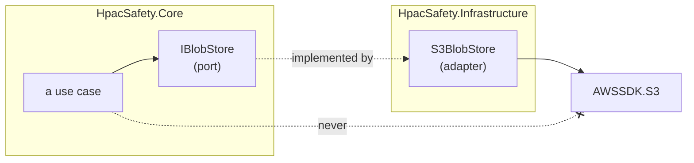

# ADR-0033 — Third-party libraries are used behind an abstraction we own

**Status:** Narrowed by
[`/features/interfaces-and-data-flow/interfaces-and-data-flow.md`](../../features/interfaces-and-data-flow/interfaces-and-data-flow.md).
Keep ports at real external boundaries or for proven multiple implementations;
do not wrap every library by default.
**Date:** 2026-08-22

## Context

`AGENTS.md` already said this twice, in passing: "anything that reaches outside
is a port declared here and implemented in `Infrastructure`", and "adapter at
every SDK boundary". Both are examples inside sections about something else —
domain-driven design, and naming patterns. Neither reads as a rule, and an
example is not something a reviewer can hold a pull request to.

It also said something that appears to cut the other way:

> a pattern that abstracts a variation which does not exist is a layer, not a
> pattern. If you cannot say what varies, write the plain code.

Applied to a vendor SDK, that corollary invites the wrong conclusion. There is
one blob store, one translation provider, one imaging library — so a reader
following the corollary in isolation writes `AmazonS3Client` into a handler and
argues, correctly by the letter of it, that no variation exists.

The two statements have to be settled against each other in one place, because
a reader who finds only one of them will apply it wrongly in one direction or
the other.

## Decision

**A third-party library is reached through an interface declared in
`HpacSafety.Core` and implemented by an adapter in `HpacSafety.Infrastructure`.
No call site outside that adapter names the vendor type.**

The stated purpose is **swappability**, and that purpose is sufficient on its
own. No second implementation, no testability argument, and no further
justification is required to open a port at a third-party boundary. The
question "what varies?" has a standing answer there: **the vendor varies.**

### Reconciling this with "a layer, not a pattern"

Both statements stay true, and both are load-bearing:

- **Inside the domain**, the corollary rules. A strategy interface with one
  implementation, an abstract base with one subclass, a factory that builds one
  type — those are layers. If you cannot name what varies, write the plain code.
- **At a third-party boundary**, the variation is named in advance and it is
  the vendor. It is real whether or not a second implementation exists today,
  because the choice of vendor is not ours alone to keep: pricing changes,
  terms change, an SDK is deprecated, a region becomes unavailable, a library's
  licence changes. The cost of that variation arriving is proportional to how
  many files name the vendor type.

The distinction is not "how likely is a second implementation" — that question
has no honest answer and invites the answer that saves work today. It is
**where the boundary is**. Ours, or someone else's.

`AGENTS.md` now carries both statements adjacent to each other under "Design",
so neither can be read without the other.

### Scope

In scope: **production dependencies that reach outside the process.** SDK
clients, HTTP clients, blob storage, image processing, translation providers,
mail, authentication providers, bot verification.

**`HttpClient` is a named example, not a special case.** It looks like the BCL
— it ships in `System.Net.Http` — but a socket open to a specific host on the
public internet is a third party's network stack wearing a BCL namespace, not
something this repository owns. Production code does not construct or call
`HttpClient` directly; it goes behind a port at the boundary being called, the
same as any other SDK client.

Not in scope:

- **Test-only libraries** — xunit, Shouldly, Testcontainers, FakeItEasy. Tests
  are the call sites that get rewritten when the tool changes; a port would add
  indirection to the one place we want to read literally. Shouldly is pinned by
  an analyzer instead (ADR-0013), which is the honest form of that commitment.
- **The .NET BCL.** `System.Text.Json`, `TimeProvider`, `ILogger` and the rest
  are the platform. `.NET` is not a swappable dependency; wrapping it is the
  generic wrapper layer rejected below.

The line is not "is it a NuGet package". It is: does this dependency belong to
a third party whose product decisions we do not control, and does production
code call it.

### Entity Framework Core is exempt

`DbContext` and `DbSet<T>` **are already an abstraction over the data store.**
They are the provider-independent seam: swapping PostgreSQL for another
relational store is a provider package and a connection string, not a rewrite
of every call site. The abstraction this rule exists to create is already
present and maintained by someone else.

Wrapping them in a hand-rolled repository buys nothing and costs the thing EF
is for. `IQueryable` composition — filtering, projection, paging, and `Include`
decided at the call site and translated to one SQL statement — cannot cross a
repository interface without either leaking `IQueryable` (in which case the
abstraction is decorative) or being replaced by a growing set of
`GetReportsByStatusAndProvincePaged` methods (in which case every new query is
a new method on an interface in `Core`).

So EF Core's SDK types — `DbContext`, `DbSet<T>`, its mapping attributes, its
fluent configuration — live in `Infrastructure`'s configuration layer, the same
place every other adapter lives. **`Core` takes no dependency on EF Core, the
way it takes none on anything else** — the exemption is from writing a
repository interface around it, not from the rule that `Core` depends on
nothing. This is a reasoned exemption, not a carve-out: it applies because the
two conditions above hold — the library already *is* the abstraction, and
interposing another one destroys its primary value. Any future library meeting
both tests can argue for the same exemption in its own ADR. No other library is
exempt today.

The invariants stay in the aggregates rather than in query code. That is
ADR-0018 and the `ddd` skill, unchanged by this decision.

### Instances that already follow the rule

The rule is being written down, not invented. `Core` already declares:

| Port | Boundary it owns |
|---|---|
| Private blob store | Bounded private object storage and authorized short-lived reads |
| Model summarizer | The one call that writes the bilingual summary pair |
| Attachment processor | Format detection and controlled image/video/document handling |
| `ITurnstileVerifier` | Cloudflare Turnstile |
| `IMemberAuthenticator` | The HPAC membership system |

**Image processing is explicitly included.** Magick.NET sits behind the blob
port's ingest path (issue #16, in flight) and is the newest instance: EXIF
stripping is expressed as an operation this repository owns, and `MagickImage`
appears in exactly one adapter.

## Alternatives rejected

**Depend on vendor types directly, everywhere.** Fewest files, and the shortest
path from an SDK sample to working code. It also spreads the vendor's type
names, exception types, and cancellation and retry semantics across every layer
that touches it, which turns "replace the translation provider" into a change
whose size is unknowable until it is started. On a system where the outbound
calls carry report content, the boundary is also the place PII rules are
enforced — with no boundary there is no single place to enforce them.

**Abstract only where a second implementation is already planned.** This is the
status quo this ADR overturns, and it is the most defensible of the rejected
options — it is exactly what "a layer, not a pattern" says for domain code. It
fails at a vendor boundary for two reasons. First, the trigger arrives from
outside: nobody plans a second implementation, a deprecation notice does, and by
then the call sites are written. Second, it makes every dependency an argument.
A rule whose application is negotiated per library is not a rule, and the
negotiation reliably resolves in favour of whatever is faster this week.

**Abstract EF Core too, behind a repository per aggregate.** Consistent, and
consistency is worth something. Rejected for the reasons above: the abstraction
already exists, and a repository interface either leaks `IQueryable` or grows a
method per query. It also encourages loading aggregates to filter them in
memory, which is a correctness and cost problem rather than a style one.

**A generic wrapper layer over everything, including the BCL** — our own
`IClock`, `IJsonSerializer`, a pass-through `IHttpClient` that mirrors
`HttpClient`'s own surface, `IFileSystem`. Maximal purity and maximal cost.
`TimeProvider` and `ILogger` are already abstractions, shipped and maintained by
the platform, and re-declaring them in `Core` produces a second vocabulary a
reader must learn with nothing behind it. It is the "layer, not a pattern"
failure applied at scale, and it would make the real ports harder to find by
burying them among ceremonial ones. This is not in tension with `HttpClient`
being in scope above: the port at an HTTP boundary is shaped by what the vendor
does — `ITurnstileVerifier`, not a transport-shaped `IHttpClient` — and
`HttpClient` itself stays an implementation detail inside that adapter.

## Consequences

- Adding a dependency that reaches outside the process means writing an
  interface in `Core` first. That is one file and a naming decision, not a
  design exercise — the port is shaped by what the caller needs, never by the
  SDK's surface. A port that mirrors the vendor's method signatures has not
  abstracted anything.
- The adapter owns translation of the vendor's failures. Vendor exception types
  do not escape `Infrastructure`; the port's contract says what callers handle.
- A vendor swap is bounded by construction: one adapter, one registration, one
  set of adapter tests. Whether the swap is easy stops depending on how
  disciplined the last six pull requests were.
- Fakes for local development are ordinary implementations of the same port —
  `FileSystemBlobStore` next to `S3BlobStore`. `AGENTS.md` already requires that
  a stand-in never weaken a guarantee the production implementation makes.
- A port with one implementation is expected and is not a finding in review. A
  vendor type outside `Infrastructure` is.
- This is enforced by review today. Making it mechanical — a banned-symbol list
  or an architecture test asserting `Core` and `Api` reference no vendor
  namespace — is the natural follow-up, in the spirit of ADR-0013, and is not
  part of this decision.

## Related

- [ADR-0013](ADR-0013-ban-assert-rather-than-grep-for-it.md) — a convention
  becomes a rule when a build enforces it
- [ADR-0018](ADR-0018-feature-folders-in-core.md) — where a port lives: with its
  feature, or in `SharedKernel`
- `AGENTS.md` and [`/features/interfaces-and-data-flow/interfaces-and-data-flow.md`](../../features/interfaces-and-data-flow/interfaces-and-data-flow.md)
- Issue #16 — image processing behind the blob port
