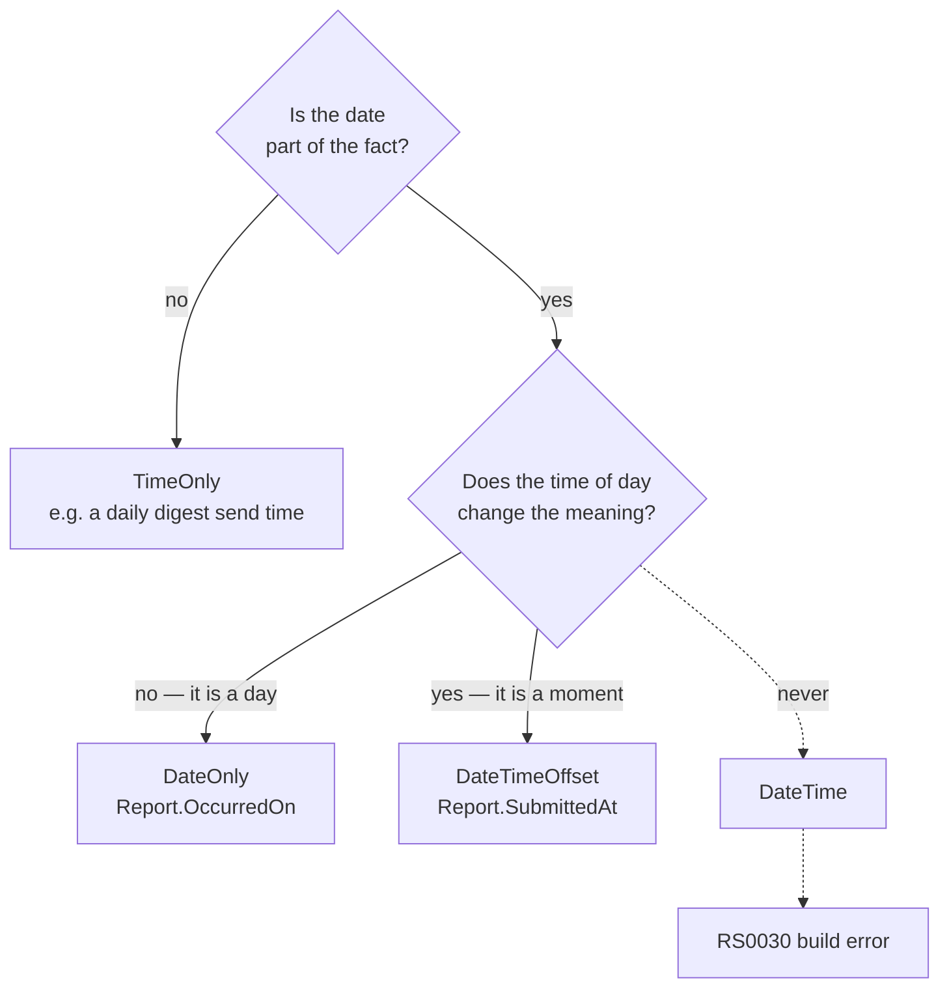

# ADR-0035 — `DateOnly`, `DateTimeOffset`, `TimeOnly`; `DateTime` is banned

**Status:** Accepted

## Context

`System.DateTime` is one type doing three different jobs. The same 64 bits mean
a moment in UTC, a moment in whatever the machine's local zone happens to be, or
a wall-clock reading with no zone at all — and which of the three it is lives in
a `Kind` flag that no signature mentions, no compiler checks, and no serializer
reliably preserves. `DateTime.Kind` is ambient state carried alongside the value
rather than in it, which means the correctness of a program using `DateTime`
depends on facts that are true of the machine, not of the type.

That is not a theoretical worry. `Kind` is lost across JSON, across most ORM
round-trips, and across every `new DateTime(...)` that does not pass a `Kind`
explicitly — and the loss is silent, because `Unspecified` is a legal value that
arithmetic and comparison accept without complaint. Two `DateTime` values that
compare equal can be six hours apart, and two that compare unequal can be the
same instant. `DateTimeOffset` carries the offset *with* the value, so a moment
means the same thing on the developer's laptop in Calgary, in the container in
`us-east-1`, and in the reader's browser.

The domain here makes the choice sharper than a general style preference would.
This system holds two genuinely different kinds of temporal fact, and the
distinction is not cosmetic:

**The occurrence date is a date.** A reporter answering "when did this happen?"
is naming a day, not a moment. They did not observe an instant; they observed
"the Saturday of the fly-in". Modelled as `DateTimeOffset` — or worse, as a
`DateTime` that some layer decides to normalize to UTC — a July 4th occurrence
reported from British Columbia becomes `2026-07-05T05:00:00Z` and then, at the
next boundary that renders it, *July 5th*. Nothing errors. A crash silently
moves to a different day, and in the aggregate that is the analysis HPAC
publishes.

**And a date here is already treated as identifying information.**
`docs/anonymization-policy.md` narrows a published date to **month and year**,
because province plus exact date plus aircraft type plus injury severity can be
unique in a flying community of a few thousand people. A field that is
deliberately blurred before publication is a field whose exact value must be
exactly what the reporter said — narrowing `2026-07-04` to "July 2026" is
correct; narrowing a value that a timezone conversion already pushed into
`2026-07-05` is correct-looking and wrong, and the error is invisible precisely
because the published form no longer shows the day.

**Audit trails, on the other hand, are moments.** When a report was submitted,
when an outbox row occurred and was processed, when a safety officer approved a
summary — these are instants on a timeline, ordered against each other, and they
must not drift when the process that wrote them and the process that reads them
disagree about the local zone.

## Decision

Model the temporal fact that is actually known, and let the type say which one
it is.

| What is known | Type |
|---|---|
| A date, and the time of day does not matter | `DateOnly` |
| A moment, and the time of day matters | `DateTimeOffset` |
| A time of day, and the date does not matter | `TimeOnly` |
| — | `DateTime` is **forbidden** |



### Which existing fields fall on which side

`DateOnly` — the reporter's own account of *when it happened*:

- `Report.OccurredOn`, and the `QuestionRole.OccurrenceDate` answer it is
  projected from. The projection parses with `DateOnly.TryParse` under the
  invariant culture, and there is no point in the round trip at which a zone is
  applied. This is the field `docs/anonymization-policy.md` narrows to month and
  year before publication.

`DateTimeOffset` — moments the system itself observed:

- `Report.SubmittedAt`
- `ReportAnswer.AnsweredAt`
- `ReportFile.UploadedAt`, `ReportFile.ExifStrippedAt`
- `Summary.ApprovedAt` — the human-review timestamp, which has to be defensible
  against a real timeline
- `OutboxMessage.OccurredAt`, `ProcessedAt`, `NextAttemptAt`, `PoisonedAt` —
  the backoff arithmetic in ADR-0002 is only correct if the values are instants
- `QuestionTranslation` and `QuestionOptionTranslation`: `TranslatedAt`,
  `UpdatedAt`

`TimeOnly` — nothing yet. It is here because the rule is a rule, not because a
field is waiting for it. If the form ever asks for time of day of the
occurrence, that answer is a `TimeOnly` and *publishing* it is a separate
anonymization question, not a typing one.

The rule applies to production code and to the schema in both directions
through EF Core: a `date` column maps to `DateOnly`, a
`timestamp with time zone` column maps to `DateTimeOffset`, and no `timestamp
without time zone` column exists.

### Enforcement

Documented rules hold for exactly as long as everyone remembers them.
Following the precedent set in
[ADR-0013](ADR-0013-ban-assert-rather-than-grep-for-it.md), `T:System.DateTime`
is added to `tests/BannedSymbols.txt`, enforced by
`Microsoft.CodeAnalysis.BannedApiAnalyzers` as `RS0030`. With
`TreatWarningsAsErrors` set in `Directory.Build.props`, that is a build error in
the editor and in a local `dotnet build`, carrying the reason and the
replacement to the author at the exact character — not a review comment and not
a CI surprise.

`RS0030` fires on *operations*, and it is worth being precise about what that
does and does not catch, because a rule whose reach is overstated is worse than
one whose reach is known:

| Code | `RS0030` |
|---|---|
| `DateTime.UtcNow`, `DateTime.Now`, `DateTime.Parse(...)` | fires |
| `new DateTime(2026, 7, 4)` | fires |
| `value.AddDays(1)`, `value.Year`, `a == b` on a `DateTime` | fires |
| `typeof(DateTime)`, `new List<DateTime>()` | fires |
| `DateTime x;` / a `DateTime` parameter or property, declared and never used | does **not** fire |

The last row is a real gap and not a hypothetical one: an EF entity could carry
a `public DateTime OccurredAt { get; set; }` and compile. It is a small gap in
practice, because the analyzer catches every site that *produces* such a value
(`UtcNow`, a constructor, a parse) and every site that *reads* anything off it —
a declaration nobody can populate or inspect is not a bug that survives review.
There is no analyzer that bans a type in declaration position, so the choice is
this ban or no ban, and this ban is the one with teeth.

### The boundary exception

A third-party library will hand back a `DateTime` — an AWS SDK response, a mail
provider, a driver. Per
[ADR-0033](ADR-0033-third-party-libraries-behind-owned-abstractions.md) that
vendor type is named in exactly one place: the adapter in
`HpacSafety.Infrastructure` that implements the port declared in
`HpacSafety.Core`. **The adapter converts at the boundary and returns the owned
type.** No call site outside the adapter ever sees a `DateTime`, and therefore no
call site inherits the ambiguity.

This does not make adapter code unbuildable, because the conversion itself is
not a banned operation. Passing a vendor `DateTime` straight into a conversion
compiles clean today:

```csharp
// inside the adapter, and only inside the adapter
var occurredAt = new DateTimeOffset(response.Timestamp, TimeSpan.Zero);
var occurredOn = DateOnly.FromDateTime(response.Timestamp);
```

What trips the analyzer is *doing arithmetic or reading members* on the vendor
value before converting — which is exactly the code that should not exist. If an
adapter genuinely needs it (a vendor that returns `Kind.Unspecified` local time
and requires `TimeZoneInfo.ConvertTimeToUtc` first), the escape is ADR-0013's:
`#pragma warning disable RS0030` with a comment saying which vendor and why. It
is deliberately visible in review, it belongs in the adapter and never at a call
site, and it must be accompanied by a test that pins the converted value.

The one thing an adapter must never do is assume. A vendor `DateTime` with
`Kind.Unspecified` has no defensible conversion, and picking one is exactly the
guess `AGENTS.md` forbids — the vendor's documented zone is a requirement to go
and find, not to infer.

## Consequences

- `tests/BannedSymbols.txt` gains `T:System.DateTime`. Its header note listing
  `DateTime.Now`/`UtcNow` as future candidates is now satisfied by the type-level
  ban; `DateTimeOffset.Now`/`UtcNow` remain unbanned, and injecting
  `TimeProvider` is still the rule for anything whose clock a test needs to
  control.
- The analyzer is currently wired in `Directory.Build.props` under the
  `$(MSBuildProjectName.EndsWith('.Tests'))` condition, so today the ban binds
  test projects only. The rule is about production code, so that condition has to
  be widened for the enforcement to match the rule. **That change is not in this
  ADR's pull request**, and until it lands the ban is enforced in `tests/` and
  documented everywhere else. See the open question in the pull request body.
- No existing code changes. At the time of writing, `src/` and `tests/` contain
  no `DateTime` at all — every field is already `DateTimeOffset` or `DateOnly`.
  This ADR records and enforces what the domain model already does rather than
  correcting it.
- Serialization and the API surface follow: a date crosses the wire as
  `2026-07-04`, a moment as an ISO-8601 string with an explicit offset. A moment
  is never sent as a bare local-looking string.
- Anyone reaching for `DateTime` because a tutorial used it gets the reason at
  the point of the mistake instead of in review.

## Alternatives rejected

**`DateTime` with a convention that it is always UTC.** This is the status quo
in most .NET codebases, and it is the option this ADR exists to refuse. A
convention is not a type. It holds until the first line that forgets it, and the
forgetting is silent: nothing distinguishes a correctly-UTC `DateTime` from one
that arrived local, so the failure is discovered by a wrong answer rather than
by a compiler. "Everyone knows it is UTC" is a claim about people, and it is
false about the person who joins next year and about every agent that writes code
here without reading this file.

**`DateTime` plus an analyzer that checks `Kind`.** Attractive, and not
buildable. `Kind` is a runtime property; an analyzer would have to prove, across
every assignment, deserialization, and database round trip, that a value's `Kind`
is what the author believed. That is whole-program dataflow analysis for a
guarantee `DateTimeOffset` gives away for free in the type. Choosing a type that
cannot express the wrong state beats detecting the wrong state after the fact.

**Epoch integers (`long` seconds or milliseconds).** Unambiguous, and that is
the whole of its case. It throws away every affordance the BCL provides —
comparison reads as integer arithmetic, formatting and parsing become hand-rolled,
the unit lives in a name (`expiresAtMs`) rather than a type, and `long` is
assignable from any other `long`, so the compiler cannot stop an expiry being
passed where a duration was wanted. It also cannot express a date at all: an
occurrence date stored as epoch seconds has *already* been converted to a moment,
which is the exact bug this ADR is about.

**NodaTime.** The strongest of the four, and rejected on its merits rather than
on familiarity. Noda's model is genuinely better than the BCL's: `Instant`,
`LocalDate`, `LocalTime`, and `ZonedDateTime` say precisely what they are,
`ZonedDateTime` carries a real IANA zone rather than a fixed offset, and it
handles DST transitions and calendar arithmetic more honestly. Two things decide
against it here. First, the BCL caught up for *this* problem: `DateOnly` and
`TimeOnly` arrived in .NET 6, and with `DateTimeOffset` for moments the three
BCL types cover every temporal fact this system holds — nothing here needs
future-dated recurrence in a named zone, which is where the BCL genuinely still
falls short and where Noda would win outright. Second, ADR-0033: NodaTime is a
third-party library, so it would be reached through a port in `Core` with an
adapter in `Infrastructure`, and `Core` would end up with owned value objects
that wrap Noda types that wrap the same concepts the BCL already offers. That is
three layers to obtain what `DateOnly` gives directly.

If a requirement arrives that the BCL cannot model honestly — scheduling in a
named zone across a DST boundary is the likely one — NodaTime is the first thing
to reconsider, and it is reconsidered with a new ADR that supersedes this one,
not by quietly adding a package.

## Related

- [ADR-0013](ADR-0013-ban-assert-rather-than-grep-for-it.md) — the enforcement
  mechanism, and why an analyzer rather than a CI grep
- [ADR-0033](ADR-0033-third-party-libraries-behind-owned-abstractions.md) — why
  the vendor `DateTime` stops at the adapter
- [ADR-0002](ADR-0002-transactional-outbox.md) — the outbox timestamps and the
  backoff arithmetic that depends on them
- [ADR-0016](ADR-0016-data-driven-question-bank.md) — `QuestionRole` is how the
  occurrence date is found among ordinary question rows
- `docs/anonymization-policy.md` — why the published date is narrowed to month
  and year
- `AGENTS.md`, under Conventions → Code
