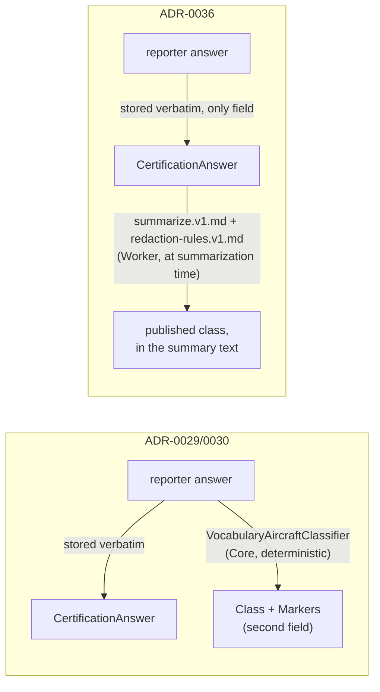

# ADR-0036: Aircraft classification moves to the summarization prompt

**Status:** Accepted
**Date:** 2026-08-22
**Supersedes:** [ADR-0029](ADR-0029-classification-is-deterministic-and-refuses-to-guess.md),
[ADR-0030](ADR-0030-classification-carries-markers-with-the-class.md)

## Context

ADR-0029 put a deterministic classifier, `VocabularyAircraftClassifier`, in
`HpacSafety.Core`. It read `ReportAircraft.CertificationAnswer` and the chosen
`Discipline`, and wrote a normalized `AircraftClass` onto a second field,
`ReportAircraft.Class`, leaving `CertificationAnswer` itself untouched. ADR-0030
added `AircraftMarker` alongside it for tandem, mini wing, and speedwing
qualifiers.

Reviewing that design against how the rest of the system stores an answer:
every other question — free text, a date, a time, a checkbox, an option code —
is written to the database exactly as the reporter gave it and read back the
same way. `ReportAircraft` was the one place a second, code-computed field sat
next to the reporter's raw answer, produced by a rules engine that read that
raw answer and decided what it meant. That is classification of a free-text
answer performed by application code at, or shortly after, submission time —
a shape the rest of the domain does not have anywhere else, and a shape that
looks exactly like the kind of derived fact this system otherwise refuses to
manufacture and store as if the reporter had said it directly.

`CertificationAnswer` was never mutated — the field stayed verbatim, and
`Class`/`Markers` were additive. But the concern this ADR responds to is not
only "did storage mutate the reporter's text" — it is "should `Core` be in the
business of deciding what a reporter's certification answer *means* at all."
Deciding what a free-text answer means, subject to a fixed vocabulary and a
"never guess, say so if you can't tell" rule, is exactly the shape of work the
anonymization pipeline already does for the rest of a report: `prompts/`
already tells the model how to redact a name, a location, a date. Classifying
the aircraft is one more instance of "read the reporter's own words and decide
what belongs in the published summary," not a different kind of problem that
warrants its own subsystem living apart from the rest of that work.

ADR-0029 explicitly rejected sending certification text to a model, reasoning
that a model would produce a plausible band for a bare `"EN B"` — the exact
guess the design existed to prevent. That risk has not gone away. What changes
here is where the guardrail against it lives: not "keep classification out of
the model's hands entirely," but "give the model operating on the report the
same fixed vocabulary and the same refusal rule the deterministic classifier
had, as an explicit instruction, and keep the human review gate (invariant 3)
in front of publication regardless." The model was already trusted with
redaction of the rest of the report under exactly that kind of instruction; a
second, code-only path for one field was inconsistent with that trust
boundary, not safer than it.

## Decision

**`HpacSafety.Core` no longer classifies aircraft.** `AircraftClass`,
`AircraftMarker`, `AircraftClassification`, `IAircraftClassifier`, and
`VocabularyAircraftClassifier` are removed. `ReportAircraft` keeps exactly the
four fields the reporter answered — `Discipline`, `Manufacturer`, `Model`,
`CertificationAnswer` — stored and returned verbatim, with no derived
classification field of any kind.

**The summarizer determines the published class**, from the raw
`CertificationAnswer` text, as one instruction among the others it already
follows for redaction. `prompts/summarize.v1.md` and
`prompts/redaction-rules.v1.md` carry the certification vocabulary from
`docs/aircraft-classification.md` and the same refusal rule the old classifier
enforced in code: a class is stated only when the answer names one in that
vocabulary, and an answer that does not resolve is written as "an aircraft" —
never a guessed class, never a default, and never the manufacturer or model in
its place.

This generalizes the storage rule this ADR is really about, beyond aircraft:

**Submitted data is recorded exactly as submitted, in its native shape, and
nothing in `Core` transforms it into a derived fact before a human or the
anonymization step sees it.** Free text stays free text, a date stays a date,
a time stays a time, a checkbox stays a boolean, a selected option stays its
code. Interpretation — including "what certification class does this text
name" — happens at the point the system already interprets a report to publish
it, under a versioned, reviewable prompt, not silently in the write path.

## Consequences

- `ReportAircraft` has no field a reviewer or an export can read as "the
  system's opinion of the class" separate from what the reporter typed. The
  published class exists only inside a generated summary, alongside every
  other fact that summary states.
- The certification vocabulary and its refusal rule now live in exactly one
  place that matters at runtime — the prompt — instead of being defined once in
  a C# classifier and again in prose in `docs/aircraft-classification.md` for
  humans. `docs/aircraft-classification.md` and the
  `aircraft-classification` skill are the source the prompt text is written
  from and kept in sync with; the prompt is the copy that ships.
- A classification is no longer independently unit-testable against a plain
  `string?` input in `HpacSafety.Core.Tests`. It is exercised the way the rest
  of the anonymization pipeline is: through the golden-file suite in
  `tests/HpacSafety.Anonymization.Tests` once the summarizer (#20) exists, and
  through human review before publication (invariant 3) regardless.
- A reviewer who disagrees with the class a summary states corrects the summary
  text directly, the same way they would correct any other sentence in it —
  there is no separate "reclassify" action to build.
- `AircraftClass = 8` (`EnB`) and the rest of the enum's stored values are
  gone. When `Infrastructure` landed on `main`, its undeployed initial migration
  briefly included the `Class` column; this pull request removes that column
  from the initial migration in place. `Markers` was never persisted, and no
  follow-up migration is needed.

## Alternatives rejected

**Keep the deterministic classifier as a hint, LLM decides the final text.**
Two sources of truth for the same fact, with no rule for which wins when they
disagree, and the code path this ADR removes for exactly that reason —
`Core` deciding what a free-text answer means — would still exist, just
demoted. Rejected.

**Keep the classifier, run it in `Infrastructure`/`Worker` instead of `Core`.**
Moves the file, not the concern. The objection is that application code
interprets and stores a derived fact from the reporter's free text at all, not
which project it lives in.

**Keep both: classifier output as a fallback if the model refuses.** Reintroduces
the same second source of truth, and papers over rather than fixes the concern
that motivated this ADR.

## Related

- `docs/aircraft-classification.md`, updated to describe this flow
- `skills/aircraft-classification/SKILL.md`, updated to match
- `prompts/summarize.v1.md`, `prompts/redaction-rules.v1.md`
- `AGENTS.md` — invariant 2
- [ADR-0029](ADR-0029-classification-is-deterministic-and-refuses-to-guess.md),
  [ADR-0030](ADR-0030-classification-carries-markers-with-the-class.md) — superseded
