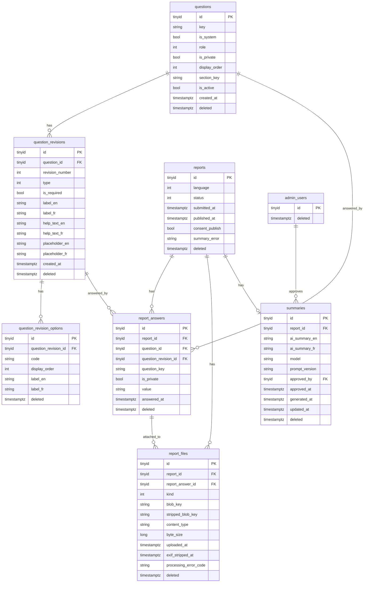

# ADR-0040: Migrate to the canonical domain and persistence model

**Status:** Accepted
**Date:** 2026-08-26

## Context

Issue #79 is the foundational, breaking-change migration everything else in
`/features` and `docs/implementation-status.md` is blocked behind. Current
main, at the point this migration was written, had:

- a normalized but partial question-version model — a version could exist with
  only its source-language translation, waiting for a machine translation that
  might never be attached;
- typed `Report` projections for province, injury, occurrence date, and time of
  day, alongside a `report_aircraft` table, both superseded by
  `docs/data-and-persistence.md`'s "no ordinary typed projections" rule;
- one `summaries` row per official locale, linked by `is_source` and
  `translated_from_summary_id`, with a separate approval per language;
- application-side AES-GCM field encryption (ADR-0019, already marked
  superseded);
- no `deleted` column or live-row filter anywhere.

`docs/data-and-persistence.md` already states the target shape in detail. This
ADR records the decisions made while writing the migration that gets current
main there, and why the alternatives below were rejected.

## Schema

`question_versions`, `question_translations`, `question_options`,
`question_option_translations`, and `report_aircraft` are dropped by this
migration; their data is folded into the tables above (or, for
`reports.province`/`pilot_injury`/`passenger_injury`/`occurred_on`/
`occurred_at_local` and all of `report_aircraft`, discarded — the same facts
already live unchanged in `report_answers`). Every table shown gains a
nullable `deleted` timestamptz column and a live-row query filter
(`WHERE deleted IS NULL`) via `SoftDeleteFilters`, except `audit_log`
(unaffected, no `Deleted` property, not shown here).

## Decision

### 1. A question revision is born complete, not completed later

`QuestionVersion` + `QuestionTranslation` (one row per locale, `is_source` /
`is_machine_translated` flags) become one `QuestionRevision` carrying
`LabelEn`/`LabelFr`/`HelpTextEn`/`HelpTextFr`/`PlaceholderEn`/`PlaceholderFr`
directly. `QuestionOption` + `QuestionOptionTranslation` collapse the same way
into `QuestionRevisionOption`. Every factory method requires both languages;
there is no longer a way to construct a revision or option missing one.

This follows directly from product invariant #1: "Questions come from the
database as complete immutable bilingual revisions." A revision that might be
half-translated was never a complete revision — it was a version *becoming*
one. Collapsing the wait into the constructor removes an entire class of bug
(a question activated, or a report answered, against wording that does not
exist yet) instead of guarding against it.

One consequence: an admin can no longer correct only the generated French
wording in place the way `QuestionTranslation.ReviseByHand` used to allow.
Correcting either language now means creating a new revision — the same
operation as any other reword. This is accepted: a revision is immutable, and
"the French said something slightly different" is exactly the kind of change
the revision history exists to preserve.

### 2. `QuestionRole` keeps only `None` and `ConsentPublish`

`OccurrenceDate`, `Province`, `PilotInjury`, `PassengerInjury`, `AircraftType`,
`AircraftCertification`, `Narrative`, and `OccurrenceTime` are removed.
`Report` reads only consent by name; per `data-and-persistence.md`, the admin
review DTO reads exact asked questions and answers directly, and the public DTO
is `{id, both summary texts, published timestamp}` — nothing else is ever
projected, published, or read by role. Keeping roles that had no reader left
would be dead vocabulary implying behavior that no longer exists.

### 3. `Summary` becomes one bilingual row with one approval

`ai_summary_en` and `ai_summary_fr` replace one row per `Locale`, `Model` and
`PromptVersion` are shared, and `ApprovedBy`/`ApprovedAt` cover the pair.
`RewriteEn` and `RewriteFr` each clear the shared approval. This matches
product invariant #6 exactly ("Editing either language clears the pair
approval") and the Worker's one-model-call design (invariant #3): the model
already returns both languages from one call, so there was never a real
"translate the other one afterward" step to model as a second row.

### 4. `reports` keeps only the consent projection

`OccurredOn`, `OccurredAtLocal`, `Province`, `TimeOfDay`, `PilotInjury`,
`PassengerInjury`, and `InvolvesSeriousInjury` are removed from `Report`, and
`report_aircraft` is dropped entirely. Every one of those answers already
exists, unchanged, in `report_answers` — the typed projection existed only to
let logic read them without a key, and no such logic ships in this codebase:
there is no outbound email escalation (invariant list, `features/README.md`),
and the public DTO never reads them. Keeping the projection would mean
maintaining a second, redundant copy of the answer with no reader.

Consequently `Discipline`, `InjurySeverity`, `Province`, `TimeOfDay`
(`Reporting`), and `PilotRating` are deleted from `Core` — nothing constructs
or reads them once the projection they backed is gone.

### 5. Application field encryption is removed outright

`IFieldCipher`, `AesGcmFieldCipher`, `EncryptedStringConverter`,
`EncryptedTimeOnlyConverter`, `FieldCipherModelCacheKeyFactory`, and
`FieldEncryptionOptions` are deleted, matching product invariant #8 and
ADR-0019's own superseded status. Storage and transport encryption are RDS/S3
managed encryption at rest plus TLS; there is no second ciphertext format, no
key custody problem, and no column that cannot be queried by value. The
occurrence time and injury/province columns this encryption protected are
themselves gone (see decision 4), so there is nothing left in `reports` that
needs field-level protection beyond what the database already provides.

### 6. `ITranslator`, `IEmailSender`, `IPiiAuditor`, `IPublicationChannel`, and `MediaUploadSlot` are deleted

None has a production caller. `ITranslator` existed for translating summaries
and machine-generating question wording — both retired by decisions 1 and 3.
`IEmailSender` backed an outbound notification flow `features/README.md`
explicitly excludes. `IPiiAuditor` and `IPublicationChannel` were declared,
unimplemented extension points for a second audit pass and external
publication channels the target design does not have. `MediaUploadSlot` minted
pre-submit upload URLs; the target design has no pre-submit upload session
(invariant #2) — attachments arrive with the one final multipart submission.

### 7. Universal soft deletion via one convention, not per-entity filters

Every entity with a `Deleted` property is picked up by one reflection-based
`SoftDeleteFilters.Apply(ModelBuilder)` pass that builds
`HasQueryFilter(e => e.Deleted == null)` for it, applied after every explicit
`IEntityTypeConfiguration<T>`. Adding the column to a new entity is then
enough to get the live-row filter; nothing has to remember to also add the
filter by hand. `audit_log` has no `Deleted` property and is therefore
correctly excluded — the convention finds the column, it does not special-case
a table name.

### 8. Outbox messages carry a typed `OutboxMessageType`, not a free string

`OutboxMessage.Type` was `string`. It becomes `OutboxMessageType`, stored as an
invariant code like every other domain enum, with one member so far
(`SummarizeReport`). `Payload` remains a plain string — it was already
documented as holding only identifiers, and typing the payload shape is
deferred until a second message type exists to justify the abstraction.

### 9. Attachment kind is added to the schema now; attachment processing is not

`AttachmentKind` (`Image`, `Video`, `Document`) and `ReportFile.Kind`,
`ReportAnswerId`, `ProcessingErrorCode` are added so the record shape in
`data-and-persistence.md` exists. `Kind` is inferred from the sniffed
`MediaType` where recognized, `Document` otherwise. Document validation,
malware scanning, video derivatives, and the full file-upload-answer linkage
are issue #81's scope — this issue "establishes the records and migration,"
not the ingest behavior. `MediaType.All` is deliberately not extended with
document formats here, since `MediaIngestor`/`MediaPolicy` assume every
accepted type is either strippable or an image/video, and extending it without
implementing document handling would silently mis-classify a real upload.

### 10. The upgrade migration transforms data explicitly; it is not reversible

`MigrateCanonicalDomainAndPersistence` reads the old `question_versions` /
`question_translations` / `question_options` / `question_option_translations`
rows and writes complete `question_revisions` / `question_revision_options`
rows before dropping the old tables, falling back to the English wording when
a French translation was never attached (see decision 1's consequence — a
revision cannot exist half-translated, and the alternative, leaving a `NULL`
in a `NOT NULL` column, is not an option). It merges each report's up-to-two
`summaries` rows into one, taking English text from the `en-CA` row (or the
only row, if just one language was ever generated), French text from the
`fr-CA` row the same way, and approving the merged row only if every existing
language row for that report was individually approved — a half-approved pair
is not a state the target model can represent, so it is treated as
unapproved rather than guessed at. `reports.province`/`pilot_injury`/
`passenger_injury`/`occurred_on`/`occurred_at_local` and the whole of
`report_aircraft` are dropped with no target column to preserve them in —
documented data loss, accepted because the same facts already exist,
unchanged, in `report_answers`. `Down()` throws `NotSupportedException`: it
would have to re-invent per-language rows the target schema has nowhere to
put. Restoring a pre-migration backup is the supported rollback path.

## Consequences

- Nothing in this codebase can construct a partially translated question
  revision or a summary approved in only one language — both classes of bug
  are now unrepresentable rather than merely disallowed.
- An admin correcting French wording always creates a new revision. There is
  no lighter-weight "just fix the translation" path.
- `report_aircraft` and the typed province/injury/date/time answers on
  `reports` are gone from any pre-migration database; the same facts remain in
  `report_answers`, unchanged.
- Every table except `audit_log` is filtered to live rows automatically once
  it has a `Deleted` column — a future entity that forgets to add the property
  is excluded from the filter (and from this ADR's guarantee), not silently
  included with a bug in its `Deleted` semantics.
- `AttachmentKind`/`ReportFile.Kind` exist in the schema ahead of the
  processing behavior that will use them fully (issue #81).

## Alternatives rejected

**Keep `QuestionVersion`/`QuestionTranslation` and only add the missing
columns.** Would have preserved the "translation pending" state the target
model explicitly forbids (invariant #1). Rejected: the whole point of a
complete, immutable revision is that there is no state between "does not
exist" and "asked in both languages."

**Keep per-language `summaries` rows and add a computed "pair approved"
view.** Would have avoided a data migration. Rejected: it does not change what
"editing either language clears approval" means when approval is still two
separate columns on two separate rows, and it leaves the one-summary-per-report
uniqueness unenforced at the database level.

**Leave `reports.province`/injury/date typed and add `report_answers` as a
second source of truth.** Rejected as exactly the redundancy
`data-and-persistence.md` rules out — two representations of the same fact
drift, and nothing in this codebase reads the typed one once the public DTO and
admin review DTO are both defined against `report_answers`.

**Extend `MediaType.All` with document formats now, ahead of #81.** Rejected:
`MediaPolicy.Validate` and `MediaIngestor` assume every accepted `MediaType` is
strippable or has a defined video-shaped no-derivative path; adding PDF/DOC/etc.
without also implementing the document path would either silently attempt to
"strip" a document or require special-casing ahead of the issue that owns that
design.

**Make the upgrade migration reversible by re-deriving per-language rows in
`Down()`.** Rejected: a merged bilingual summary has already discarded which
language a shared field like `Model` came from when the two rows disagreed
(they should not, but nothing enforced that on the old schema), so `Down()`
would have to fabricate history rather than restore it.

## Related

- `docs/data-and-persistence.md` — the canonical target this migration reaches
- [ADR-0016](ADR-0016-data-driven-question-bank.md) — the question-bank shape being completed
- [ADR-0019](ADR-0019-application-side-field-encryption.md) — the encryption this migration removes
- [ADR-0034](ADR-0034-tiny-ids.md) — identifier shape, unchanged by this migration
- `src/HpacSafety.Infrastructure/Persistence/Migrations/MigrateCanonicalDomainAndPersistence.cs`
- Issue #79
