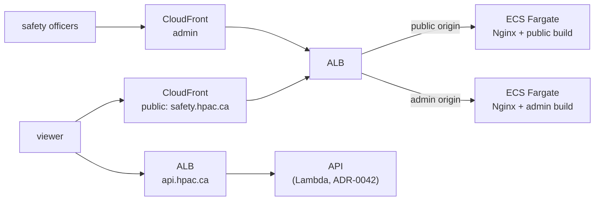

# ADR-0044 — The web front end is a Docker container, not S3 + CloudFront

**Status:** Accepted, partially superseded by
[ADR-0048](ADR-0048-one-website-admin-as-a-route.md). Supersedes the
static-site hosting portion of [ADR-0009](ADR-0009-hosting-on-aws.md) (S3 +
CloudFront): a container origin, not a bucket, is still correct. The
*two-sites-two-containers* topology decided below is reversed by ADR-0048
back to one site, one container — see that ADR for the current shape; the
Nginx/container reasoning here otherwise stands.

## Context

[ADR-0043](ADR-0043-react-typescript-vite-web-front-end.md) moves the web
front end to a React/TypeScript/Vite build. That build still produces a
static asset bundle — Vite's production output is HTML/JS/CSS files, no
Node process is required to serve them. Nothing about ADR-0043 by itself
requires leaving S3 + CloudFront.

The owner has asked, separately and explicitly, for the web front end to run
in a Docker container as well — the same packaging model now used for the API
([ADR-0042](ADR-0042-lambda-hosted-api-with-fargate-migration-path.md)) and
the Worker (ADR-0009). This ADR records that as its own decision, since it is
independent of the framework choice and reverses ADR-0009's static-hosting
row directly.

## Decision

Serve each site's built assets from **Nginx in a Docker container**, one
service per site (public, admin), each running as its own **ECS Fargate
service** behind the existing ALB, with **CloudFront kept in front of the
ALB** for edge caching and TLS termination close to the visitor. Both
container images are built and pushed to ECR by the same CI pipeline that
already builds the API and Worker images (ADR-0009).

Two ALB target groups, one per site, matching the current
separate-origins/separate-distributions shape one-for-one — each bucket
becomes a Fargate service instead of the two collapsing into one, which keeps
this ADR from re-deciding the site-separation question ADR-0031 already
raised and the current spec already settled the other way.

## Why these choices

**A container, not a Node server, not `serve`/`http-server` ad hoc.** Nginx
serving pre-built static files is the standard, minimal-surface way to run a
static bundle in a container — no application runtime, no dependency on the
build toolchain existing at serve time, smaller image, well-understood
caching-header configuration for hashed asset filenames vs. `index.html`.

**Fargate, not Lambda, for the web container — unlike the API.** ADR-0042 put
the API on Lambda specifically because sparse traffic makes an always-on task
wasteful and the API can tolerate a cold start on an already-async
submission flow. A page load is different: a visitor's *first* paint is the
thing a cold start would delay, on exactly the kind of bad connection ADR-0023
was written to protect ("a landing zone"). An always-warm, cheap Fargate task
serving static files avoids that trade entirely, and Nginx-serving-static-files
is cheap enough at this traffic volume that Lambda's savings are not worth the
latency risk. **Both are still one container image on ECS/Fargate-shaped
infrastructure** (API, Worker, and now Web all build/push/deploy the same
way), which is the property that matters for operational consistency.

**Keep CloudFront in front, rather than exposing the ALB directly.** CloudFront
still does real work here independent of the origin type: edge caching of
hashed static assets close to visitors across Canada, and each distribution's
existing behaviors (admin: `no-store`, `noindex`) stay exactly as they are,
just pointed at the ALB instead of S3.

**Two ECS services, matching the current two sites.** The target spec already
requires separate origins and separate deployment permissions for public and
admin; this ADR only changes what each origin *is* (a container instead of a
bucket), not how many there are.

## Alternatives

- **Keep S3 + CloudFront for the built assets.** Fully compatible with
  ADR-0043 on its own. Rejected because the owner explicitly asked for Docker
  hosting for the web front end, independent of the framework decision.
- **Lambda (matching the API, via the Web Adapter pattern from ADR-0042).**
  Rejected for the reason above: cold start hits first paint, not an
  already-asynchronous submission.
- **App Runner.** Same objection ADR-0009 raised for the API/Worker: it
  doesn't buy anything over Fargate for a single HTTP service, and moving off
  it later (if the web tier ever needs to share infrastructure patterns with
  the Worker, or needs the ALB-target-group Lambda/Fargate swap ADR-0042
  established) means another migration this avoids by starting on ECS.
- **A Node/Vite SSR server in the container instead of Nginx.** Rejected:
  ADR-0043 explicitly dropped SSR/prerendering as out of scope; running a
  Node process to serve files a static web server can serve would add a
  runtime and an attack surface for no benefit.

## Consequences

- `infra/ecs.tf` gains two web services and task definitions (public, admin)
  alongside the existing Worker service, each sized minimally (this is static
  file serving). `infra/s3.tf`'s two site buckets and their CloudFront origin
  configs are removed; each `CloudFront` distribution's origin becomes its
  ALB target group.
- `S3_BUCKET_PUBLIC`/`S3_BUCKET_ADMIN` and their `aws s3 sync --delete` deploy
  steps are removed entirely — deploy becomes "build image, push to ECR,
  update ECS service" per site, the same shape as the API and Worker.
- CI's `web` job builds each site's Vite production bundle into its own Nginx
  image rather than syncing it to S3; the images are what CI tests, not a
  bucket sync.
- `docs/infrastructure-and-operations.md`'s topology diagram and deployment
  steps are updated alongside this ADR.
- Cost shifts from "S3 + CloudFront, effectively free at this volume" to "two
  more small Fargate tasks, always on." Accepted trade for first-paint latency
  and packaging consistency with the API/Worker.

## Related

- [ADR-0042](ADR-0042-lambda-hosted-api-with-fargate-migration-path.md) — the
  API's container hosting, and why it differs (Lambda vs. Fargate) for the
  same reason argued here
- [ADR-0043](ADR-0043-react-typescript-vite-web-front-end.md) — what the
  container serves
- [ADR-0009](ADR-0009-hosting-on-aws.md) — superseded for web hosting
- `features/web-localization-and-design/web-localization-and-design.feature`
  — the separate-sites shape this ADR preserves
- `docs/infrastructure-and-operations.md`
