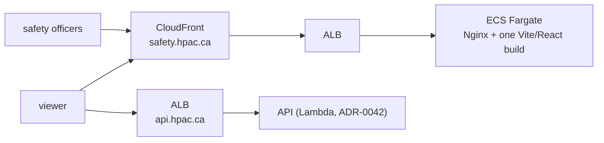

# ADR-0048 — One website again; the admin review queue is a route, not a separate site

**Status:** Accepted. Partially supersedes
[ADR-0044](ADR-0044-containerized-web-hosting.md): the *container-per-site*
count and the *two ECS Fargate services / two CloudFront distributions*
topology are reversed back to one, reinstating
[ADR-0031](ADR-0031-terraform-shape-and-topology.md)'s "one website, admin as
a route" shape on top of ADR-0044's container hosting. Nothing else in
ADR-0044 changes — Nginx serving a built static bundle in an ECS Fargate
container, behind CloudFront, is still correct; there is now one of it
instead of two.

[ADR-0043](ADR-0043-react-typescript-vite-web-front-end.md)'s "public site and
admin site stay two separately built and deployed applications" is reversed
in the same way: one React/TypeScript/Vite application, one build, one
`package.json`, with the admin review queue as an authenticated route inside
it rather than a second app.

## Context

The topology has swung twice already: ADR-0009 specified two sites, ADR-0031
consolidated to one (admin as a route), and the current target — before this
ADR — reverted to two again when ADR-0043/ADR-0044 moved hosting to
containers. The owner has now decided, again deliberately, that it is going
to be one website: the admin surface is just a secure page on the same site,
not a separately deployed application.

## Decision

One Vite/React application, one build output, served by one Nginx container
(one ECS Fargate service, one CloudFront distribution, one hostname:
`safety.hpac.ca`). The admin review queue lives at `/admin`, gated by
client-side route protection backed by the API's existing
`admin_users`-allowlist authorization on every data request — the same
security argument ADR-0031 already made: the delivery path was never the
security boundary, the API is.

## Why

ADR-0031's reasoning for one origin still applies unchanged, now aimed at a
container instead of a bucket: the admin bundle is static JS, byte-identical
for every visitor, and holds no report data — every piece of report data a
reviewer sees is authorized per-request by the API. Splitting it into a
second container buys per-surface network isolation (a second CloudFront
distribution's WAF/geo/IP controls) for an asset that carries nothing worth
isolating, at the cost of a second image, a second ECS service, a second
CloudFront distribution, a second hostname, and a second thing to keep in
sync on every deploy.

**Rejected: keep two containers (ADR-0044 as accepted).** Doubles the
Fargate/CloudFront footprint for isolation that protects an asset with no
report data in it.

**Rejected: two Vite apps sharing a component library.** A shared-library
split buys nothing here — the two "apps" are one product with one route
gated by auth, not two products that happen to look similar.

## Consequences

- One `src/web/` Vite/React app, one `package.json`, one `dist/`. The admin
  route is part of the same client bundle.
- One ECS Fargate service, one task definition, one CloudFront distribution,
  one deploy job, one image tag per deploy — `deploy-web.yml` and `infra/`
  drop the public/admin duplication wherever it appears.
- `/admin/*` still needs its own cache/response-header behavior on the one
  distribution (`no-store`, `noindex`) — a per-path CloudFront behavior, not a
  per-distribution one, exactly as ADR-0031 already set up.
- `features/web-localization-and-design/web-localization-and-design.feature`'s
  "independently deployed" scenario is rewritten to describe one deployed
  application with an admin route, in this PR.
- `docs/infrastructure-and-operations.md`'s topology diagram and deployment
  steps are updated alongside this ADR.

## Related

- [ADR-0031](ADR-0031-terraform-shape-and-topology.md) — the one-site/admin-
  as-a-route reasoning this ADR reinstates
- [ADR-0043](ADR-0043-react-typescript-vite-web-front-end.md) — partially
  superseded: one app, not two
- [ADR-0044](ADR-0044-containerized-web-hosting.md) — partially superseded:
  one container, not two
- `features/web-localization-and-design/web-localization-and-design.feature`
- `docs/infrastructure-and-operations.md`
