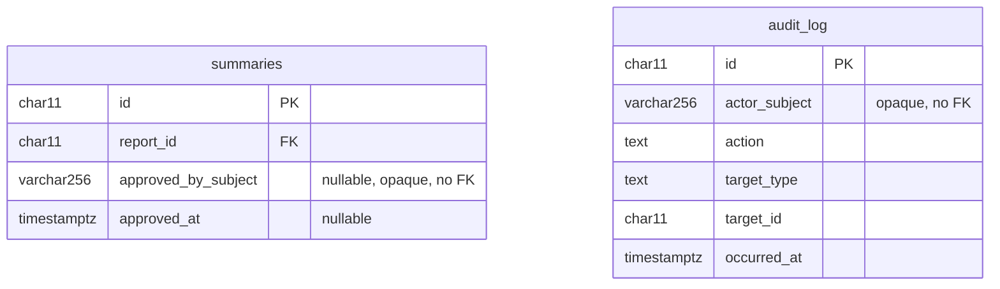

# ADR-0065 — No user records; identity is the token subject

**Status:** Accepted. Partially supersedes
[ADR-0020](ADR-0020-seeding-by-migration.md) and
[ADR-0040](ADR-0040-migrate-canonical-domain-and-persistence.md).

## Context

The canonical model gave this system an `admin_users` table: an allowlist of
HPAC member identifiers, each with a role and an active flag, referenced by
foreign key from `summaries.approved_by` and `audit_log.admin_user_id`. The
design was that authentication established an upstream identity and the local
allowlist decided what that identity could do.

[ADR-0064](ADR-0064-jwt-bearer-authentication-with-three-roles.md) moves the
role into the token. That leaves `admin_users` holding a member identifier and
a role that nothing reads, in an application whose stated posture is to treat
every data boundary as privacy-sensitive and keep the system small.

## Decision

**This system stores no user records of any kind.** Identity and role come
only from claims on a validated token, per request, and are never written down.

`admin_users` is dropped. The two columns that referenced it become opaque
subject strings:

A subject is the value of the token's `sub` claim. It is opaque: joinable to
nothing, because there is no table to join to.

There is no allowlist, so there is no allowlist management, no concurrency
token on a role change, no active flag, and no admin soft-deletion. Revoking a
person's access is the identity provider's job, and it takes effect when their
token stops being issued or expires.

### The exception to physical deletion

`AGENTS.md` invariant 8 and `skills/manage-hpac-migrations` both forbid
physical deletion: no `DROP TABLE` on a table holding application data. This
decision carves one narrow exception, on one specific ground.

**`admin_users` has never held application data in any deployed environment.**
The only row any database has ever received is the obviously-fake
`admin@localhost` seeded under the `hpac.seed_development_admin` guard from
[ADR-0020](ADR-0020-seeding-by-migration.md), and production never sets that
guard. There is no real person's record to preserve, no history to lose, and
nothing for a soft delete to protect. Dropping the table removes an empty
structure, not a record.

The rule stands unchanged for every table that holds reports, answers, files,
summaries, or audit entries. This exception does not generalize, and a future
`DROP TABLE` needs its own argument on its own facts.

### What survives

Historic `audit_log` rows keep their existing values. `char(11)` widens to
`varchar(256)`, which is lossless, so an old TinyId survives verbatim as a
string — it simply no longer resolves to anything. That is acceptable for an
append-only history and is recorded in `docs/data-and-persistence.md` rather
than rewritten, because rewriting audit rows is a destructive transform and
the audit log is the one table this system never edits.

## Why

A table whose every column is derivable from a token is not a source of truth;
it is a copy that can drift. Once the role lives in the claim, `admin_users`
can only be right by accident or wrong by neglect.

There is also a plain privacy argument. This system receives real aviation
occurrence reports containing personal and medical information. The fewer
places a person's identity is written, the smaller the surface that can leak.
Holding no user table at all is the strongest version of that, and it costs
nothing here, because the allowlist was never the security boundary — the API
was.

## Alternatives

- **Keep an identity-only stub row** for referential integrity, created on
  first sight of a subject. Rejected: it reintroduces a user table, and a row
  written on first sight is a record of who has used the system.
- **Keep the table and stop reading its role column.** Rejected: it leaves a
  dead column that contradicts the feature files, and ADR-0047 forbids exactly
  that kind of drift.
- **Rewrite historic audit actors to a sentinel.** Rejected: destructive, and
  it discards the only attribution those rows ever had.

## Consequences

- One migration drops both foreign keys and the check constraint, renames and
  widens the two columns, recreates the constraint, indexes the new audit
  column, and drops the table last.
- `AdminUser`, `AdminRole`, and `MayEditQuestions` are deleted from Core.
- `DevelopmentAdminSeed` cannot be deleted — a committed migration calls it and
  past migrations are never edited — so it stays as inert history.
- The `hpac.seed_development_admin` connection-string opt-in is retired.
- Every scenario about the allowlist, admin revocation, and admin soft deletion
  is removed from the feature files in the same pull request.

## Related

- [ADR-0064](ADR-0064-jwt-bearer-authentication-with-three-roles.md) — where the role comes from instead
- [ADR-0020](ADR-0020-seeding-by-migration.md) — the development administrator seed this retires
- [ADR-0040](ADR-0040-migrate-canonical-domain-and-persistence.md) — the `admin_users` shape this replaces
- [ADR-0034](ADR-0034-tiny-ids.md) — a token subject is not a TinyId
- [ADR-0055](ADR-0055-ef-core-migrations-sql-files-stored-procedures.md) — how the drop is delivered
