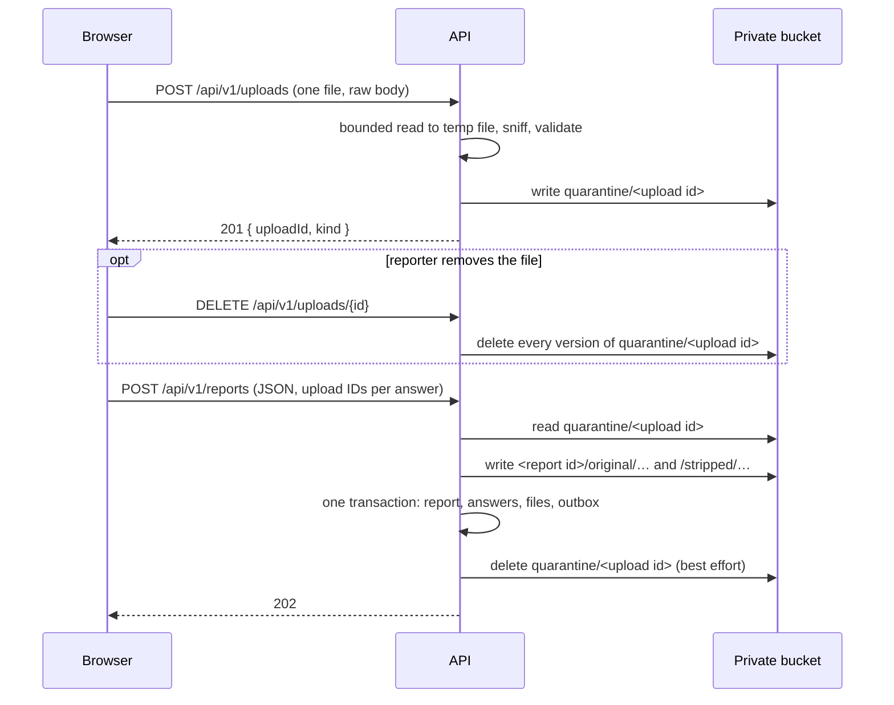

# ADR-0096 — An attachment uploads on attach and is claimed at submission

## Status

Accepted; amended by
[ADR-0100](ADR-0100-an-attachment-is-kept-as-long-as-the-saved-report.md),
which restores uploads with the saved report and keeps unclaimed uploads for
fifteen days. This ADR:

- **amends** AGENTS.md invariant 2 and the guardrail list in
  [`features/README.md`](../../features/README.md): a reporter's attachment is
  now the one piece of unfinished report data that reaches the server before
  the final submission;
- **amends** [ADR-0026](ADR-0026-presigned-urls-and-private-blob-storage.md):
  a reporter still never receives a pre-signed PUT, `IBlobStore` loses
  `CreateUploadUrl`, gains a delete, and the development adapter becomes MinIO
  behind the same `S3BlobStore`;
- **supersedes** the attachment half of the final multipart design in
  [ADR-0040](ADR-0040-migrate-canonical-domain-and-persistence.md)
  §6: the final submission carries upload IDs, not file parts.

## Context

The form sent every attachment inside the one final multipart request. A 50 MB
phone video on a weak connection meant a Finish button that sat for minutes,
showed nothing, and lost everything if the connection dropped. A reporter could
not see a file was wrong until the whole report was refused, and could not back
out of one file without starting again.

The owner wants each file uploaded the moment it is attached, with an activity
indicator, a Cancel control while it uploads, a Delete control once it has, and
Next and Finish held until every upload has finished. Every call goes through
the API.

This is the standard shape for large attachments — mail, chat, and issue
trackers all do it — and it collides with a rule this repository wrote on
purpose: nothing about a report reaches the server until the reporter commits
to it. The decision is how much of that rule to give up, and what keeps the
rest.

## Decision

**A reporter's file is uploaded through the API as soon as it is attached,
into private quarantine, under a server-minted opaque upload ID. The one final
submission names those IDs, and the API claims them in the same transaction
that creates the report. An upload nobody claims expires.**

- **The upload is validated before it is stored.** The API reads the request
  body into a temporary file, stopping one byte past the 50 MB limit, then
  sniffs and validates it against the same `MediaPolicy` as before. A refused
  file never reaches the bucket, and the reporter learns why on that file's row
  rather than at Finish. The body is the file itself, with its declared type in
  `Content-Type`; the client filename is never sent.
- **An upload has no database row.** Its bytes sit at `quarantine/<upload id>`
  and nowhere else. The upload ID is 128 bits of randomness, and knowing it is
  the only way to name, delete, or claim the file.
- **An upload is not linked to the member who made it.** The endpoint requires
  a member token, like submission, and records nothing about the subject
  ([ADR-0067](ADR-0067-a-reporter-must-be-a-member-and-is-not-recorded.md)).
  Tying an upload to its uploader would build exactly the link ADR-0067
  forbids, one step before the report exists.
- **Removing a file erases it.** `DELETE /api/v1/uploads/{id}` deletes every
  version of the quarantine key, so on the versioned bucket the bytes are gone
  at once rather than a day later. It is idempotent. This is not a physical
  delete of an application record — AGENTS.md invariant 8 still holds — because
  an unclaimed upload is not yet part of any report; it is the reporter
  withdrawing something they never submitted.
- **Cancelling an upload leaves nothing.** The browser aborts the request; the
  API has written nothing to the bucket until validation finishes, and the
  temporary file is deleted when the request ends.
- **Unclaimed uploads expire.** The existing `expire-quarantine` lifecycle rule
  (`infra/storage.tf`) covers the `quarantine/` prefix: the key stops resolving
  after about a day, and its bytes are gone about a day after that. Development
  sets the same rule on MinIO. Expiry is day-granular and asynchronous, never a
  deadline.
- **An expired upload is named, not guessed at.** A submission naming an upload
  that no longer exists is refused before anything is written, with a 400
  listing those upload IDs. The form marks those files "expired — attach again"
  and keeps every other answer.
- **The submission is JSON.** Each file-upload answer carries `attachments`,
  each an upload id and the file's name
  ([ADR-0097](ADR-0097-a-reviewer-downloads-an-attachment-under-its-sanitized-original-name.md)).
  The count limit (default five) and duplicate checks
  move from file parts to IDs.
- **Uploads are not restored after a reload.** The browser draft still never
  holds a file or an upload ID, so the privacy window stays the lifecycle
  rule's day, not the draft's fifteen.

### Storage adapters

`S3BlobStore` is the one adapter. Production reaches the bucket through the ECS
task role — no access key. Development runs MinIO in docker-compose and points
the same adapter at it with a service URL, path-style addressing, and local
credentials. A reviewer's pre-signed URL is signed for the host the browser can
reach, which in development is not the host the API uses.
`FileSystemBlobStore` is removed: it was the development stand-in ADR-0026
needed for a contributor with no bucket, and MinIO is that bucket.

## Consequences

- A reporter's unfinished attachment can exist on the server for up to about two
  days without a report. It is unreadable to any reviewer, carries no filename,
  and belongs to nobody the system can name.
- A member can fill quarantine with uploads they never submit. The per-IP rate
  limit on the upload endpoint and the lifecycle rule bound that; the count limit
  applies only at submission, because an upload belongs to no report yet.
- The API role gains `s3:DeleteObjectVersion` on `quarantine/*`.
- Attachment processing still ran inside the submission request when this was
  written. [ADR-0098](ADR-0098-submission-copies-the-original-and-the-worker-makes-the-derivative.md)
  moves it to the Worker (#361); streaming it without an in-memory buffer is
  #362.

## Alternatives rejected

- **Keep attachments in the final request.** It keeps the old rule whole, but it
  is the experience the owner is replacing.
- **A pre-signed PUT straight to the bucket.** It keeps large bodies off the
  API, but unvalidated bytes land before anything has looked at them, and the
  owner wants every call through the API.
- **Record uploads in a table.** It would make expiry a query instead of a
  lifecycle rule, and give an unfinished report a database footprint the rest
  of the design still refuses.
- **Restore uploads after a reload.** It needs the upload to outlive the
  fifteen-day draft, which stretches the window a submitted-nowhere file sits
  on the server from a day to two weeks.
- **A delete marker only.** On the versioned bucket the bytes a reporter
  removed would survive another day.

## Related

- [ADR-0026](ADR-0026-presigned-urls-and-private-blob-storage.md) — private storage and reviewer reads, amended here.
- [ADR-0040](ADR-0040-migrate-canonical-domain-and-persistence.md) — the final multipart design, whose attachment half this replaces.
- [ADR-0067](ADR-0067-a-reporter-must-be-a-member-and-is-not-recorded.md) — why an upload names no uploader.
- [ADR-0089](ADR-0089-no-malware-scanning-for-attachments.md) — validation is still the only gate.
- Issue #360.
