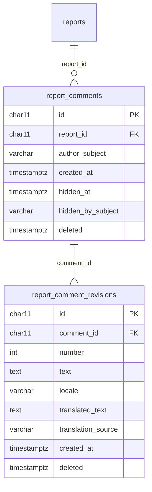

# ADR-0114 — Members may comment on a published report

**Status:** Accepted. Extends
[ADR-0065](ADR-0065-no-user-records-identity-is-the-token-subject.md): a
comment's author is recorded as an opaque token subject, like an approver or
an audit actor. Adds a fifth off-submission-path purpose for machine
translation to the list in `AGENTS.md`.

## Context

The published feed (#28) is read-only. HPAC wants members to discuss a
published lesson on its page, in either official language, and wants readers
of both languages included in that discussion. Showing who wrote a comment by
name and HPAC number waits for the real identity provider (#413).

Three things about a comment are unlike anything the system already stores:

- A member wrote it, and it is public. Every other member-written thing is a
  report, which is private until a reviewer approves an anonymized summary.
- Its author is a known member who may change it later. A report records
  nothing about its reporter (ADR-0067), and an answer is immutable.
- Nobody anonymizes it. A comment is not a report, and there is no model call
  for it.

## Decision

1. **Any signed-in member may comment**, in any role, on a report the public
   API currently shows. Reading comments needs no account.
2. **The author is the token subject, and nothing else.** A comment stores
   `author_subject`, an opaque string that joins to nothing, exactly as
   `summaries.approved_by_subject` and `audit_log.actor_subject` do. No new
   claim is read and there is still no user table. Every comment is labelled
   "Member", and the API tells a signed-in reader which comments are theirs
   with a computed `isMine` flag, never by returning the subject.
3. **Comments are post-moderated.** A comment is public as soon as it is
   posted. A safety officer or administrator can hide it. Hiding is recorded in
   the audit log and is never undone in the application.
4. **A comment is not anonymized.** The composer tells members not to name or
   identify people. A comment that does anyway is a moderation matter for a
   reviewer to hide, not something the system rewrites.
5. **Edits keep every revision.** A comment owns an ordered list of immutable
   revisions, and its current text is the newest one. The author can delete
   their own comment. Deletion is a `deleted` stamp on the comment and its
   revisions, as everywhere else in the system (ADR-0040). A deleted or hidden
   comment disappears from every public read and from the report's comment
   count.
6. **The Worker translates each revision into the other official language**,
   off the request path, through the same `ITranslator` port answers use
   ([ADR-0112](ADR-0112-only-answers-that-need-it-get-a-second-language.md)).
   Posting or editing enqueues one `translate_comment` outbox message for the
   new revision in the same transaction. The translation is recorded with
   source `auto`. A failed call retries under the outbox's normal backoff, and
   posting never waits for it.
7. **Public reads come from views.** `public_report_comments` shows each
   visible comment's current revision, only for reports in `public_reports`,
   and `public_reports` gains `comment_count`
   ([ADR-0055](ADR-0055-ef-core-migrations-sql-files-stored-procedures.md)).
   Unpublishing a report therefore hides its comments and its count with no
   further step, and brings them back unchanged if it is published again.

## Rejected alternatives

- **Showing the member's email address now.** It needs a claim ADR-0064 says
  the API never reads, and it would put a contact address on a public page.
  Deferred to #413, where the identity provider decides what is available.
- **Pre-moderation**, where a reviewer approves each comment before it is
  public. It is safer, but the owner chose a live discussion and accepted
  that a comment naming someone is public until a reviewer hides it.
- **Showing signed-in members a comment before a reviewer approves it**, and
  anonymous readers only afterwards. This has two audiences and two queues
  for one small feature.
- **Overwriting the text on edit.** An edited comment would lose what readers
  already saw, and the translation would silently refer to text that no
  longer exists.
- **Translating at read time.** Each page view would call the provider, and
  the translation would differ between readers.
- **Physically deleting a comment.** It contradicts invariant 8, and there is
  no reason to make comments the exception.

## Consequences

- Machine translation now has five purposes off the submission path. The
  request that posts a comment still never calls a provider.
- A member's opaque subject is now stored against something public. It is not
  itself public, it identifies nobody outside the identity provider, and it
  is the same kind of value the audit log already holds.
- Replies, reactions, notifications, author names, attachments, comment
  search, and a reviewer queue of comments are not built. See
  [`features/comments/README.md`](../../features/comments/README.md).
