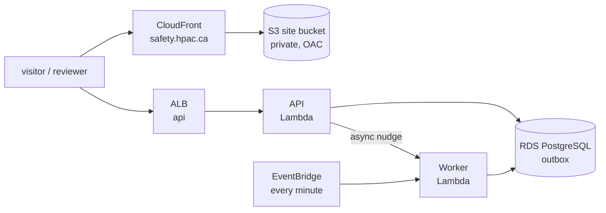

# ADR-0123 — The Worker runs on Lambda and the website on S3 and CloudFront

**Status:** Accepted.
- **Supersedes the Worker row of
  [ADR-0042](ADR-0042-lambda-hosted-api-with-fargate-migration-path.md)**
  ("ECS Fargate service, no load balancer"). ADR-0042's decision for the API
  stands: a container image on Lambda behind the ALB.
- **Supersedes the container hosting of
  [ADR-0044](ADR-0044-containerized-web-hosting.md) and
  [ADR-0048](ADR-0048-one-website-admin-as-a-route.md).** ADR-0048's one
  website, with admin as a route, stands. Only what serves its files changes.

## Context

An audit (#437) found that the hosting ADRs and `infra/` disagreed. Nothing is
deployed yet (#30), so the owner chose what the target is.

- **The Worker** polls the outbox every five seconds (`Worker.cs`). It
  processes four kinds of work: a summary (one Gemini call), an attachment
  (an ffmpeg remux of at most two minutes, or an image decode), answer
  translation, and comment translation. HPAC receives dozens of reports a year,
  and no person waits on the Worker in real time: a reporter has their `202`
  already. An always-on task bills for every idle second, like the API task
  ADR-0042 already moved off Fargate.
- **The website** is one Vite build of static files. The Terraform already
  serves it from a private S3 bucket through CloudFront, with an origin access
  control, a clean-URL function, and a `no-store`/`noindex` policy on
  `/admin/*`. `deploy-web.yml` already runs `s3 sync` and invalidates the
  cache. ADR-0044 moved it to an Nginx container chiefly so that everything
  would deploy as a container. That buys nothing a static bundle needs.

## Decision

1. **The Worker is a Lambda function**, from the same container image
   (Ubuntu's ffmpeg included,
   [ADR-0118](ADR-0118-the-worker-image-installs-ubuntus-ffmpeg.md)).
   - **A nudge after each commit.** When the API commits a report, a comment,
     or a review action that queues work, it invokes the Worker
     asynchronously. The nudge carries no content and only shortens the wait.
   - **A sweep that guarantees delivery.** An EventBridge schedule invokes it
     once a minute.
   - **Each invocation drains once and returns.** It claims due outbox
     messages with the same `FOR UPDATE SKIP LOCKED` claim, backoff, and
     poison threshold, until none is due or the time budget is nearly spent.
     Polling stays the source of truth: a lost nudge only delays work until
     the next sweep.
2. **The website is static files in a private S3 bucket, behind CloudFront.**
   It keeps the origin access control, the clean-URL function, and the admin
   headers policy. CloudFront is AWS's own CDN, and the bundle holds no report
   data. The API remains the security boundary (ADR-0048).
3. **The API stays on Lambda** behind the ALB (ADR-0042).

## Rejected alternatives

- **The Worker as an always-on Fargate service** (ADR-0042's Worker row). It
  processes work within seconds and needs no code change, but it pays for an
  idle task all year.
- **A scheduled Fargate task that drains and exits.** It is cheap, but each
  run pays a 30–60 second task start, and work waits minutes.
- **App Runner for the Worker.** It is built for HTTP and throttles CPU
  between requests, so it suits a background loop poorly.
- **An Nginx container on ECS for the website** (ADR-0044/0048). It is an
  always-on task and an image to patch, for the same static files.

## Consequences

- **The Worker needs a Lambda entry point**: a host that runs one drain and
  returns, instead of the `BackgroundService` loop. The processors themselves
  are unchanged. A follow-up issue builds it, the nudge, the EventBridge
  schedule, and the Terraform.
- **Invocation limits.** A Lambda invocation is capped at 15 minutes, which
  covers one remux (at most two minutes) with room to spare. Its `/tmp` is
  sized to hold a 50 MB original and its derivative. The 234 MB image makes a
  cold start slower, which the owner accepts because nobody is waiting.
- **Migrations at every cold start.** Both functions still apply pending
  migrations at startup under the advisory lock
  ([ADR-0055](ADR-0055-ef-core-migrations-sql-files-stored-procedures.md)). A
  cold start with nothing pending finds nothing to do after a single check.
- **The Terraform must change.** Today it runs the API and the Worker as ECS
  Fargate services. Both move to Lambda (#30 and its follow-ups). The website
  Terraform already matches this decision.
