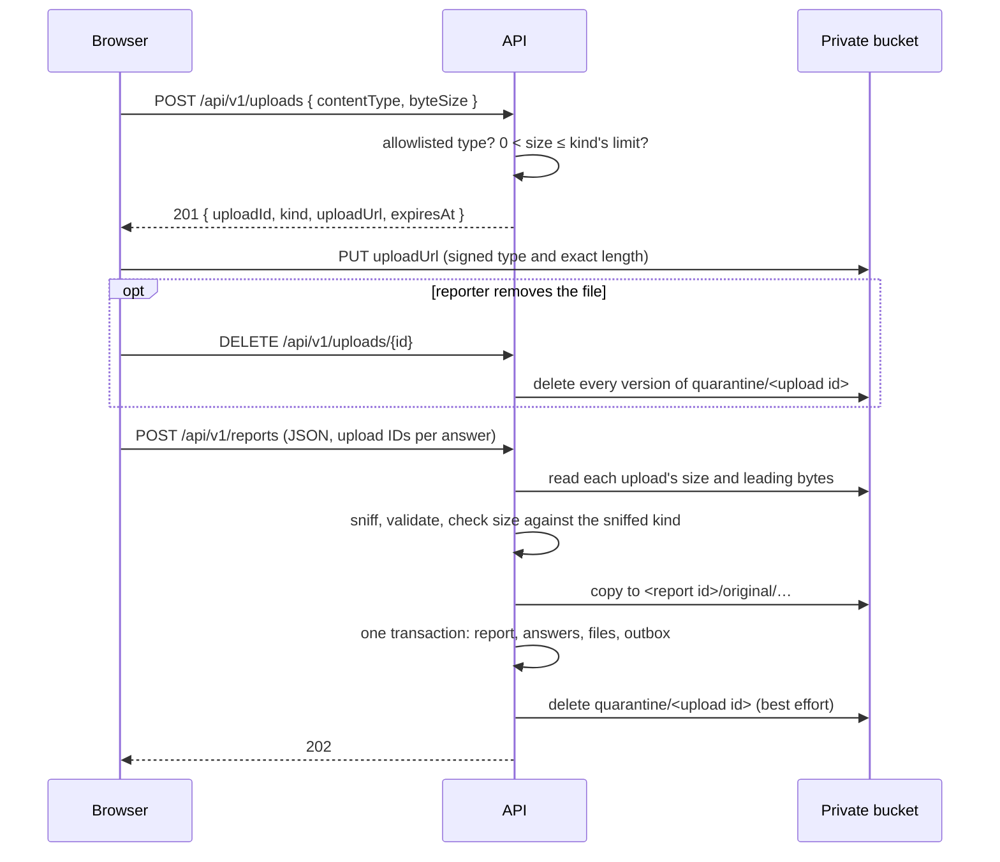

# ADR-0126 — An attachment uploads straight to quarantine by pre-signed PUT

## Status

Accepted. This ADR:

- **amends**
  [ADR-0096](ADR-0096-an-attachment-uploads-on-attach-and-is-claimed-at-submission.md):
  the file's bytes no longer pass through the API, and validation moves from
  the upload to the claim. Everything else ADR-0096 decided stands: an upload
  sits in `quarantine/<upload id>`, has no database row, names no member, is
  erased by `DELETE`, expires unless claimed, and is claimed by the one final
  submission. ADR-0100's fifteen-day window is unchanged;
- **amends**
  [ADR-0026](ADR-0026-presigned-urls-and-private-blob-storage.md): a reporter
  now receives a pre-signed PUT, as ADR-0026 first intended, but for one
  opaque quarantine key only, and never with a report ID in it;
- **replaces** the single 50 MB `MediaPolicy.MaxByteSize` with a limit per
  kind.

## Context

ADR-0096 sends each attachment as a raw request body through
`POST /api/v1/uploads`. The API runs on Lambda
([ADR-0042](ADR-0042-lambda-hosted-api-with-fargate-migration-path.md),
[ADR-0123](ADR-0123-the-worker-runs-on-lambda-and-the-website-on-s3-and-cloudfront.md)),
and Lambda caps a request body at 6 MB through a Function URL and at 1 MB
behind an ALB. A photo from a modern phone is near the first limit, and a
phone video is far past both. The design that works in docker-compose cannot
work in the deployed shape.

The owner also wants larger limits, set per kind: a phone video of a flight
is routinely hundreds of megabytes, while an image or a document rarely needs
more than 25 MB (#462, owner decision 2026-09-25).

ADR-0096 had rejected a pre-signed PUT because "unvalidated bytes land before
anything has looked at them". That is still true of this design. The cost is
now weighed against a limit the platform imposes, not against a preference.

## Decision

**The API mints an opaque upload ID and a short-lived pre-signed PUT for
exactly one quarantine key. The browser sends the file straight to storage.
The submission sniffs and validates every upload it claims, and refuses the
ones that fail by ID.**

### Minting an upload

- `POST /api/v1/uploads` takes JSON: the file's declared content type and its
  exact size in bytes. It never takes a filename.
- The API refuses before minting anything when the declared type is not on the
  allowlist, the size is zero, or the size exceeds the declared kind's limit.
  The reporter still learns of these on that file's row, at once.
- An accepted request returns `201` with a new 128-bit upload ID, the kind, a
  pre-signed PUT URL, and when it expires.
- The URL is signed for `quarantine/<upload id>` only, for the declared
  `Content-Type`, and for the exact `Content-Length`. Storage refuses a PUT
  whose type or length differs from what was signed, so no upload can land
  above its kind's limit.
- The URL lives at most `BlobUrlLifetime.Maximum` (15 minutes).
- The request needs a member token and a per-IP rate limit, and records
  nothing about the member, as in ADR-0096 and
  [ADR-0067](ADR-0067-a-reporter-must-be-a-member-and-is-not-recorded.md).
  The URL is signed with the API's own role, so it names no member either.
- Nothing is written to storage or the database when an upload is minted.

### Size limits per kind

| Kind | Limit |
|---|---|
| Video | 250 MB |
| Image | 25 MB |
| Document | 25 MB |

The limits are configuration, one setting per kind, replacing
`HpacSafety:Media:Policy:MaxByteSize`. The attachment count limit (default
five) is unchanged. Multipart and resumable uploads are still not built: a
250 MB single PUT is within what S3 accepts in one request.

### Validation at claim

- The claim reads each upload's stored size and only as many leading bytes as
  sniffing needs, never the whole file into memory.
- It sniffs the content, requires the declared and detected types to agree, and
  checks the **real** size against the limit of the **detected** kind. A file
  declared as a video but sniffed as a 30 MB image is refused as too large.
- Any refused upload fails the whole submission before anything is written: a
  `400` names each refused upload ID with its safe reason. This matches how
  ADR-0096 names an expired upload. The form marks each refused file on its row
  and keeps every other answer and upload.
- The Worker's own sniff and validation
  ([ADR-0098](ADR-0098-submission-copies-the-original-and-the-worker-makes-the-derivative.md),
  [ADR-0119](ADR-0119-a-published-report-offers-its-documents-for-download.md))
  are unchanged. The claim's check is what keeps a mislabelled file out of a
  report at all.

### Storage

- The uploads bucket accepts a cross-origin `PUT` only from the site origins.
  Development's RustFS allows the dev server's origin.
- Cancelling aborts the PUT. A PUT is atomic, so an aborted one leaves nothing;
  the browser may still ask the API to delete the upload ID, which is
  idempotent.
- The port regains an upload-URL method. As ADR-0026 required, only one
  chokepoint mints an upload URL, and it can only name a quarantine key.

## Consequences

- A file sits in quarantine unvalidated until its report is submitted, or for
  up to the fifteen-day lifecycle window if it never is. It is unreadable to any
  reviewer, carries no filename, belongs to nobody the system can name, and is
  capped at its declared kind's limit by the signature.
- A reporter learns of a declared-type or size refusal on attach, but learns of
  a content mismatch only at Finish. The mismatch is rare in practice — a
  browser declares the type it read from the file — and the form keeps
  everything else.
- The API never holds an attachment's bytes, so the bounded temporary-file read
  ADR-0096 required is gone from the upload path. The streaming check still
  applies wherever the Worker reads an original (REQ-MED-024).
- The claim now makes one metadata request and one small ranged read per
  upload, on top of the server-side copy.
- #443 sizes the Worker's Lambda for a 250 MB video; #465's Terraform adds the
  bucket's CORS rule.

## Alternatives rejected

- **Keep uploading through the API.** It keeps validation before storage, but
  Lambda's request limit makes it impossible for any phone video.
- **Move the API off Lambda for uploads alone.** An always-on service for one
  endpoint reverses ADR-0042 and ADR-0123 to buy back a property the claim
  check covers.
- **A pre-signed POST with a `content-length-range` policy.** It bounds the
  size without the browser declaring it exactly, but a signed exact
  `Content-Length` on a PUT bounds it just as well, keeps one request shape, and
  lets the API refuse an oversize file before minting anything.
- **Validate with a separate call after the PUT.** It would restore at-attach
  feedback for a content mismatch at the cost of another endpoint and another
  round trip per file. The owner decided that validation happens at claim.
- **Multipart or resumable uploads.** Still a guardrail: no resumable upload
  protocol.

## Related

- [ADR-0026](ADR-0026-presigned-urls-and-private-blob-storage.md) — private storage and pre-signed URLs, amended here.
- [ADR-0096](ADR-0096-an-attachment-uploads-on-attach-and-is-claimed-at-submission.md) — upload on attach and claim at submission, amended here.
- [ADR-0100](ADR-0100-an-attachment-is-kept-as-long-as-the-saved-report.md) — the fifteen-day window, unchanged.
- [ADR-0089](ADR-0089-no-malware-scanning-for-attachments.md) — validation is still the only gate.
- Issues #462 (implementation), #469 (this record), #443, #465.
