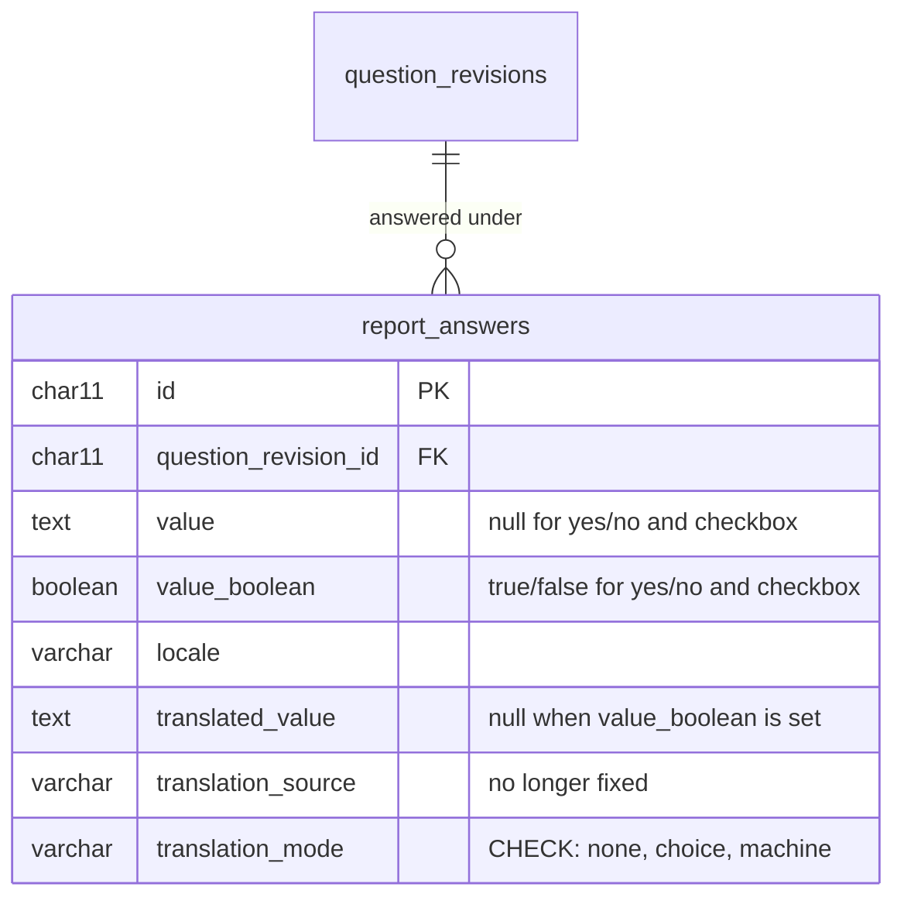

# ADR-0130 — A yes or no answer is stored as a boolean

## Status

Accepted. This ADR:

- **supersedes**
  [ADR-0127](ADR-0127-a-yes-or-no-answer-is-stored-in-the-reporters-language.md)
  in full: a yes/no answer is no longer stored as a word in the reporter's
  language, and it has no fixed counterpart;
- **partially supersedes**
  [ADR-0072](ADR-0072-every-answer-is-stored-as-a-string.md): its boolean row.
  Its date, time, and date-and-time forms stand;
- **partially supersedes**
  [ADR-0112](ADR-0112-only-answers-that-need-it-get-a-second-language.md):
  yes/no and checkbox return to its `none` row, as it first decided;
- **amends**
  [ADR-0128](ADR-0128-an-answer-names-its-choice-and-a-picker-option-is-fixed-or-replaced.md):
  yes/no and checkbox answers are still not choices, but they are no longer
  words;
- **amends**
  [ADR-0080](ADR-0080-every-answer-gets-a-worker-translated-second-language.md)'s
  immutability, once, for the conversion below. It does not generalize.

## Context

A yes/no answer is a fact, not a phrase. ADR-0072 stored it as the tokens
`yes` and `no`. ADR-0127 then stored it as the reporter's own word (`oui` or
`non` for a French reporter), wrote the other language beside it as a fixed
counterpart, and made every reader accept four words. The consent projection,
a conditional question's check, the reviewer view, and the form all carried
that vocabulary, and a consumer comparing to `"yes"` alone was a bug waiting
to happen.

The owner ruled (#489, 2026-09-25) that the answer is stored as `true` or
`false`, and that only the interface turns it into words, in the language the
reader is viewing.

## Decision

**Which answers.** Every answer to a `yes_no` or `checkbox` question,
including publication consent and media consent.

**Storage.** `report_answers` gains a nullable `value_boolean boolean`. A
yes/no or checkbox answer writes `true` or `false` there and leaves `value`
null. A skipped one leaves both null. A row never carries both: a `CHECK`
holds that at most one of `value` and `value_boolean` is set.

**No words and no second language in the database.** A boolean answer has
translation mode `none`, no `translated_value`, and no `translation_source`.
The React interface renders `true` as Yes / Oui and `false` as No / Non from
its own locale catalogue (`report.booleanYes`, `report.booleanNo`). A `CHECK`
holds that a row with `value_boolean` set has no `translated_value` and mode
`none`. `TranslationMode.Fixed` and `TranslationSource.Fixed` are removed, and
the translation-mode `CHECK` no longer allows `fixed`.

**Wire format.** A boolean travels as a JSON `true` or `false` literal, both
ways. The submission refuses a string for a yes/no or checkbox question
(`"true"`, `"yes"`, `"oui"`) with `400`, and refuses a boolean for any other
type. A JSON `null` is a skip. The reviewer's report view returns the boolean
as a JSON boolean. The form keeps its language-free token while the reporter
answers, so a browser draft saved before this change still restores, and
sends the boolean when the report is submitted.

**Readers.** The consent projection and a conditional question's check read
the boolean. Only `true` is consent or enables the dependent question. An
unanswered consent is still not consent.

**Model input.** The Worker sends the boolean as `true` or `false` in
`report_content` or `private_context`, with no words. The prompt text is
unchanged.

**Marking pass.** The deterministic marking pass
([ADR-0082](ADR-0082-a-deterministic-marking-pass-precedes-the-one-model-call.md))
never uses a boolean as a candidate. A private yes/no would otherwise mark
every literal `true` or `false` in the narrative. The value still reaches
the model in `private_context`.

**Existing answers are converted once.** The migration that adds
`value_boolean` converts every existing yes/no and checkbox answer, on live
and soft-deleted reports alike:

| Stored `value` | `value_boolean` |
|---|---|
| `yes`, `oui` | `true` |
| `no`, `non` | `false` |
| null (skipped) | null |

It then clears `value`, `translated_value`, and `translation_source`, and sets
the mode to `none`. A boolean row holding any other value stops the migration
with an error rather than being skipped or guessed. Only the word's spelling
is lost: the answer's `locale` still records the reporter's language.

## Why the conversion may rewrite answers

Answers are immutable (ADR-0080) so that nothing changes what a reporter said.
This conversion changes the representation, not the meaning: every stored
word maps to exactly one boolean, and a word that does not stops the
migration. Leaving the words in place would keep two read paths forever, and
every reader would still need the four-word vocabulary this decision removes.
The exception covers this one migration. Any other rewrite of an answer needs
its own argument on its own facts.

## Rejected alternatives

- **Write `true`/`false` as text in `value`.** It needs no new column, but a
  yes/no would still be a string that every reader parses.
- **Leave the existing words in place.** It keeps immutability literal, at the
  cost of two read paths and the four-word vocabulary forever.
- **Keep `fixed` in the enum, unused.** A code nothing writes invites something
  to write it again.
- **Send the model words** (English, or the reporter's language). The owner
  chose the raw boolean. The model reads `true` beside the question's wording
  as plainly as it reads `yes`.
- **Accept a string on the wire and parse it.** It would keep the four-word
  vocabulary alive at the API boundary.

## Consequences

- `YesNoAnswer` is removed. `ReportAnswer` gains `BooleanValue`, and `Report`
  records a boolean answer through its own overload.
- `SummarizationField` says whether it holds a boolean, so the marking pass can
  skip it.
- The reviewer view's answer value is a string or a boolean. `formatAnswer`
  maps a boolean through the locale catalogue.
- A consumer reading a yes/no answer from `value` is a bug. It reads
  `value_boolean`.
- The Typeform import is unaffected: it imports questions, not answers.

## Related

- [ADR-0127](ADR-0127-a-yes-or-no-answer-is-stored-in-the-reporters-language.md) — the word form, superseded here.
- [ADR-0072](ADR-0072-every-answer-is-stored-as-a-string.md) — the string forms; its boolean row is superseded here.
- [ADR-0112](ADR-0112-only-answers-that-need-it-get-a-second-language.md) — which answers get a second language.
- [ADR-0060](ADR-0060-conditional-questions-depend-on-a-boolean-question.md) — conditional questions on a yes/no parent.
- [ADR-0082](ADR-0082-a-deterministic-marking-pass-precedes-the-one-model-call.md) — the marking pass.
- Issues #489 (this change), #452 (the word form).
