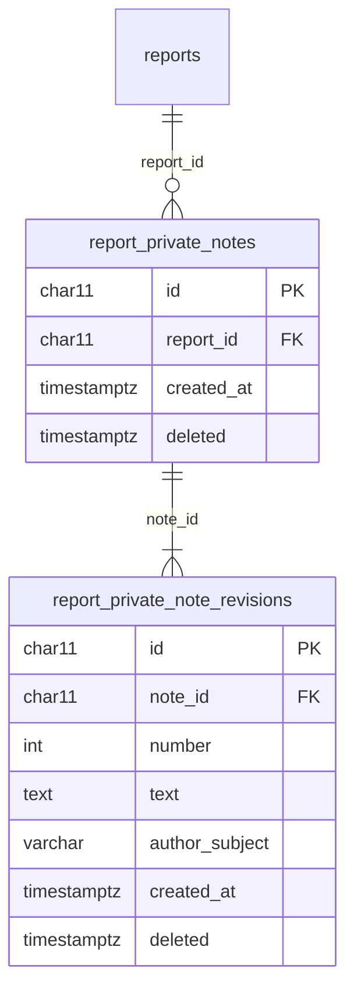

# ADR-0133 — Staff keep private notes on a report

**Status:** Accepted. Reuses the revision shape of
[ADR-0114](ADR-0114-members-may-comment-on-a-published-report.md) and records
writers as opaque token subjects, as
[ADR-0065](ADR-0065-no-user-records-identity-is-the-token-subject.md) requires.

## Context

Safety officers and administrators follow a report up outside the system:
they call the reporter, talk to investigators, and learn context that belongs
with the report. Today the only reviewer-written text on a report is the
optional unpublishing note, one per report and overwritten each time. There is
nowhere to keep a running record (#508).

Such a record is more sensitive than the report itself. It can name the people
involved, and nobody anonymizes it. So it has to stay out of everything that
leaves the review screen: the summary, the model, translation, the public
feed, and the comments.

## Decision

1. **A private note is a reviewer's plain text on one report.** Any number per
   report, on any report that is not deleted, in any status. It is stored as
   typed: never rendered as Markdown or rich text, never machine-translated.
2. **Only `SafetyOfficer` and `Administrator` read or write notes**, through
   `/api/admin/reports/{reportId}/private-notes` under the reviewer policy:
   list, add, edit, remove, and read one note's history. Either role may edit
   or remove any note, not only their own.
3. **Each edit is a new immutable revision.** A note owns an ordered list of
   revisions, and its current text is the newest. Every revision records its
   writer's token subject and when it was written, and nothing else about the
   member. An edit names the revision it was based on; one based on an older
   revision is refused with `409`, as a stale review command is
   ([ADR-0105](ADR-0105-approving-a-consented-pair-publishes-it.md)).
4. **Removal is a soft delete.** The note and every revision are stamped
   `deleted` with one time, and one content-free `RemovedPrivateNote` audit
   entry records who removed it. There is no undo. Soft-deleting a report
   stamps its notes with the report's deletion time.
5. **Nothing but those endpoints reads the tables.** No database view, no
   public or member endpoint, the report detail DTO, `ReportForSummaryDto`, or
   the Worker. Writing a note queues no outbox work.

## Rejected alternatives

- **Reusing `report_comments` with a private flag.** Comments are public by
  design, translated by the Worker, and read through public views. One flag
  would be all that stands between a staff note and the public feed.
- **A column on `reports`**, like the unpublishing note. One text per report,
  overwritten on edit, with no history and no writer.
- **Overwriting on edit.** A note records what staff knew and when; an
  overwritten note loses that.
- **Author-only edit and removal**, as comments have. Notes are a shared
  working record of the review team; each revision already says who wrote it.
- **Auditing every read of the notes.** Opening the report is already audited
  as `ViewedRawReport`; the notes are read on that page.

## Consequences

- A second kind of opaque subject is stored against report content that only
  reviewers read. It identifies nobody outside the identity provider.
- A note linking to a private attachment is #507's, not this decision's.
- Mentions, notifications, rich text, attachments on a note, search, and
  restoring a removed note are not built. See
  [`features/moderation-authentication-and-publication/README.md`](../../features/moderation-authentication-and-publication/README.md).
