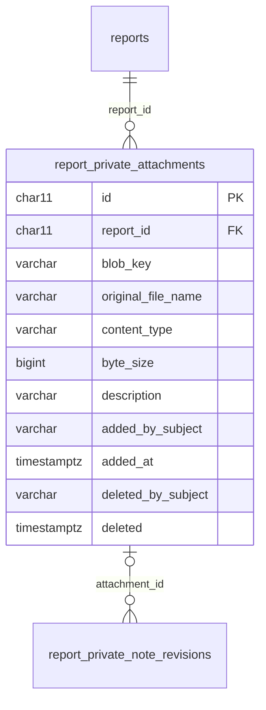

# ADR-0135 — Staff add private attachments to a report

**Status:** Accepted. Reuses the upload primitive of
[ADR-0126](ADR-0126-an-attachment-uploads-straight-to-quarantine-by-pre-signed-put.md),
the forced download of
[ADR-0026](ADR-0026-presigned-urls-and-private-blob-storage.md) and
[ADR-0097](ADR-0097-a-reviewer-downloads-an-attachment-under-its-sanitized-original-name.md),
and the opaque token subject of
[ADR-0065](ADR-0065-no-user-records-identity-is-the-token-subject.md). Extends
[ADR-0133](ADR-0133-staff-keep-private-notes-on-a-report.md): a private note's
revision may refer to one private attachment.

## Context

Staff obtain files after a report is filed: a coroner's report, a police
report, an investigation archive. They belong with the report, and they are
for staff only (#507). They are not the reporter's attachments. Nobody consented
to publishing them, nobody validated them against the reporter allowlist, and
they can run to a gigabyte, which cannot pass through an API that runs where a
request body is capped at 6 MB (ADR-0126).

Every read of a reporter attachment today — the Worker, the model input, the
public views, the report detail DTO, counts — reads `report_files`. A flag on
that table would be all that keeps a coroner's report out of each of them.

## Decision

1. **Their own table and their own compartment.** A private attachment is a
   row in `report_private_attachments`, never in `report_files`, and its bytes
   live under `<report id>/private/<attachment id>`, a fourth
   `MediaCompartment`. Nothing that reads reporter attachments — the Worker,
   `ReportForSummaryDto`, `public_reports`, `public_report_media`, the report
   detail DTO, any count — knows the table exists. No database view reads it.
2. **Only `SafetyOfficer` and `Administrator`**, under the reviewer policy at
   `/api/admin/reports/{reportId}/private-attachments`: mint an upload, add
   (claim), list, download, and remove. Any report that is not deleted, in any
   status, with or without consent.
3. **Upload by ADR-0126's pre-signed PUT, to the same quarantine.**
   `UploadLink` stays the only caller of `IBlobStore.CreateUploadUrl`; it gains
   a second entry point for a private upload, judged by its own
   `PrivateAttachmentPolicy`. The PUT lands in `quarantine/<upload id>` exactly
   as a reporter's does, so the one quarantine lifecycle rule expires an
   unclaimed private upload too, and no bucket rule changes. The claim copies
   it, inside storage, into the private compartment, inserts the row, and then
   erases the quarantine copy (best effort, as a submission does). A browser
   is never handed a URL that writes to a report's compartment.
4. **Any type, one configurable cap.** The declaration is judged on size alone:
   above zero and at most `HpacSafety:Media:PrivateAttachments:MaxByteSize`
   (default 1073741824, 1 GB), separate from the reporter caps. Configuration
   alone changes it. The declared type is signed as given when it is a
   well-formed `type/subtype`, and as `application/octet-stream` when it is
   empty or malformed; the mint response says which, and the browser PUTs with
   it. Nothing is sniffed, validated against an allowlist, parsed, unpacked,
   previewed, transformed, or scanned (ADR-0089). The bytes are stored and
   served exactly as sent. A single PUT carries up to 5 GB, so 1 GB needs no
   multipart upload.
   **A private attachment is never anonymized** (owner, 2026-09-26). The
   reporter-media pipeline does not apply to it: no EXIF or other metadata
   stripping, no derivative, no redaction, and no marking pass. A photo keeps
   its location data and a document its author. Only the two reviewer roles
   ever reach it, so there is no audience to anonymize it for.
5. **Downloaded under the staff member's own file name.** The claim carries
   the file name; it is sanitized as ADR-0097 sanitizes a reporter's, and a
   name that sanitizes to nothing is refused. Unlike ADR-0097, the extension is
   the name's own: nothing sniffed the bytes, so no served type could supply a
   truer one, and the download is forced, never rendered. A new chokepoint,
   `PrivateAttachmentLink`, is the only place that signs a GET for the private
   compartment, and it signs nothing else. `ReviewerMediaLink` and
   `PublicMediaLink` already refuse every compartment but their own, so a
   private key can never leave through them. The link lives at most 15
   minutes, and each download writes one `DownloadedPrivateAttachment` audit
   entry before the URL is disclosed.
6. **What is recorded.** The sanitized name, the stored type and size, an
   optional plain-text description of at most 500 characters, and the adder's
   token subject and time. Remove is a soft delete stamping `deleted` and the
   remover's subject, with one `RemovedPrivateAttachment` audit entry; the
   object is kept (invariant 8), and a removed attachment is neither listed
   nor downloadable. Deleting a report stamps its private attachments with the
   report's deletion time, as it does its notes.
7. **A private note may refer to one.** The reference lives on the note's
   revision, `report_private_note_revisions.attachment_id`, not on the note:
   under ADR-0133 a revision is everything the note said at one time, so an
   edit may add, change, or drop the reference, and the history shows each
   revision's own. The attachment must be live and on the same report as the
   note; one on another report, or already removed, is refused with `400`. A
   revision that referred to an attachment removed later keeps the reference,
   and the page shows the attachment as removed.
8. **No outbox message, no Worker processing.** Adding, downloading, or
   removing a private attachment queues nothing.

## Rejected alternatives

- **A row in `report_files` with a private flag.** Every reporter-attachment
  reader would need to remember the flag, and one that forgot would put a
  police report in the model input or the public report page.
- **Uploading through the API body.** A request body on the API's host is
  capped at 6 MB; 1 GB cannot pass through it (ADR-0126).
- **A pre-signed PUT straight into the private compartment.** It would make a
  report's compartment writable from a browser, which ADR-0126 rules out for
  every compartment but quarantine, and an abandoned upload there would never
  expire.
- **Anonymizing it as reporter media.** Stripping a photo's metadata or
  deriving a copy would destroy evidence staff added it for, and nobody outside
  the two reviewer roles ever sees it.
- **The reporter allowlist and sniffing.** Staff need zip archives and formats
  nobody can list in advance, and nothing downstream reads the bytes, so a
  sniff would refuse legitimate files and protect nothing.
- **The reference on the note row.** A note's text is its revisions; a
  reference outside them could change without a revision, and the history
  could not say what the note referred to when.
- **Multipart or resumable upload.** Not needed below 5 GB.

## Consequences

- Staff files of any size up to the cap reach storage without the API holding
  their bytes, and are reachable only by the two reviewer roles.
- A second compartment exists that no public or reporter code path names; the
  chokepoint scan keeps it that way.
- A 1 GB upload must start within the 15-minute life of its PUT URL; the PUT
  itself may run longer.
- The attachment strip and viewer-scoped counts of #427 count `report_files`
  only, so private attachments are excluded from them by construction.
