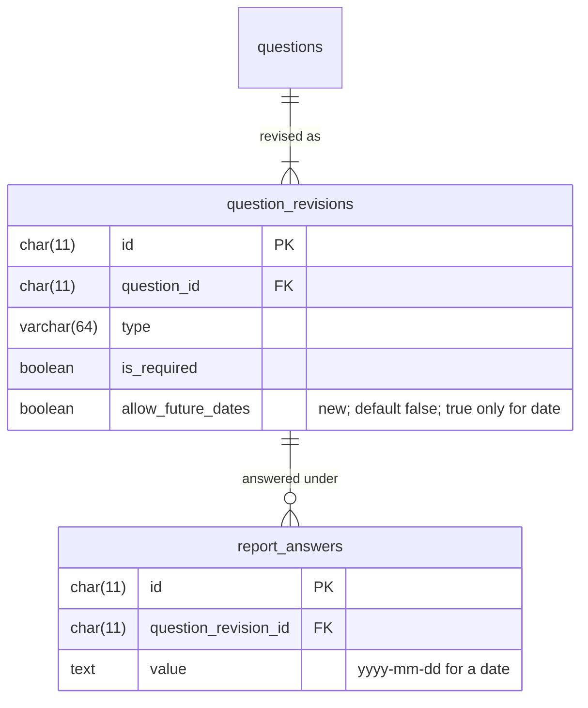

# ADR-0138 — A date question allows future dates only when it says so

## Status

Accepted. This ADR **extends**
[ADR-0072](ADR-0072-every-answer-is-stored-as-a-string.md): a date answer is
still stored as `yyyy-mm-dd`, and is now also checked against its revision's
`allow_future_dates`. It adds a revision field under
[ADR-0071](ADR-0071-an-answered-question-forks-instead-of-revising.md)'s
revise-or-fork rule.

## Context

A date question rendered as a plain `<input type="date">`. Some browsers show
it as a bare `yyyy-mm-dd` text box with no calendar, and nothing stopped a
reporter entering a date in the future for the date of an occurrence, which
cannot have happened yet.

The owner decided (#517, 2026-09-26) that a date question opens a simple
calendar, that a phone keeps its native picker, and that refusing future
dates is a setting of each question rather than a rule for every date
question, off by default.

## Decision

**The setting.** `question_revisions.allow_future_dates` is `boolean not null
default false`. Only a date question may set it true; the domain refuses it
on any other type and `ck_question_revisions_future_dates_date` backs that
up. It is a revision field like `is_required`: changing it revises an
unanswered question and forks an answered one, so every answer is judged by
the revision it was given under. The migration adds the column with its
default, so every existing date question, the seeded occurrence date
included, stores `false`. It changes no wording and creates no revision.

**Which today.** The form holds a date to the reporter's local today. The API
holds it to today at UTC+14, the latest time zone in use, so it never refuses
a date that is already today somewhere. A date is a calendar day with no
zone ([ADR-0035](ADR-0035-dateonly-datetimeoffset-timeonly-datetime-is-banned.md)),
and the API does not know the reporter's zone. The form's check is the strict
one; the API's is the backstop for a client that skips it, and it refuses by
question key before anything is written.

**The picker.** On a fine pointer the field is a text box taking
`yyyy-mm-dd`, with a small in-house calendar popover: one month, month
navigation, month and year pickers, and the keyboard model of a date-picker
dialog. Its month and weekday names come from `Intl.DateTimeFormat`; its
labels from the locale catalogues. On a coarse pointer the field stays a
native `<input type="date">`, whose value is `yyyy-mm-dd` on every platform,
with `max` set to the local today when future dates are not allowed.

**Typeform.** Typeform's date field cannot express the setting, so the export
carries it in each field's `hpac` object, as it does everything else Typeform
has no slot for, and a reimport reads it back
([ADR-0077](ADR-0077-typeform-json-import-and-export.md)). A plain Typeform
file has no `hpac` object, so it imports every date question without it.

## Consequences

- No reporter is refused a date that is today where they are. One whose
  local date is behind UTC+14's can send tomorrow's date only by bypassing
  the form, and the API accepts it, since it is already today somewhere.
- The calendar is about 300 lines the repository owns, styled with the design
  tokens. It needs no package, and no third-party code reaches the bundle.
- A phone's native picker may ignore `max`. The inline message on Next and the
  API's refusal still hold.

## Alternatives considered

- **No future dates on any date question.** The first decision on #517,
  replaced by the owner the same day with the per-question setting: whether a
  date may lie ahead depends on what the question asks.
- **Judge today on the server in UTC, or in Canada's zones.** Rejected: either
  refuses a date that is already today for a reporter east of the zone chosen,
  and the client already holds the reporter's own today.
- **Send the reporter's zone or offset with the submission.** Rejected: it adds
  a field to the one final request for a check that is only a backstop, and a
  client that skips the form's check can send any offset.
- **A date-picker package** (react-day-picker, a headless calendar).
  Rejected: the need is one month view and a keyboard model, which a small
  component covers without a dependency to theme, localize, and keep current.
- **The custom calendar on phones as well.** Rejected: the native picker is
  what a phone's reporter knows, and it is accessible on every platform
  without work of ours.
