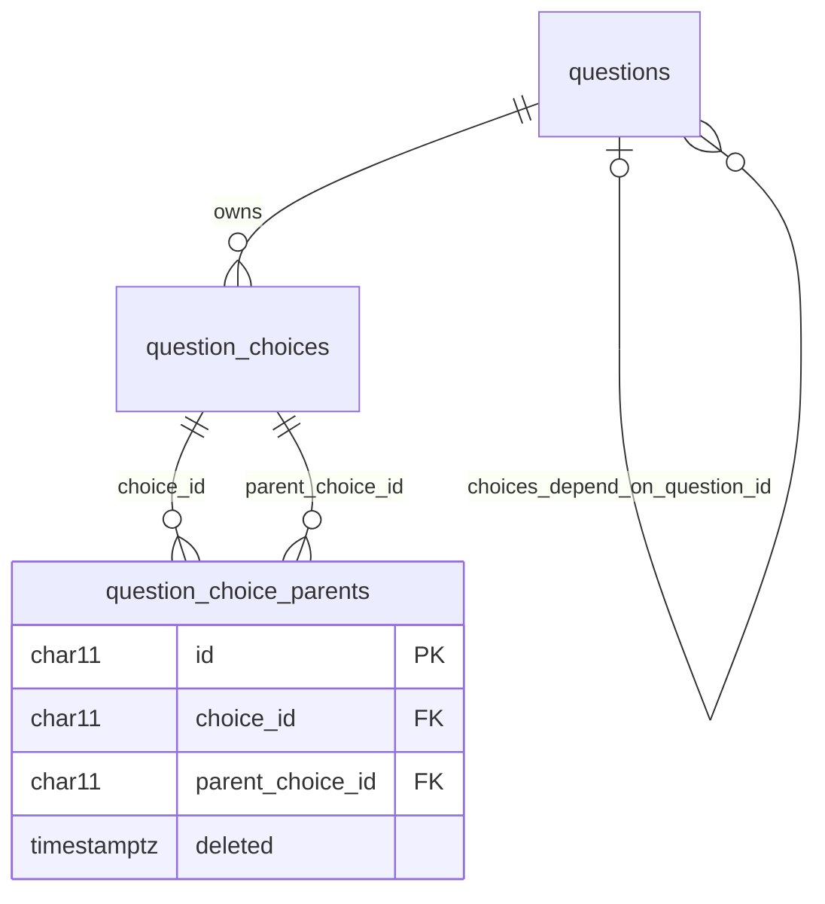

# ADR-0151 — One dependent choice may be offered under several parent choices

## Status

Accepted. This ADR **supersedes**
[ADR-0146](ADR-0146-a-choice-list-may-depend-on-another-questions-answer.md).
It keeps everything ADR-0146 decided except five rules, which it replaces:

- the one-parent link;
- wording unique per parent choice;
- the refusal to merge type-ahead values under different parent choices;
- the rule that a linked parent choice is never removed;
- Typeform import and export carrying no dependency.

Everything else still holds, restated here so this record stands alone:

- which types take part, one level only, and the parent asked first;
- the dependency and the links sit outside revisions;
- a replace, merge, or fork re-points links when it happens;
- a parent the form does not ask filters nothing;
- a disabled child never blocks Next or Submit;
- the submission checks the child's choice against the parent's answer.

It amends AGENTS.md invariant 1 ("Dependent choices") and argues one column
drop against invariant 8.

## Context

Under ADR-0146, a choice that belongs under several parent answers was entered
once per parent. The live question bank shows the cost. The dependent
`Certification:` question holds `EN-A` to `EN-D` twice each (`en_a` and
`en_a_2`, …): one copy under Paraglider, the other under Hang Glider.
Administrators maintain every copy by hand, and each copy collects its own
answers (#558).

## Decision

### Many parent choices, through a join table

- A live choice of a dependent question names **one or more** parent choices.
  Zero is refused. The form offers the choice whenever the parent's answer is
  any one of them.
- The links move from `question_choices.parent_choice_id` into a join table,
  `question_choice_parents`:
  - a tiny-id key (ADR-0034), `choice_id`, `parent_choice_id`, and
    `deleted`;
  - both foreign keys restricted, and a `CHECK` refusing a self-reference;
  - one row per pair **for life**, under a full unique index. A live pair is
    therefore unique too.
- **A link is never erased.**
  - Unticking a parent stamps the link `deleted`. Re-ticking restores that
    same row, as writing a removed choice again revives it (ADR-0095).
  - Because the aggregate reads stamped rows to restore them, the table has
    no default live-row filter. This is the same exception `question_choices`
    has.
  - A link row's parent choice never changes. Re-pointing a link stamps it
    and adds or restores the link to the new parent choice. When the child
    choice already names that choice, the two collapse into one.
- A link to a parent choice that was **removed** (not replaced or merged)
  stays live and filters nothing, because the form never answers with a
  removed choice. An editor save leaves such a link as it is: the editor lists
  only live parent choices, so it cannot tick or untick one.

### Wording is unique on a dependent question

- The same wording twice among a dependent question's live choices is
  refused, in either language. To offer a choice under another parent answer,
  tick that parent on the existing choice. This replaces ADR-0146's "unique
  per parent choice".
- Two wordings are the same when they match after trimming, collapsing runs of
  whitespace to one space, and ignoring case.

### Merging, replacing, removing

- **Type-ahead merges union the parents.** Merging two values under different
  parent choices is now allowed. The surviving value is offered under every
  parent either value was under. ADR-0146 refused this because answers would
  read a value offered under another make. The owner accepts that: the two
  values were the same wording, and one choice, one wording is the point.
- **A replaced picker option** inherits the live parents of the option it
  retires, unless the save names others.
- **Removing a parent choice** is allowed when every live child choice offered
  under it keeps at least one other live parent choice. The removed choice's
  links stay, inert. Removal is refused only when it would leave a live child
  choice with no live parent. The refusal names those child choices. The
  choice can still be replaced or merged instead, which passes its links on.
- Merging parent values can no longer put one wording twice under one parent
  choice, since wording is unique on the child. ADR-0146's check for that is
  removed.

### Reporter-added values

- A value typed into a dependent type-ahead is matched against **the whole
  question**, in either language, ignoring case and whitespace as above. The
  owner chose this over two alternatives, on 2026-09-26:
  - **Adding no link.** The answer would then name a value not offered under
    the parent's answer, and the submission would be refused.
  - **A copy per parent.** This breaks uniqueness.
- When the matched value is live but not offered under the parent's answer,
  it gains a link to that answer and is flagged for review. The reviewer can
  untick the parent again. A merged match reads as its target, and the target
  gains the link. A removed match comes back flagged and is not revived.
- A new value is linked to the one parent answer given at submission.
- On the type-ahead review page, a Safety Officer or Administrator may add or
  remove a value's parents, but never down to none. This is the multi-select
  form of ADR-0146's "change, never clear", and it keeps its audit action.

### The wire

- The public form's choices carry `parentChoiceIds: string[]` in place of
  `parentChoiceId`.
- The browser offers a choice when the parent's answer is in that list. When
  the parent's answer changes, the child keeps its answer if its choice is
  also under the new answer, and clears it otherwise.
- The API refuses a child answer whose choice does not list the answered
  parent choice.

### Typeform carries the dependency

This reverses ADR-0146. The `hpac` extension gains:

- `choices_depend_on_key`: the parent question's key;
- on each choice, an `hpac` object whose `parent_refs` lists the parent choice
  refs (codes).

Import restores both through the ordinary authoring screen. A file exported
before this change has neither, and imports with no dependency, as before.

### The migration

One migration, in one transaction:

1. **Create** `question_choice_parents`.
2. **Fold** each non-null `parent_choice_id` into a link, then **verify** that
   every one has a live link. A missing link raises an exception and rolls the
   whole migration back.
3. **Merge identical duplicates.** Within one dependent question, live choices
   whose English **and** French wording are the same, by the comparison above,
   become one choice.
   - The oldest survives. An Administrator's choice records no creation time.
     Within one wording, `UnusedCode` coded the copies `stem`, `stem_2`,
     `stem_3`, … in the order they were made. So the oldest is the shortest
     code, then the lowest code, then the id.
   - The survivor gains every live parent of the others.
   - Each other copy is retired: replaced by the survivor if the question is a
     picker (ADR-0128), merged into it if it is a type-ahead (ADR-0129). A
     value already merged into a retired copy is re-pointed at the survivor, so
     merges stay flat.
   - Answers are never rewritten. Each keeps naming the choice it was given
     under, which reads the same wording.
   - A condition naming a retired picker copy follows its `replaced_by` to the
     survivor on read, as every condition does (ADR-0128, ADR-0132).
   - Any link naming a retired copy as its parent is re-pointed at the
     survivor. There are none today, because a child is nobody's parent, but
     the step costs nothing and keeps the rule true.
   - Where one language matches and the other does not, nothing merges. The
     question's next save refuses the pair as a uniqueness conflict, naming
     it, and an Administrator resolves it by hand.
4. **Drop** `question_choices.parent_choice_id`, with its index, check, and
   foreign key.

### Invariant 8: dropping `parent_choice_id`

Invariant 8 carves out `DROP TABLE` exceptions and forbids an `ALTER` that
loses a value. This is a column drop, not a table drop, and it loses no value:

- step 2 copies every non-null value into a link row before the drop, and
  verifies the copy in the same transaction, so a failed copy drops nothing;
- the link rows hold exactly what the column held, plus what the column could
  not (a second parent);
- a null column held nothing to keep.

The drop does not generalize. A later column drop needs its own argument on
its own facts.

### Where each rule is enforced

- **The database**: restricted foreign keys, the self-reference `CHECK`, and
  one row per pair.
- **`ChoiceDependencies`** in the domain checks the rest:
  - at least one live parent per live child choice;
  - every link names a choice of the parent question;
  - every newly ticked parent is one of its live choices;
  - the removal rule;
  - de-duplicated re-pointing.

  As in ADR-0146, these read the parent's current revision and choices, which
  only a trigger could reach, and ADR-0060 and ADR-0074 rejected triggers.
- **`Question`** checks that wording is unique, and unions parents on merge.

## Rejected alternatives

- **Keep one parent per choice (ADR-0146).** Every shared model or catch-all
  is maintained once per parent and splits its answers. This is the cost #558
  exists to remove.
- **An array of parent ids on `question_choices`.** It cannot hold a foreign
  key, and PostgreSQL arrays of foreign keys are what a junction table is for.
- **Erase a link when a parent is unticked.** Every other choice edit stamps
  rather than erases (ADR-0095, invariant 8). A stamped link also records
  under which answers a choice was once offered.
- **Rewrite answers onto the surviving duplicate.** Answers are immutable. A
  retired copy already reads the survivor's wording, through `replaced_by` or
  `merged_into`.
- **Merge duplicates whose wording differs in one language.** Which wording
  wins would be a guess. An Administrator resolves those on the next save.
- **Unlinked "shown under every parent" choices.** A choice for every parent
  ticks every parent. ADR-0146's reasons stand.

## Consequences

- `question_choice_parents` replaces `question_choices.parent_choice_id`.
- `question_choices` needs no default filter, and neither does the new table.
- The admin option view and request carry `parentChoiceIds`. The public
  option view does too. The review page's relink endpoint takes the complete
  list.
- The editor's "Offered under" is a multi-select on every choice row.
- A reporter's typed value may add a link to a live value, flagged for review.
- The Typeform `hpac` extension gains the dependency.
- After the migration, `Certification:` holds one `EN-A` to `EN-D` each,
  offered under both Paraglider and Hang Glider. `EN-CCC`, with one copy,
  keeps exactly its one parent.

## Related

- [#558](https://github.com/HPAC-Safety/safety-report/issues/558),
  [#520](https://github.com/HPAC-Safety/safety-report/issues/520).
- [ADR-0146](ADR-0146-a-choice-list-may-depend-on-another-questions-answer.md): superseded.
- [ADR-0095](ADR-0095-a-question-owns-its-choices-outside-its-revisions.md),
  [ADR-0128](ADR-0128-an-answer-names-its-choice-and-a-picker-option-is-fixed-or-replaced.md),
  [ADR-0129](ADR-0129-a-type-ahead-value-is-edited-in-place-merged-and-reviewed.md),
  [ADR-0132](ADR-0132-a-condition-follows-its-parent-through-a-fork.md),
  [ADR-0077](ADR-0077-typeform-json-import-and-export.md).
