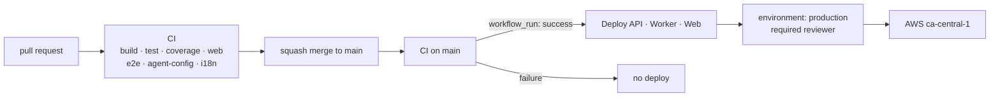
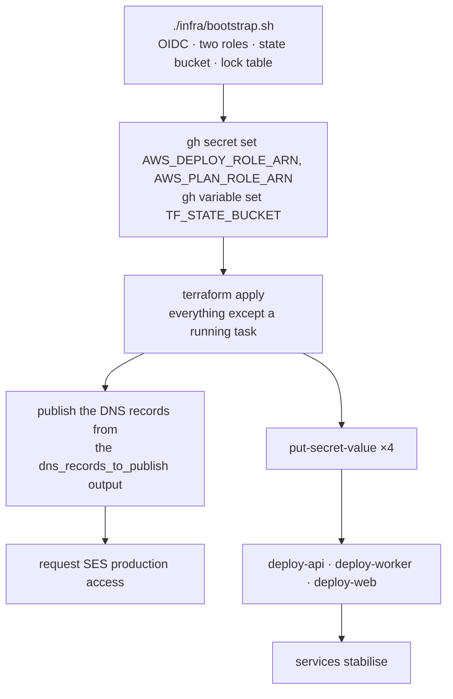
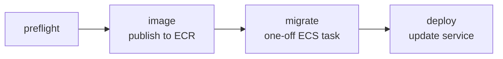

# Deployment

How the four deployables reach AWS, what credentials that needs, and where each
one lives. Hosting rationale is [ADR-0009](decisions/ADR-0009-hosting-on-aws.md);
the infrastructure itself is Terraform, per
[ADR-0010](decisions/ADR-0010-infrastructure-as-code.md).

> **Status: scaffold.** The workflows exist and are wired. The three `deploy-*`
> workflows fail with a clear message because the AWS environment has not been
> created yet; `terraform.yml` validates `infra/` on every pull request and skips
> its AWS jobs with a notice for the same reason. The Terraform itself is written
> and lives in [`infra/`](../infra/README.md) — it has never been applied.
> Creating the account and running the bootstrap is
> [#32](https://github.com/HPAC-Safety/safety-report/issues/32); filling in the
> AWS calls in the deploy workflows is
> [#30](https://github.com/HPAC-Safety/safety-report/issues/30).

## What deploys, and from where

| Workflow | Deploys | Target |
|---|---|---|
| `.github/workflows/terraform.yml` | `infra/` | The AWS environment itself |
| `.github/workflows/deploy-api.yml` | `src/HpacSafety.Api` | ECS Fargate service |
| `.github/workflows/deploy-worker.yml` | `src/HpacSafety.Worker` | ECS Fargate service |
| `.github/workflows/deploy-web.yml` | `src/web/public`, `src/web/admin` | S3 + CloudFront, separately |

Containers are produced by `dotnet publish -c Release /t:PublishContainer`.
.NET 10 emits an OCI image directly, so there is no Dockerfile to drift from the
project file.



Every deploy workflow triggers on `workflow_run` of **CI**. A red build cannot
deploy, and neither can an unmerged one. Each also has `workflow_dispatch`, so a
rollback never requires a commit.

### The trigger guard

`workflow_run`'s `branches: [main]` filter matches the *triggering run's*
`head_branch`, and a `pull_request`-triggered CI run reports its `head_branch` as
the pull request's **source** branch — a green CI run on a feature branch here
reports `head_branch: ci/pipeline-and-deploy-scaffolding`, not `main`.

That filter is therefore doing load-bearing work, and its exact semantics are not
worth betting an ECR push on. Every `preflight` job carries an explicit guard as
well:

```yaml
if: >-
  github.event_name == 'workflow_dispatch' ||
  (github.event.workflow_run.event == 'push' &&
   github.event.workflow_run.head_branch == 'main' &&
   github.event.workflow_run.conclusion == 'success')
```

`event == 'push'` is the important one. It admits only a merge to `main`, never a
pull request run and never a dispatched CI run. Without it, a green CI run on an
open pull request could reach `image`, which is **not** behind the `production`
environment — the required reviewer guards `migrate` and `deploy` only — and push
a container built from unreviewed, unmerged code.

### Image tags

`IMAGE_TAG` is `github.event.workflow_run.head_sha`, never `github.sha`.

On a `workflow_run` trigger `github.sha` is the tip of the default branch **at
run time**, not the commit CI tested. If a second pull request merges between CI
finishing and the deploy workflow starting, `github.sha` moves and the image is
tagged with a commit it was not built from. Rollback is by tag, so that failure
stays silent until the day it matters.

`head_sha` is the commit CI tested, and is what every checkout step uses.

## Authentication: OIDC, no stored AWS keys

Workflows assume an IAM role through GitHub's OIDC provider:

```yaml
permissions:
  id-token: write
  contents: read
```

There is no `AWS_ACCESS_KEY_ID` and no `AWS_SECRET_ACCESS_KEY` anywhere in this
repository, and there never should be.

The role's trust policy must be scoped to **this repository** and to
`ref:refs/heads/main`. A role that trusts `repo:HPAC-Safety/*:*` would let any
repository in the org deploy this system; a role that trusts
`repo:HPAC-Safety/safety-report:*` would let any branch — including one pushed
to a fork — do the same.

```json
{
  "Condition": {
    "StringEquals": {
      "token.actions.githubusercontent.com:aud": "sts.amazonaws.com",
      "token.actions.githubusercontent.com:sub": "repo:HPAC-Safety/safety-report:ref:refs/heads/main"
    }
  }
}
```

### Two roles, because a pull request is not a branch

`terraform plan` runs on pull requests, and a `pull_request`-triggered workflow
presents the subject `repo:HPAC-Safety/safety-report:pull_request` — not a branch
ref. It cannot assume the role above, and widening that role so it could is
exactly what the scoping rule forbids.

So `infra/bootstrap.sh` creates two:

| Role | Trusts | May |
|---|---|---|
| `hpac-safety-deploy` | `…:ref:refs/heads/main` | Manage the environment, push images, update services |
| `hpac-safety-plan` | `…:pull_request` | Read. Nothing else. |

`hpac-safety-plan` is `ReadOnlyAccess` plus read on the state bucket, minus three
explicit `Deny` statements: `s3:GetObject` on the uploads bucket (those objects
are photographs of crash sites), `secretsmanager:GetSecretValue`, and the RDS
log-download actions. `Deny` beats `Allow` unconditionally, so those hold
whatever AWS adds to `ReadOnlyAccess` later.

Neither role can mint a credential: both policies `Deny` `iam:CreateUser`,
`iam:CreateAccessKey`, `iam:CreateLoginProfile`, `organizations:*`, and
`account:*`. Reasoning: [ADR-0032](decisions/ADR-0032-terraform-ci-without-an-aws-account.md).

## Deploy-time configuration

### Secrets

Two, and neither is usable without the trust policy above. They are role names,
not credentials.

| Name | Purpose | Printed by |
|---|---|---|
| `AWS_DEPLOY_ROLE_ARN` | Role assumed via OIDC by the deploy workflows and by `terraform apply` | `bootstrap.sh`, on stdout |
| `AWS_PLAN_ROLE_ARN` | Read-only role assumed by `terraform plan` on a pull request | `bootstrap.sh`, in its closing instructions |

```bash
gh secret set AWS_DEPLOY_ROLE_ARN --repo HPAC-Safety/safety-report --body "$(./infra/bootstrap.sh)"
gh secret set AWS_PLAN_ROLE_ARN   --repo HPAC-Safety/safety-report
```

### Variables

ARNs and resource names are not credentials. Keeping them as variables means a
failed deploy log says which cluster it could not reach.

| Name | Example | Used by |
|---|---|---|
| `AWS_REGION` | `ca-central-1` | all |
| `TF_STATE_BUCKET` | `hpac-safety-tfstate-123456789012` | `terraform.yml` |
| `ECR_REPOSITORY_API` | `hpac-safety/api` | api |
| `ECR_REPOSITORY_WORKER` | `hpac-safety/worker` | worker |
| `ECS_CLUSTER` | `hpac-safety` | api, worker |
| `ECS_SERVICE_API` | `hpac-safety-api` | api |
| `ECS_SERVICE_WORKER` | `hpac-safety-worker` | worker |
| `ECS_TASK_DEFINITION_MIGRATE` | `hpac-safety-migrate` | api |
| `ECS_SUBNETS` | `subnet-…,subnet-…` | api |
| `ECS_SECURITY_GROUPS` | `sg-…` | api |
| `S3_BUCKET_PUBLIC` | `hpac-safety-public` | web |
| `S3_BUCKET_ADMIN` | `hpac-safety-admin` | web |
| `CLOUDFRONT_DISTRIBUTION_PUBLIC` | `E…` | web |
| `CLOUDFRONT_DISTRIBUTION_ADMIN` | `E…` | web |

```bash
gh variable set AWS_REGION --body ca-central-1 --repo HPAC-Safety/safety-report
```

`TF_STATE_BUCKET` is the one value that cannot be committed: `backend.tf` is a
**partial** configuration because the bucket name carries the AWS account id, and
`terraform init` is passed it as `-backend-config="bucket=$TF_STATE_BUCKET"`.

Most of the rest are Terraform **outputs**. `terraform output -json
deploy_variables` returns every one of them from state, which is where they
should be read from — two sources of truth for a bucket name is one too many.
The `apply` job writes them into its run summary, and wiring the deploy
workflows to read them instead of `vars.*` is
[#30](https://github.com/HPAC-Safety/safety-report/issues/30).

`preflight` validates **every** variable the workflow's later jobs read,
including the three only `migrate` uses. A variable missing from `preflight`
does not go unnoticed — it fails two jobs later inside an `aws ecs run-task`
call, with an AWS CLI error rather than the named one this contract promises.

The check is a composite action, [`.github/actions/require-config`](../.github/actions/require-config/action.yml),
shared by all three workflows. It began as three near-identical copies of a
shell function, and they had already drifted.

Its manifest contains **no `${{ … }}` expression of any kind**, including inside
a description. GitHub template-evaluates an action manifest in full, the
`secrets` context does not exist at that point, and a worked example in a
description string was enough to make the whole action fail to load — see
[#36](https://github.com/HPAC-Safety/safety-report/issues/36). CI exercises the
action on every pull request so the manifest cannot break unnoticed again.

## Runtime secrets do not belong in GitHub

This is the distinction most easily got wrong. The application needs these
**while it runs**, not while it deploys. They live in **AWS Secrets Manager**
and are injected into the ECS task definition. Putting them in GitHub would
copy them into a second system that has no need to hold them.

| Secrets Manager entry | Injected as | Held by |
|---|---|---|
| `hpac-safety/anthropic-api-key` | `Anthropic__ApiKey` | Worker — summarize, PII audit, translate |
| `hpac-safety/turnstile-secret-key` | `Turnstile__SecretKey` | API — server-side `siteverify` |
| `hpac-safety/connection-string` | `ConnectionStrings__Default` | API and Worker |
| `hpac-safety/notifications-to` | `Notifications__To` | Worker — `safety@hpac.ca` in production |

Terraform creates those four **entries** and none of their **values**. There is
no `aws_secretsmanager_secret_version` resource in `infra/`, and adding one is
the defect rather than the fix — see
[ADR-0010](decisions/ADR-0010-infrastructure-as-code.md). A task whose secret has
no value fails to start, loudly, in the ECS event log; that is the intended
behaviour, since an API booting without its Turnstile key would accept
unverified submissions.

The RDS master password is a fifth secret that Terraform never sees at all:
`manage_master_user_password` has RDS generate and rotate it into its own entry.
`terraform output database_master_password_secret_arn` says where.

The Turnstile **site** key is public by design and may be a variable. The
Turnstile **secret** key must never reach a static bundle.

## The environment itself

`infra/` is the whole AWS environment as Terraform, and
`.github/workflows/terraform.yml` is how it runs. The three `deploy-*` workflows
ship artifacts *into* it and never create anything.
[`infra/README.md`](../infra/README.md) describes what it owns.

| Job | Runs on | Needs AWS? | Does |
|---|---|---|---|
| `infra` | every pull request and push | no | `fmt -check`, `init -backend=false`, `validate`, `tflint`, `shellcheck bootstrap.sh`, `node --check` on the CloudFront Function |
| `plan` | pull request, same-repo only | yes, read-only | `terraform plan`, posted as a pull request comment |
| `apply` | merge to `main`, or dispatch | yes | `plan` then `apply`, behind `environment: production` |

`infra` is a **required status check** and is the only one that can be, because
it is the only one that works with no account behind it. `plan` and `apply`
detect that the AWS configuration is missing, emit a `::notice::` naming #32, and
exit 0 — the reasoning is
[ADR-0032](decisions/ADR-0032-terraform-ci-without-an-aws-account.md), and it is
[ADR-0011](decisions/ADR-0011-ci-contexts-precede-their-checks.md)'s applied to
the same problem: a permanently-red check trains people to merge past red.

After every apply the job runs `terraform plan -detailed-exitcode` again and
fails if it is not empty. ADR-0010 requires apply on an unchanged repository to
be a no-op; that step is what makes it an assertion rather than an aspiration.

## Manual steps, and why each one has to be

Everything below needs an account that does not exist yet, a human decision, or
another organisation. None of it can be automated, and the first two take real
calendar time — start them before anything needs them.

| Step | Blocked on |
|---|---|
| Create the AWS account, or a dedicated account in an organisation | A person with a payment method. A separate account is worth it: this one holds personal information about real accidents. |
| Enable MFA on the root user, then stop using it | Physical possession of the factor |
| Create an admin user or SSO permission set for whoever runs the bootstrap | The account existing |
| Set a budget alert | A number somebody is willing to be woken up for |
| Request SES production access | **A human review at AWS, a day or more.** Until it clears, mail only reaches individually verified addresses — `safety@hpac.ca` receives nothing. |
| Publish DNS records on `hpac.ca` — SES verification, three DKIM CNAMEs, MAIL FROM MX and SPF, DMARC, ACM validation, CloudFront and ALB aliases | **HPAC's DNS administrator.** Another organisation's zone; days, not minutes. Every record is in the `dns_records_to_publish` Terraform output. |
| `aws secretsmanager put-secret-value` for each of the four entries | Values that must never enter Terraform state |

## First deploy on a fresh account

The first `terraform apply` does not produce a working system on its own —
nothing has been pushed to ECR and no secret has a value. That is a property of
bootstrapping, not a defect. The order:



Two things look like failures on the way and are not:

- **The ECS services do not stabilise after the first apply.** The task
  definitions point at an image tag nothing has pushed yet, and the secrets have
  no values. Both are fixed by the two steps after it.
- **`aws_acm_certificate_validation` blocks**, for up to two hours, waiting for
  DNS records only HPAC's DNS administrator can publish. That is deliberate: the
  alternative is a listener serving a certificate that was never validated.

## Recovery

### A workflow cannot assume its role

The trust policy is the whole mechanism, and it is converged — not skipped — on
every bootstrap run. Change the constant at the top of `infra/bootstrap.sh` and
re-run it. Check the subject the run actually presented: `main` gives
`repo:HPAC-Safety/safety-report:ref:refs/heads/main`, a pull request gives
`…:pull_request`, and they need different roles.

### The plan says something changed that nobody changed

That is drift, and it means somebody clicked in the console. **Nothing is created
or edited by hand after bootstrap.** Either import the change or revert it; do
not add it to `infra/` retroactively as if Terraform had made it. A plan people
have learned to skim is the review artifact ADR-0010 was chosen for, lost.

### The state file is lost or corrupt

The state bucket is versioned for exactly this. Restore the previous version:

```bash
aws s3api list-object-versions --bucket "$TF_STATE_BUCKET" \
  --prefix hpac-safety/production.tfstate
aws s3api copy-object --bucket "$TF_STATE_BUCKET" \
  --key hpac-safety/production.tfstate \
  --copy-source "$TF_STATE_BUCKET/hpac-safety/production.tfstate?versionId=<previous>"
```

Then `terraform plan` and read it before doing anything else. If state is gone
entirely, the resources still exist — recovery is `terraform import`, resource by
resource, not `terraform apply`.

### A lock is stuck

An apply that was cancelled mid-run leaves the lock held.
`terraform force-unlock <id>` releases it. Confirm no apply is actually running
first; two concurrent applies is what the lock exists to prevent.

### Rebuilding the environment from scratch

`terraform destroy` then `terraform apply`, with one deliberate obstacle: the RDS
instance sets `deletion_protection = true` and `skip_final_snapshot = false`.
Clearing that is a conscious act, which is the right amount of friction for the
one resource holding data about real accidents. The uploads bucket is versioned
and will not delete while it holds objects.

Rebuilding does **not** restore the database. That is a snapshot restore, and it
is a separate decision from rebuilding the infrastructure around it.

## Migrations

Migrations are their own job in `deploy-api.yml`, with an explicit `needs` edge,
and they complete before the new task set takes traffic.

They do **not** run at application startup. Two API tasks booting together would
both try to take the migration lock, and the loser either crashes or serves
traffic against a half-migrated schema.



Only `deploy-api.yml` owns the schema, so exactly one workflow can change it. If
a release needs both, deploy the API first.

## The `production` environment

All jobs that touch AWS state declare `environment: production`, which carries a
required reviewer. A deploy is a deliberate act, not a side effect of merging.

The environment exists, with `ChaseFlorell` and `jopekar` as required
reviewers and `protected_branches: true`, so only `main` can deploy. It was
created with, and can be reapplied by:

```bash
gh api -X PUT repos/HPAC-Safety/safety-report/environments/production \
  --input - <<'JSON'
{
  "wait_timer": 0,
  "prevent_self_review": false,
  "reviewers": [
    { "type": "User", "id": 471626 },
    { "type": "User", "id": 7506460 }
  ],
  "deployment_branch_policy": {
    "protected_branches": true,
    "custom_branch_policies": false
  }
}
JSON
```

## Rollback

Every deploy workflow takes an `image_tag` input on `workflow_dispatch`.
Rolling back is re-running it with the previous commit SHA — no revert commit,
no rebuild.

```bash
gh workflow run deploy-api.yml -f image_tag=<previous-sha>
```

For the static sites, re-run `deploy-web.yml` from the previous commit and let
the CloudFront invalidation follow.

**A rollback does not undo a migration.** Migrations must be written so that the
previous application version still runs against the new schema — add columns,
do not rename them; drop only in a later release. That constraint is on the
migration author, not on this workflow.

## Local development

None of this is needed to develop. `IBlobStore` resolves to a filesystem
implementation and `IEmailSender` to a logging one, so a local run never touches
AWS. See the per-app READMEs under `src/`.
