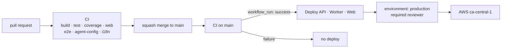
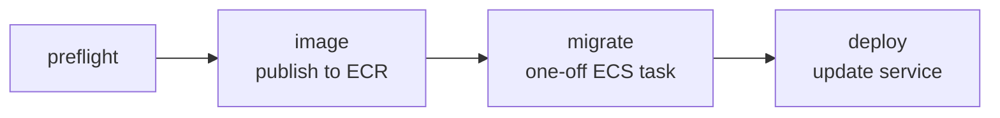

# Deployment

How the four deployables reach AWS, what credentials that needs, and where each
one lives. Hosting rationale is [ADR-0009](decisions/ADR-0009-hosting-on-aws.md);
the infrastructure itself is Terraform, per
[ADR-0010](decisions/ADR-0010-infrastructure-as-code.md).

> **Status: scaffold.** The workflows exist, are wired, and fail with a clear
> message because the AWS environment has not been created yet. Creating it is
> [#32](https://github.com/HPAC-Safety/safety-report/issues/32); filling in the
> AWS calls is [#30](https://github.com/HPAC-Safety/safety-report/issues/30).

## What deploys, and from where

| Workflow | Deploys | Target |
|---|---|---|
| `.github/workflows/deploy-api.yml` | `src/HpacSafety.Api` | ECS Fargate service |
| `.github/workflows/deploy-worker.yml` | `src/HpacSafety.Worker` | ECS Fargate service |
| `.github/workflows/deploy-web.yml` | `src/web/public`, `src/web/admin` | S3 + CloudFront, separately |

Containers are produced by `dotnet publish -c Release /t:PublishContainer`.
.NET 10 emits an OCI image directly, so there is no Dockerfile to drift from the
project file.



Every deploy workflow triggers on `workflow_run` of **CI**, filtered to `main`
and to `conclusion == success`. A red build cannot deploy. Each also has
`workflow_dispatch`, so a rollback never requires a commit.

## Authentication: OIDC, no stored AWS keys

Workflows assume an IAM role through GitHub's OIDC provider:

```yaml
permissions:
  id-token: write
  contents: read
```

There is no `AWS_ACCESS_KEY_ID` and no `AWS_SECRET_ACCESS_KEY` anywhere in this
repository, and there never should be.

The role's trust policy must be scoped to **this repository** and to
`ref:refs/heads/main`. A role that trusts `repo:HPAC-Safety/*:*` would let any
repository in the org deploy this system; a role that trusts
`repo:HPAC-Safety/safety-report:*` would let any branch — including one pushed
to a fork — do the same.

```json
{
  "Condition": {
    "StringEquals": {
      "token.actions.githubusercontent.com:aud": "sts.amazonaws.com",
      "token.actions.githubusercontent.com:sub": "repo:HPAC-Safety/safety-report:ref:refs/heads/main"
    }
  }
}
```

## Deploy-time configuration

### Secrets

Exactly one, and it is not usable without the trust policy above.

| Name | Purpose |
|---|---|
| `AWS_DEPLOY_ROLE_ARN` | Role assumed via OIDC |

```bash
gh secret set AWS_DEPLOY_ROLE_ARN --repo HPAC-Safety/safety-report
```

### Variables

ARNs and resource names are not credentials. Keeping them as variables means a
failed deploy log says which cluster it could not reach.

| Name | Example | Used by |
|---|---|---|
| `AWS_REGION` | `ca-central-1` | all |
| `ECR_REPOSITORY_API` | `hpac-safety/api` | api |
| `ECR_REPOSITORY_WORKER` | `hpac-safety/worker` | worker |
| `ECS_CLUSTER` | `hpac-safety` | api, worker |
| `ECS_SERVICE_API` | `hpac-safety-api` | api |
| `ECS_SERVICE_WORKER` | `hpac-safety-worker` | worker |
| `ECS_TASK_DEFINITION_MIGRATE` | `hpac-safety-migrate` | api |
| `ECS_SUBNETS` | `subnet-…,subnet-…` | api |
| `ECS_SECURITY_GROUPS` | `sg-…` | api |
| `S3_BUCKET_PUBLIC` | `hpac-safety-public` | web |
| `S3_BUCKET_ADMIN` | `hpac-safety-admin` | web |
| `CLOUDFRONT_DISTRIBUTION_PUBLIC` | `E…` | web |
| `CLOUDFRONT_DISTRIBUTION_ADMIN` | `E…` | web |

```bash
gh variable set AWS_REGION --body ca-central-1 --repo HPAC-Safety/safety-report
```

## Runtime secrets do not belong in GitHub

This is the distinction most easily got wrong. The application needs these
**while it runs**, not while it deploys. They live in **AWS Secrets Manager**
and are injected into the ECS task definition. Putting them in GitHub would
copy them into a second system that has no need to hold them.

| Secret | Held by |
|---|---|
| `ANTHROPIC_API_KEY` | Worker — summarize, PII audit, translate |
| `TURNSTILE_SECRET_KEY` | API — server-side `siteverify` |
| `ConnectionStrings__Default` | API and Worker |
| `Notifications__To` | Worker — `safety@hpac.ca` in production |

The Turnstile **site** key is public by design and may be a variable. The
Turnstile **secret** key must never reach a static bundle.

## Migrations

Migrations are their own job in `deploy-api.yml`, with an explicit `needs` edge,
and they complete before the new task set takes traffic.

They do **not** run at application startup. Two API tasks booting together would
both try to take the migration lock, and the loser either crashes or serves
traffic against a half-migrated schema.



Only `deploy-api.yml` owns the schema, so exactly one workflow can change it. If
a release needs both, deploy the API first.

## The `production` environment

All jobs that touch AWS state declare `environment: production`, which carries a
required reviewer. A deploy is a deliberate act, not a side effect of merging.

The environment exists, with `ChaseFlorell` and `jopekar` as required
reviewers and `protected_branches: true`, so only `main` can deploy. It was
created with, and can be reapplied by:

```bash
gh api -X PUT repos/HPAC-Safety/safety-report/environments/production \
  --input - <<'JSON'
{
  "wait_timer": 0,
  "prevent_self_review": false,
  "reviewers": [
    { "type": "User", "id": 471626 },
    { "type": "User", "id": 7506460 }
  ],
  "deployment_branch_policy": {
    "protected_branches": true,
    "custom_branch_policies": false
  }
}
JSON
```

## Rollback

Every deploy workflow takes an `image_tag` input on `workflow_dispatch`.
Rolling back is re-running it with the previous commit SHA — no revert commit,
no rebuild.

```bash
gh workflow run deploy-api.yml -f image_tag=<previous-sha>
```

For the static sites, re-run `deploy-web.yml` from the previous commit and let
the CloudFront invalidation follow.

**A rollback does not undo a migration.** Migrations must be written so that the
previous application version still runs against the new schema — add columns,
do not rename them; drop only in a later release. That constraint is on the
migration author, not on this workflow.

## Local development

None of this is needed to develop. `IBlobStore` resolves to a filesystem
implementation and `IEmailSender` to a logging one, so a local run never touches
AWS. See the per-app READMEs under `src/`.
