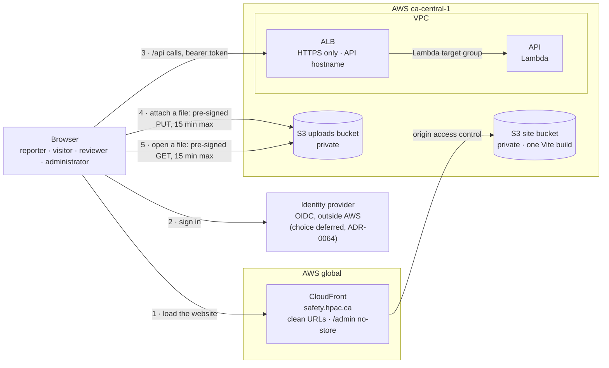
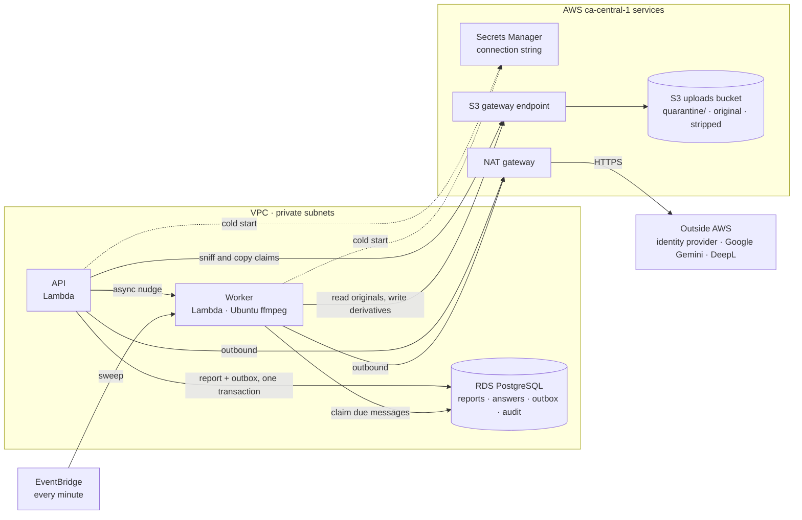
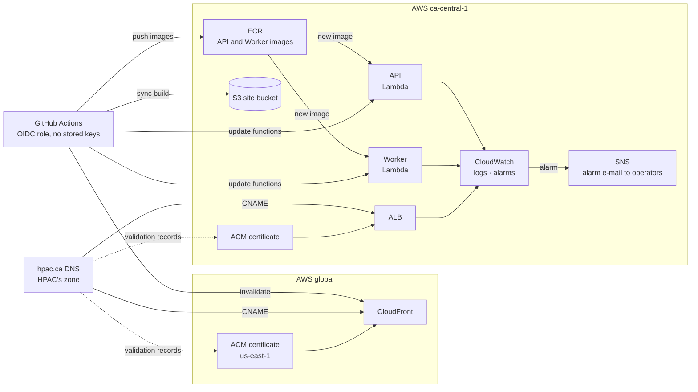

# Infrastructure and operations

## Production topology

**CON-INF-001** Production is one deliberately small AWS environment in `ca-central-1`.
*Verified by: none — an infrastructure property no application scenario can
observe; Terraform validation and the `infra` job are its check.*

The whole system runs in AWS. Everything that holds data is in `ca-central-1`;
the only global pieces are CloudFront, which serves the static website bundle,
and its `us-east-1` certificate. Hosting is set by
[ADR-0042](decisions/ADR-0042-lambda-hosted-api-with-fargate-migration-path.md)
(the API on Lambda) and
[ADR-0123](decisions/ADR-0123-the-worker-runs-on-lambda-and-the-website-on-s3-and-cloudfront.md)
(the Worker on Lambda, the website on S3 and CloudFront).

### 1. How requests reach the system

### 2. How work is processed

The outbound calls, all over HTTPS through the NAT gateway:

| Caller | Calls | For |
|---|---|---|
| API | the identity provider's published signing keys | validating a member's token ([ADR-0064](decisions/ADR-0064-jwt-bearer-authentication-with-three-roles.md)) |
| API | DeepL | an administrator's or reviewer's Translate draft ([ADR-0062](decisions/ADR-0062-administrators-may-machine-translate-question-text.md), [ADR-0108](decisions/ADR-0108-a-reviewer-may-machine-translate-a-summary-language.md)) |
| Worker | Google Gemini | the one summarization call per attempt ([ADR-0104](decisions/ADR-0104-summaries-are-generated-by-gemini-through-a-paid-key.md)) |
| Worker | DeepL | an answer's or a comment's second language ([ADR-0112](decisions/ADR-0112-only-answers-that-need-it-get-a-second-language.md), [ADR-0114](decisions/ADR-0114-members-may-comment-on-a-published-report.md)) |

### 3. How it is deployed and operated

How the pieces connect:

- **Two public entry points.**
  - CloudFront serves the static website from a private bucket that only it
    can read.
  - The HTTPS ALB fronts the API and nothing else, reached on its own
    hostname, not through CloudFront
    ([ADR-0081](decisions/ADR-0081-trust-forwarded-headers-from-the-security-group-boundary.md)).
  - The website bundle holds no report data. The API authorizes every data
    request, so the delivery path is not the security boundary
    ([ADR-0048](decisions/ADR-0048-one-website-admin-as-a-route.md)).
- **The API** is a Lambda function behind an ALB Lambda target group. It
  validates the member's token, writes a report with its outbox messages in
  one transaction, and nudges the Worker.
- **The Worker** is a Lambda function.
  - The API's nudge starts it after each commit, and an EventBridge schedule
    sweeps once a minute, so a lost nudge only delays work.
  - Each run claims due outbox messages, processes them (a summary, an
    attachment, answer or comment translation), and returns.
- **Attachments** reach S3 only through a pre-signed PUT the API mints.
  - `POST /api/v1/uploads` returns a PUT of at most 15 minutes to one
    `quarantine/` key, signed for the declared type and exact size. A
    lifecycle rule expires an unclaimed upload after 15 days.
  - The uploads bucket accepts a cross-origin `PUT` only from the site
    origins ([ADR-0126](decisions/ADR-0126-an-attachment-uploads-straight-to-quarantine-by-pre-signed-put.md)).
  - Submission sniffs each claimed upload with ranged reads, then copies it
    inside the bucket.
  - The Worker writes derivatives.
  - A browser reads a file only through a pre-signed GET of at most 15
    minutes, never a public object URL
    ([ADR-0096](decisions/ADR-0096-an-attachment-uploads-on-attach-and-is-claimed-at-submission.md),
    [ADR-0117](decisions/ADR-0117-a-published-report-shows-the-reporters-photos-and-video.md),
    [ADR-0119](decisions/ADR-0119-a-published-report-offers-its-documents-for-download.md)).
- **Outbound calls** leave through the NAT gateway: the identity provider's
  signing keys, Gemini, and DeepL. S3 traffic stays in the VPC through the
  gateway endpoint.
- **Migrations** apply at each function's cold start under a PostgreSQL
  advisory lock. There is no migration task
  ([ADR-0055](decisions/ADR-0055-ef-core-migrations-sql-files-stored-procedures.md)).
- **Deployment** is GitHub Actions assuming AWS roles through OIDC. It pushes
  images to ECR, updates both functions, syncs the website build to its
  bucket, and invalidates CloudFront.
- **DNS** for `hpac.ca` is HPAC's own zone. Its records point at CloudFront and
  the ALB, and it publishes the ACM validation records.

### Where today's Terraform differs

`infra/` predates ADR-0123 and does not match this target yet. These are the
known differences:

- The API and the Worker run as ECS Fargate services, not Lambda functions
  (#443).
- An unused `migrate` ECS task definition remains (#441).
- SES resources, the Worker's `ses:SendEmail` grant, and a `notifications-to`
  secret remain for an email flow that no longer exists (#441).

The website's S3 bucket, CloudFront distribution, certificates, network, RDS,
uploads bucket, alarms, and ECR already match.

**CON-INF-002** No SES/email resources, messaging integrations, public bucket or CDN copy of
an attachment (a published file is reached only through a pre-signed GET of
at most 15 minutes, ADR-0117), application encryption key, speculative queueing platform, or autoscaling
machinery is part of the target.
*Verified by: REQ-MOD-039 for the publication and messaging boundary; none for
the rest.* Existing infrastructure for those removed
features should be pruned when implementation aligns.

## Network and data protection

**CON-INF-003** Only the CloudFront distribution and the HTTPS ALB are public. The API
and Worker Lambda functions are attached to private subnets; security groups narrowly allow API/Worker to RDS and necessary
egress. S3 public access is blocked. Managed encryption is
enabled for RDS, snapshots/backups, logs, secrets, and every bucket. TLS is
required for browsers, the identity provider, AWS service access, database
connections, and the model provider.
*Verified by: none — an infrastructure property no application scenario can
observe; Terraform validation and the `infra` job are its check.*

A small deployment may use one NAT gateway and the relevant AWS endpoints to
control cost. Availability, backup retention, deletion protection, and final
snapshot behavior are explicit production variables, not assumptions hidden in
application code.

## Configuration and secrets

Configuration includes database/storage endpoints, attachment count and per-kind size
limits (250 MB video, 25 MB image or document), accepted attachment types, the site origins (`site_origins`, which the
uploads bucket's CORS rule allows to `PUT`),
rate limits, the authentication issuer, audience, and role-claim name,
model/prompt version, retry bounds, and stuck-work thresholds.

**CON-INF-004** There are no cookie settings, no Turnstile configuration, and no HPAC auth kill
switch or hardcoded endpoint. Sessions are bearer tokens, Turnstile is gone
([ADR-0068](decisions/ADR-0068-the-member-token-replaces-turnstile-on-submission.md)),
and outside Development this system never contacts a member login endpoint
([ADR-0064](decisions/ADR-0064-jwt-bearer-authentication-with-three-roles.md)).
The one exception is Development's members-site sign-in
([ADR-0079](decisions/ADR-0079-a-development-login-may-verify-against-the-live-members-site.md)).
Forwarded headers are trusted without a proxy list, because the security group
admits only the load balancer
([ADR-0081](decisions/ADR-0081-trust-forwarded-headers-from-the-security-group-boundary.md)).
*Verified by: REQ-SUB-018, REQ-MOD-003.*

**CON-INF-005** Secret values live in Secrets Manager and never in Terraform state, GitHub
variables, source, appsettings committed to the repository, logs, or task
definitions. Terraform creates secret containers/references; an authorized
operator supplies values out of band. The identity provider's client secret is
one of these. Two recorded exceptions are GitHub repository secrets passed to a
task as environment variables by the deploy workflow: DeepL's key
([ADR-0062](decisions/ADR-0062-administrators-may-machine-translate-question-text.md))
and the summarization provider's key, `AiChatClient__ApiKey`
([ADR-0104](decisions/ADR-0104-summaries-are-generated-by-gemini-through-a-paid-key.md)).
*Verified by: none — an infrastructure property no application scenario can
observe; Terraform validation and the `infra` job are its check.*

**CON-INF-006** **The development JWT signing key is deliberately not a secret.** It is a
throwaway symmetric key committed to `appsettings.Development.json`, following
the pattern already set by the committed development encryption key: it signs
tokens that only a developer's own machine will ever accept, and it appears in
no deployed environment because the development token issuer is not mapped
outside Development
([ADR-0066](decisions/ADR-0066-a-development-identity-provider-signed-with-a-dev-key.md)).
Production validates against the provider's published keys and holds no signing
key of its own.
*Verified by: REQ-MOD-019.*

## Deployment

**CON-INF-007** GitHub Actions authenticates to AWS through OIDC and short-lived role
assumption. There are no long-lived AWS access keys. Pull requests run build,
test, security/configuration, web, and Terraform validation/plan checks without
production mutation.

On an approved main deployment:

1. immutable API and Worker images are built and pushed to ECR with the commit
   SHA, and the website is built once;
2. the API and Worker Lambda functions are updated to that image, and the
   website build is synced to its S3 bucket and the CloudFront distribution
   invalidated, each independently; and
3. health/readiness checks confirm the rollout.

There is no migration task or deploy step. The API and the Worker each apply
pending migrations at startup, under a PostgreSQL advisory lock that re-checks
after it is taken, so whichever starts first migrates and the other finds
nothing to do ([ADR-0055](decisions/ADR-0055-ef-core-migrations-sql-files-stored-procedures.md)). Rollback deploys a known image/static
artifact; database migrations follow expand/contract compatibility when a
release may be rolled back.
*Verified by: none — an infrastructure property no application scenario can
observe; Terraform validation and the `infra` job are its check.*

## Operations

**CON-INF-008** Logs are structured and privacy-safe. Metrics cover request rate/error/latency,
submission rejection categories, outbox age and attempts, summary success/
failure, attachment validation/derivative success/failure, database health, task health, and
storage capacity. Dashboards avoid dimensions derived from report content.
*Verified by: REQ-AI-021, REQ-MED-003.*

**CON-INF-009** Alerts stay focused and actionable, and the application itself sends no
reporter or reviewer email.
*Verified by: REQ-MOD-039 for the absence of an outbound channel; none for the
alert set itself.*

- oldest live summarization/attachment work exceeds a configured age;
- a summary or attachment job reaches poison/failed state;
- API/Worker service or migration health fails; and
- RDS capacity/availability or backup health requires intervention.

Alerts route to the existing HPAC operational channel outside this application's
publication features. The application itself does not send reporter/reviewer
email.

Runbooks cover first deployment, migration failure, rollback, stuck/poison work,
model outage, identity-provider outage, safe derivative
failure, restore-from-backup verification, secret rotation, and security
incident response. Restore drills verify retained private data stays private.

## Storage lifecycles and backups

**CON-INF-010** A fifteen-day lifecycle, matching the browser's saved report (ADR-0100), expires unreferenced quarantine candidates. No lifecycle
physically purges report-linked originals/derivatives merely because a report
was soft-deleted. RDS automated backups and final snapshots meet an explicit
retention policy; backup access is audited and limited. This operational
retention is distinct from application visibility.
*Verified by: REQ-DOM-010, REQ-DOM-011, REQ-DOM-012, REQ-MED-005.*
