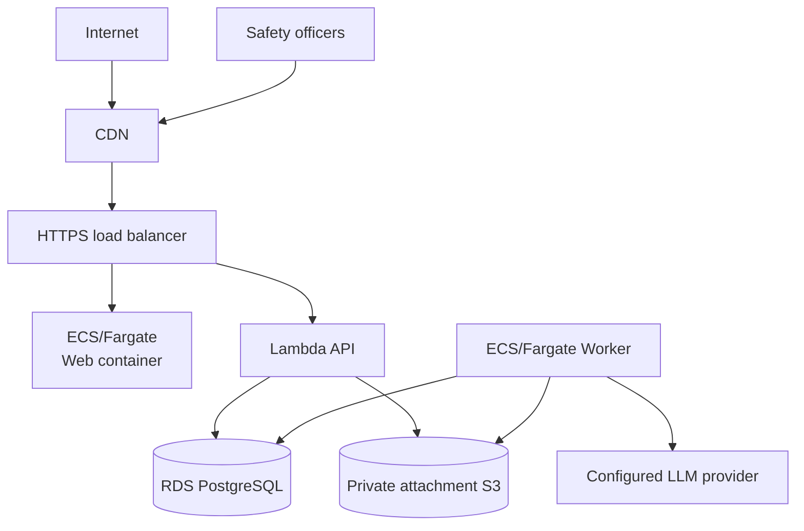

# Infrastructure and operations

## Production topology

Production is one deliberately small AWS environment in `ca-central-1`:

The public form and the admin review queue are routes within one
React/TypeScript/Vite build, served by one Nginx ECS Fargate container behind
one CloudFront distribution
([ADR-0043](decisions/ADR-0043-react-typescript-vite-web-front-end.md),
[ADR-0044](decisions/ADR-0044-containerized-web-hosting.md),
[ADR-0048](decisions/ADR-0048-one-website-admin-as-a-route.md)). The API,
Worker, and the web site run from container images, on different primitives —
the API is a Lambda function (container image, behind the ALB via a Lambda
target group; see
[ADR-0042](decisions/ADR-0042-lambda-hosted-api-with-fargate-migration-path.md)),
the Worker and the web site each a separate ECS Fargate service. RDS and
attachment storage are private. Secrets Manager supplies runtime secrets.
Terraform owns the topology; explicit migrations own schema changes.

No SES/email resources, messaging integrations, public attachment distribution,
application encryption key, speculative queueing platform, or autoscaling
machinery is part of the target. Existing infrastructure for those removed
features should be pruned when implementation aligns.

## Network and data protection

Only the CloudFront distribution and the HTTPS ALB are public. The API
Lambda function, the web container, and Worker tasks are attached to private
subnets; security groups narrowly allow API/Worker to RDS and necessary
egress. S3 public access is blocked. Managed encryption is
enabled for RDS, snapshots/backups, logs, secrets, and every bucket. TLS is
required for browsers, HPAC authentication, AWS service access, database
connections, and the model provider.

A small deployment may use one NAT gateway and the relevant AWS endpoints to
control cost. Availability, backup retention, deletion protection, and final
snapshot behavior are explicit production variables, not assumptions hidden in
application code.

## Configuration and secrets

Configuration includes database/storage endpoints, attachment count and 50 MB size
limit, accepted attachment types, document malware scanner, trusted proxy
networks, the site origin,
cookie settings, rate limits/lockout, Turnstile site/secret settings, HPAC auth
kill switch and hardcoded endpoint, model/prompt version, retry bounds, and
stuck-work thresholds.

Secret values live in Secrets Manager and never in Terraform state, GitHub
variables, source, appsettings committed to the repository, logs, or task
definitions. Terraform creates secret containers/references; an authorized
operator supplies values out of band.

## Deployment

GitHub Actions authenticates to AWS through OIDC and short-lived role
assumption. There are no long-lived AWS access keys. Pull requests run build,
test, security/configuration, web, and Terraform validation/plan checks without
production mutation.

On an approved main deployment:

1. immutable API, Worker, and web images are built and pushed with the
   commit SHA;
2. a one-off migration task runs the reviewed migration and must succeed;
3. the API (Lambda function), Worker, and web (ECS services) deploy
   independently using that image version, and the web deploy invalidates
   the CloudFront distribution; and
4. health/readiness checks confirm the rollout.

Services never run migrations on startup. Rollback deploys a known image/static
artifact; database migrations follow expand/contract compatibility when a
release may be rolled back.

## Operations

Logs are structured and privacy-safe. Metrics cover request rate/error/latency,
submission rejection categories, outbox age and attempts, summary success/
failure, attachment validation/derivative success/failure, database health, task health, and
storage capacity. Dashboards avoid dimensions derived from report content.

Alerts stay focused and actionable:

- oldest live summarization/attachment work exceeds a configured age;
- a summary or attachment job reaches poison/failed state;
- API/Worker service or migration health fails; and
- RDS capacity/availability or backup health requires intervention.

Alerts route to the existing HPAC operational channel outside this application's
publication features. The application itself does not send reporter/reviewer
email.

Runbooks cover first deployment, migration failure, rollback, stuck/poison work,
model outage, Turnstile outage, HPAC authentication kill switch, safe derivative
failure, restore-from-backup verification, credential rotation, and security
incident response. Restore drills verify retained private data stays private.

## Storage lifecycles and backups

A short lifecycle expires unreferenced quarantine candidates. No lifecycle
physically purges report-linked originals/derivatives merely because a report
was soft-deleted. RDS automated backups and final snapshots meet an explicit
retention policy; backup access is audited and limited. This operational
retention is distinct from application visibility.
